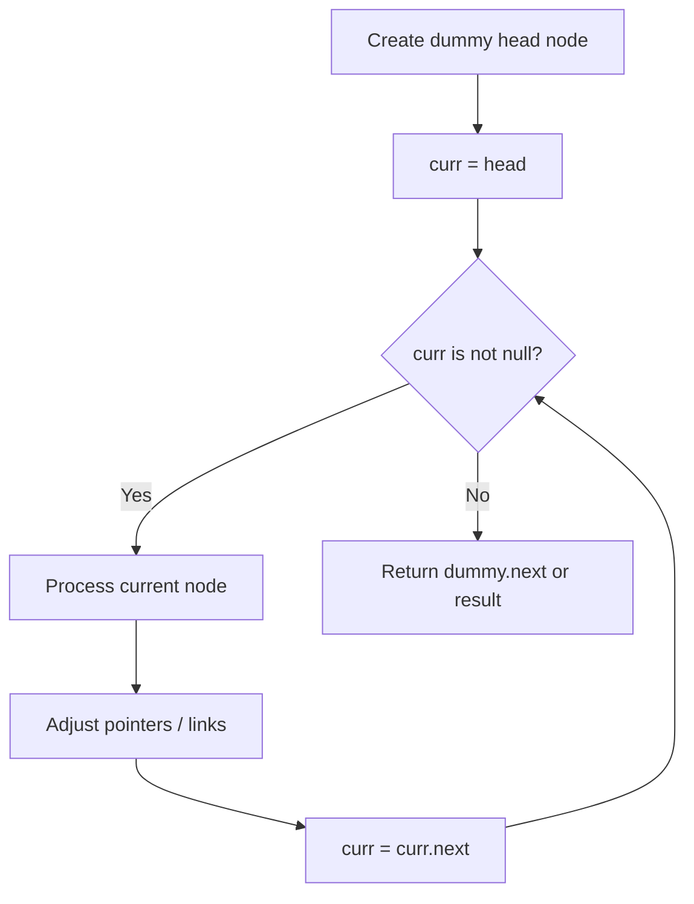
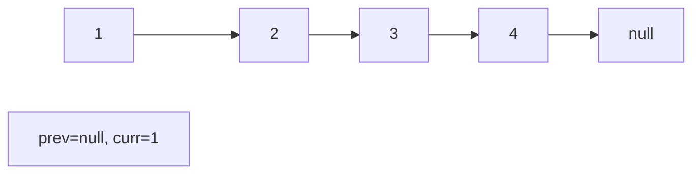
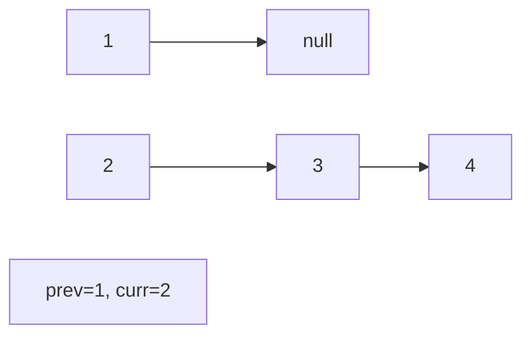
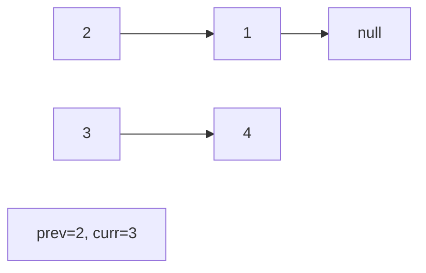
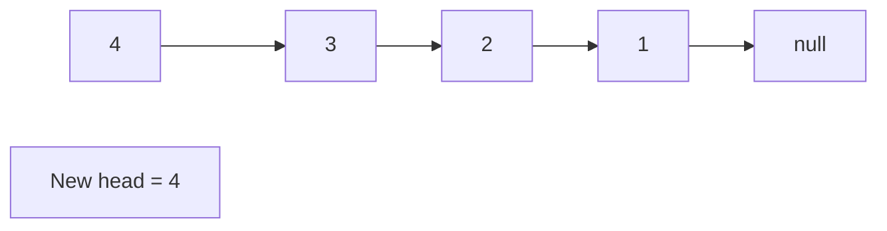

# Problem 817: Linked List Components

**Difficulty:** Medium  
**Tags:** Array, Hash Table, Linked List  
**Pattern:** Linked List  
**Link:** [leetcode.com/problems/linked-list-components](https://leetcode.com/problems/linked-list-components/)

## Description

You are given the `head` of a linked list containing unique integer values and an integer array `nums` that is a subset of the linked list values.

Return *the number of connected components in *`nums`* where two values are connected if they appear **consecutively** in the linked list*.

 

Example 1:

```

**Input:** head = [0,1,2,3], nums = [0,1,3]
**Output:** 2
**Explanation:** 0 and 1 are connected, so [0, 1] and [3] are the two connected components.

```

Example 2:

```

**Input:** head = [0,1,2,3,4], nums = [0,3,1,4]
**Output:** 2
**Explanation:** 0 and 1 are connected, 3 and 4 are connected, so [0, 1] and [3, 4] are the two connected components.

```

 

**Constraints:**

	- The number of nodes in the linked list is `n`.
	- `1 <= n <= 10^4`
	- `0 <= Node.val < n`
	- All the values `Node.val` are **unique**.
	- `1 <= nums.length <= n`
	- `0 <= nums[i] < n`
	- All the values of `nums` are **unique**.

## Approach: Linked List

Traverse or manipulate the linked list using pointer techniques. Common patterns: dummy head node for edge cases, fast/slow pointers for cycle detection or middle finding, in-place reversal, and merge operations.

## Pseudocode

```
1. Create dummy head if needed
2. Initialize pointer(s) at head
3. Traverse / modify list:
   a. Process current node
   b. Adjust next pointers as needed
   c. Move to next node
4. Return dummy.next or result
```

## Algorithm Flow



## Visual State Transitions

**Linked List Operation (Reverse):**

**Frame 1: Initial list**


**Frame 2: Reverse first link**


**Frame 3: Reverse second link**


**Frame 4: Fully reversed**



## Complexity Analysis

- **Time:** O(n)
- **Space:** O(1)

## Solution (Python3)

```python
class Solution:
    def numComponents(self, head: Optional[ListNode], nums: List[int]) -> int:
        # Linked list traversal/manipulation
        dummy = ListNode(0)
        dummy.next = head
        prev, curr = dummy, head
        while curr:
            nxt = curr.next
            # Process current node
            prev = curr
            curr = nxt
        return dummy.next
```

## Solution (C++)

```cpp
#include <string>
#include <vector>
using namespace std;

class Solution {
public:
    int numComponents(ListNode* head, vector<int>& nums) {
        // Linked list traversal/manipulation
        ListNode dummy(0);
        dummy.next = head;
        ListNode* prev = &dummy;
        ListNode* curr = head;
        while (curr) {
            ListNode* nxt = curr->next;
            // Process current node
            prev = curr;
            curr = nxt;
        }
        return dummy.next;
    }
};
```
