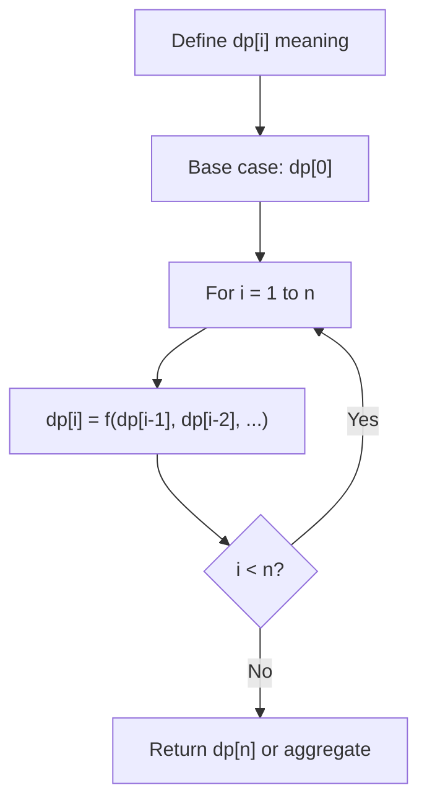
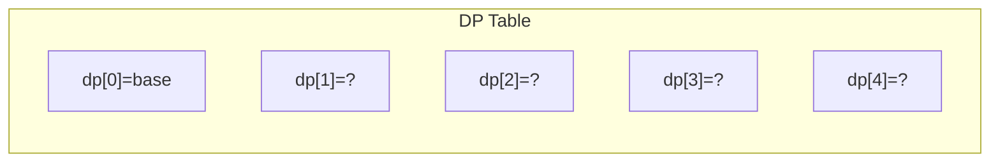
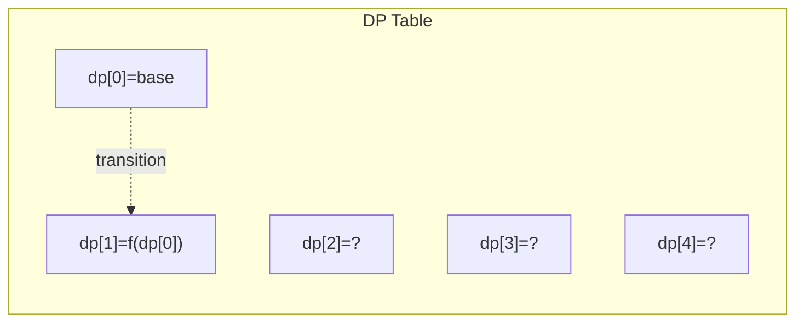
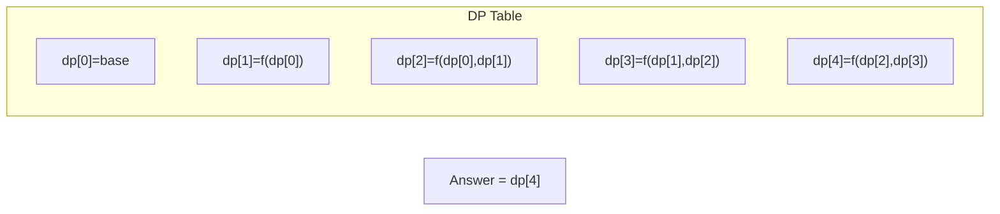

# Problem 818: Race Car

**Difficulty:** Hard  
**Tags:** Dynamic Programming  
**Pattern:** Dynamic Programming (1D)  
**Link:** [leetcode.com/problems/race-car](https://leetcode.com/problems/race-car/)

## Description

Your car starts at position `0` and speed `+1` on an infinite number line. Your car can go into negative positions. Your car drives automatically according to a sequence of instructions `'A'` (accelerate) and `'R'` (reverse):

	- When you get an instruction `'A'`, your car does the following:

	
		`position += speed`
		- `speed *= 2`
	
	
	- When you get an instruction `'R'`, your car does the following:
	
		If your speed is positive then `speed = -1`
		- otherwise `speed = 1`
	
	Your position stays the same.

For example, after commands `"AAR"`, your car goes to positions `0 --> 1 --> 3 --> 3`, and your speed goes to `1 --> 2 --> 4 --> -1`.

Given a target position `target`, return *the length of the shortest sequence of instructions to get there*.

 

Example 1:

```

**Input:** target = 3
**Output:** 2
**Explanation:** 
The shortest instruction sequence is "AA".
Your position goes from 0 --> 1 --> 3.

```

Example 2:

```

**Input:** target = 6
**Output:** 5
**Explanation:** 
The shortest instruction sequence is "AAARA".
Your position goes from 0 --> 1 --> 3 --> 7 --> 7 --> 6.

```

 

**Constraints:**

	- `1 <= target <= 10^4`

## Approach: Dynamic Programming (1D)

Break the problem into overlapping subproblems. Define dp[i] as the optimal value for the subproblem ending at or considering index i. Build the solution bottom-up, using previously computed dp values.

## Pseudocode

```
1. Define dp[i] = optimal value for subproblem i
2. Base case: dp[0] = initial value
3. For i from 1 to n:
   a. dp[i] = recurrence(dp[i-1], dp[i-2], ...)
4. Return dp[n] or max/min of dp
```

## Algorithm Flow



## Visual State Transitions

**1D Dynamic Programming Table Build:**

**Frame 1: Initialize base cases**


**Frame 2: Fill dp[1] from dp[0]**


**Frame 3: Fill remaining cells**



## Complexity Analysis

- **Time:** O(n)
- **Space:** O(n)

## Solution (Python3)

```python
class Solution:
    def racecar(self, target: int) -> int:
        # Dynamic programming (1D) - O(n) time, O(n) space
        if not target:
            return 0
        n = len(target) if isinstance(target, list) else target
        dp = [0] * (n + 1)
        dp[0] = 1  # base case
        for i in range(1, n + 1):
            dp[i] = dp[i-1]  # transition (customize per problem)
            if i >= 2:
                dp[i] += dp[i-2]
        return dp[n]
```

## Solution (C++)

```cpp
#include <string>
#include <vector>
using namespace std;

class Solution {
public:
    int racecar(int target) {
        // Dynamic programming (1D) - O(n) time, O(n) space
        int n = target;
        if (n <= 0) return 0;
        vector<int> dp(n + 1, 0);
        dp[0] = 1;
        for (int i = 1; i <= n; i++) {
            dp[i] = dp[i-1];
            if (i >= 2) dp[i] += dp[i-2];
        }
        return dp[n];
    }
};
```
