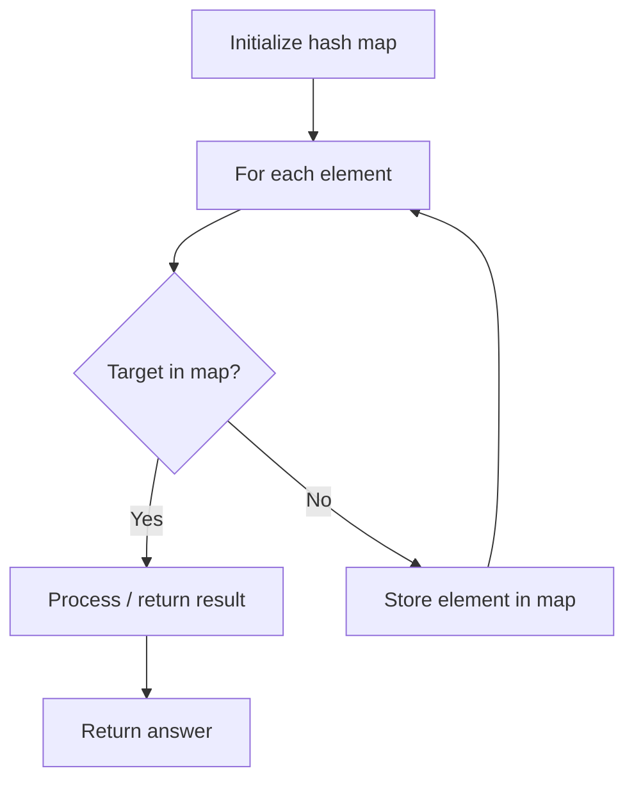

# Problem 819: Most Common Word

**Difficulty:** Easy  
**Tags:** Array, Hash Table, String, Counting  
**Pattern:** Hash Map Lookup  
**Link:** [leetcode.com/problems/most-common-word](https://leetcode.com/problems/most-common-word/)

## Description

Given a string `paragraph` and a string array of the banned words `banned`, return *the most frequent word that is not banned*. It is **guaranteed** there is **at least one word** that is not banned, and that the answer is **unique**.

The words in `paragraph` are **case-insensitive** and the answer should be returned in **lowercase**.

**Note** that words can not contain punctuation symbols.

 

Example 1:

```

**Input:** paragraph = "Bob hit a ball, the hit BALL flew far after it was hit.", banned = ["hit"]
**Output:** "ball"
**Explanation:** 
"hit" occurs 3 times, but it is a banned word.
"ball" occurs twice (and no other word does), so it is the most frequent non-banned word in the paragraph. 
Note that words in the paragraph are not case sensitive,
that punctuation is ignored (even if adjacent to words, such as "ball,"), 
and that "hit" isn't the answer even though it occurs more because it is banned.

```

Example 2:

```

**Input:** paragraph = "a.", banned = []
**Output:** "a"

```

 

**Constraints:**

	- `1 <= paragraph.length <= 1000`
	- paragraph consists of English letters, space `' '`, or one of the symbols: `"!?',;."`.
	- `0 <= banned.length <= 100`
	- `1 <= banned[i].length <= 10`
	- `banned[i]` consists of only lowercase English letters.

## Approach: Hash Map Lookup

Use a hash map (dictionary) to store elements for O(1) lookup. Iterate through the input, checking membership or counting frequencies in the map.

## Pseudocode

```
1. Initialize hash map
2. Iterate through elements:
   a. Check if target/complement exists in map
   b. If found: process result
   c. Otherwise: store element in map
3. Return result
```

## Algorithm Flow



## Complexity Analysis

- **Time:** O(n)
- **Space:** O(n)

## Solution (Python3)

```python
class Solution:
    def mostCommonWord(self, paragraph: str, banned: List[str]) -> str:
        # Hash map approach - O(n) time, O(n) space
        seen = {}
        for i, val in enumerate(paragraph):
            complement = banned - val
            if complement in seen:
                return [seen[complement], i]
            seen[val] = i
        return ""
```

## Solution (C++)

```cpp
#include <string>
#include <unordered_map>
#include <vector>
using namespace std;

class Solution {
public:
    string mostCommonWord(string& paragraph, vector<string>& banned) {
        // Hash map approach - O(n) time, O(n) space
        unordered_map<int, int> seen;
        for (int i = 0; i < paragraph.size(); i++) {
            int complement = banned - paragraph[i];
            if (seen.count(complement)) {
                return {seen[complement], i};
            }
            seen[paragraph[i]] = i;
        }
        return "";
    }
};
```
