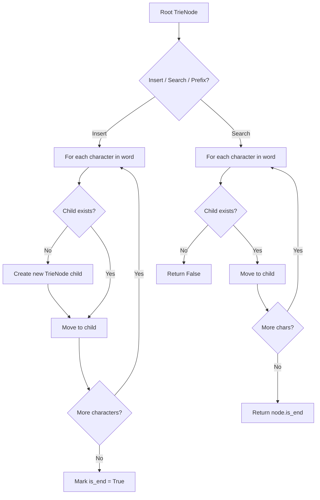
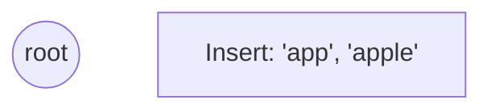
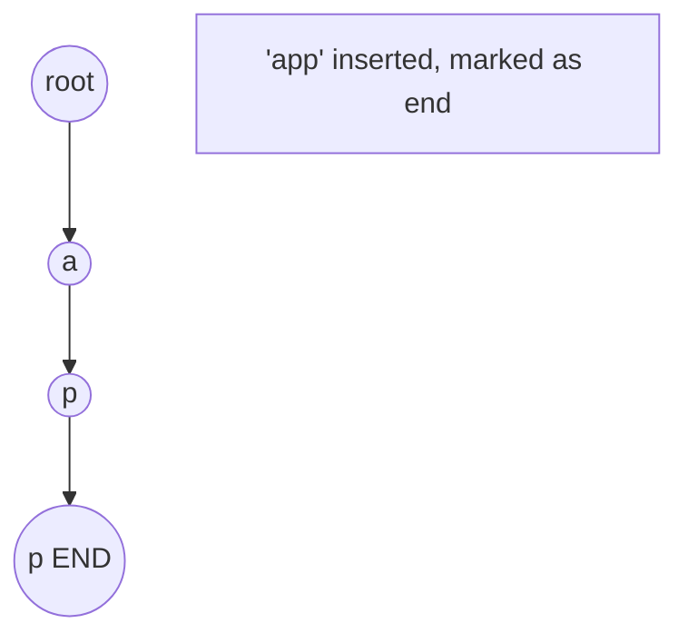
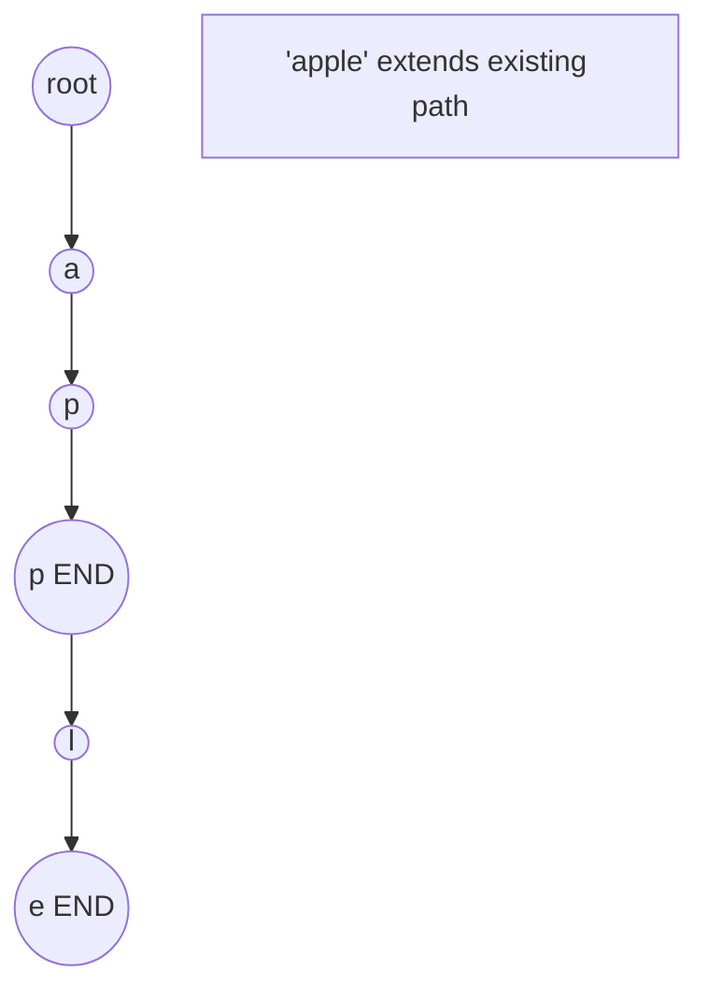
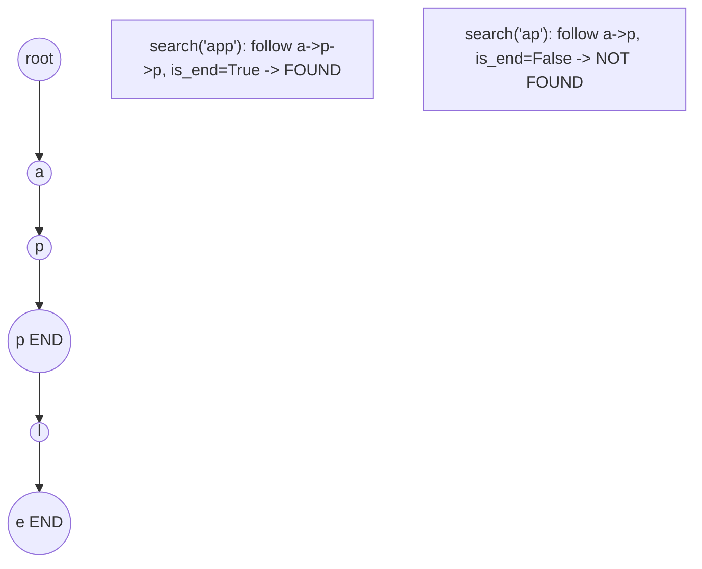

# Problem 820: Short Encoding of Words

**Difficulty:** Medium  
**Tags:** Array, Hash Table, String, Trie  
**Pattern:** Trie / Prefix Tree  
**Link:** [leetcode.com/problems/short-encoding-of-words](https://leetcode.com/problems/short-encoding-of-words/)

## Description

A **valid encoding** of an array of `words` is any reference string `s` and array of indices `indices` such that:

	- `words.length == indices.length`
	- The reference string `s` ends with the `'#'` character.
	- For each index `indices[i]`, the **substring** of `s` starting from `indices[i]` and up to (but not including) the next `'#'` character is equal to `words[i]`.

Given an array of `words`, return *the **length of the shortest reference string** *`s`* possible of any **valid encoding** of *`words`*.*

 

Example 1:

```

**Input:** words = ["time", "me", "bell"]
**Output:** 10
**Explanation:** A valid encoding would be s = `"time#bell#" and indices = [0, 2, 5`].
words[0] = "time", the substring of s starting from indices[0] = 0 to the next '#' is underlined in "time#bell#"
words[1] = "me", the substring of s starting from indices[1] = 2 to the next '#' is underlined in "time#bell#"
words[2] = "bell", the substring of s starting from indices[2] = 5 to the next '#' is underlined in "time#bell#"

```

Example 2:

```

**Input:** words = ["t"]
**Output:** 2
**Explanation:** A valid encoding would be s = "t#" and indices = [0].

```

 

**Constraints:**

	- `1 <= words.length <= 2000`
	- `1 <= words[i].length <= 7`
	- `words[i]` consists of only lowercase letters.

## Approach: Trie / Prefix Tree

Build a trie (prefix tree) where each node represents a character. Insert words character by character, and search by following child pointers. Supports efficient prefix matching.

## Pseudocode

```
1. TrieNode: children = {}, is_end = False
2. Insert(word):
   - For each char: create child if absent, move to child
   - Mark last node as end
3. Search(word):
   - For each char: if child absent return False, move to child
   - Return node.is_end
4. StartsWith(prefix): same as search but return True at end
```

## Algorithm Flow



## Visual State Transitions

**Trie Insert and Search:**

**Frame 1: Empty trie**


**Frame 2: Insert 'app'**


**Frame 3: Insert 'apple'**


**Frame 4: Search 'app' = True, 'ap' = False**



## Complexity Analysis

- **Time:** O(L) per operation
- **Space:** O(N * L)

## Solution (Python3)

```python
class Solution:
    def minimumLengthEncoding(self, words: List[str]) -> int:
        # Trie-based approach
        trie = {}
        # Build trie from word list
        words = words if isinstance(words, list) else [words]
        for word in words:
            node = trie
            for ch in word:
                if ch not in node:
                    node[ch] = {}
                node = node[ch]
            node['#'] = True
        
        # Search in trie
        def search(word):
            node = trie
            for ch in word:
                if ch not in node:
                    return False
                node = node[ch]
            return '#' in node
        
        return 0
```

## Solution (C++)

```cpp
#include <string>
#include <vector>
using namespace std;

class Solution {
public:
    int minimumLengthEncoding(vector<string>& words) {
        // Trie-based approach
        struct TrieNode {
            TrieNode* children[26] = {};
            bool isEnd = false;
        };
        TrieNode* root = new TrieNode();
        // Build trie
        for (auto& word : words) {
            TrieNode* node = root;
            for (char ch : word) {
                int idx = ch - 'a';
                if (!node->children[idx])
                    node->children[idx] = new TrieNode();
                node = node->children[idx];
            }
            node->isEnd = true;
        }
        return 0;
    }
};
```
