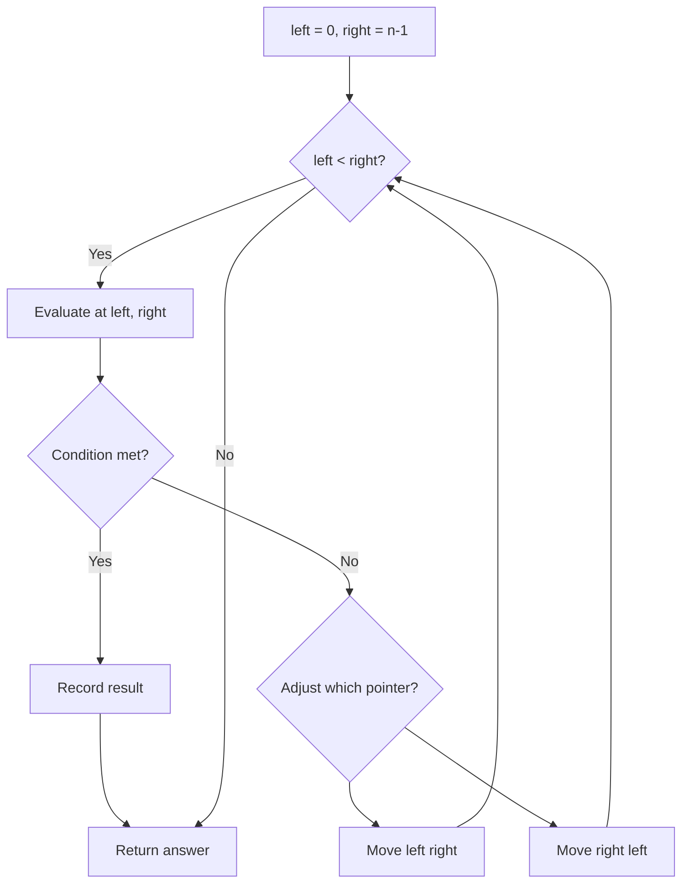
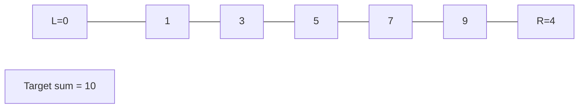
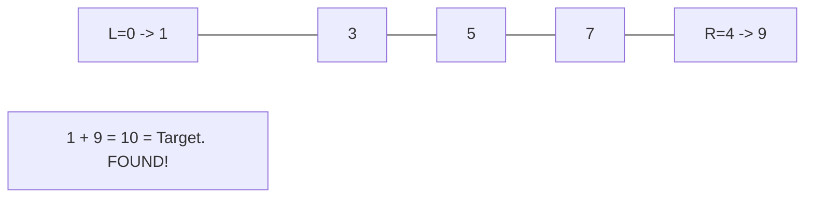

# Problem 821: Shortest Distance to a Character

**Difficulty:** Easy  
**Tags:** Array, Two Pointers, String  
**Pattern:** Two Pointers  
**Link:** [leetcode.com/problems/shortest-distance-to-a-character](https://leetcode.com/problems/shortest-distance-to-a-character/)

## Description

Given a string `s` and a character `c` that occurs in `s`, return *an array of integers *`answer`* where *`answer.length == s.length`* and *`answer[i]`* is the **distance** from index *`i`* to the **closest** occurrence of character *`c`* in *`s`.

The **distance** between two indices `i` and `j` is `abs(i - j)`, where `abs` is the absolute value function.

 

Example 1:

```

**Input:** s = "loveleetcode", c = "e"
**Output:** [3,2,1,0,1,0,0,1,2,2,1,0]
**Explanation:** The character 'e' appears at indices 3, 5, 6, and 11 (0-indexed).
The closest occurrence of 'e' for index 0 is at index 3, so the distance is abs(0 - 3) = 3.
The closest occurrence of 'e' for index 1 is at index 3, so the distance is abs(1 - 3) = 2.
For index 4, there is a tie between the 'e' at index 3 and the 'e' at index 5, but the distance is still the same: abs(4 - 3) == abs(4 - 5) = 1.
The closest occurrence of 'e' for index 8 is at index 6, so the distance is abs(8 - 6) = 2.

```

Example 2:

```

**Input:** s = "aaab", c = "b"
**Output:** [3,2,1,0]

```

 

**Constraints:**

	- `1 <= s.length <= 10^4`
	- `s[i]` and `c` are lowercase English letters.
	- It is guaranteed that `c` occurs at least once in `s`.

## Approach: Two Pointers

Use two pointers moving through the data structure. Depending on the problem, pointers may move toward each other (converging), in the same direction (fast/slow), or independently.

## Pseudocode

```
1. Initialize left = 0, right = n-1 (or two independent pointers)
2. While pointers haven't crossed:
   a. Evaluate condition at pointer positions
   b. Move left pointer right or right pointer left
3. Return result
```

## Algorithm Flow



## Visual State Transitions

**Two Pointer Convergence:**

**Frame 1: Initialize pointers**


**Frame 2: Sum = 1+9 = 10, found!**



## Complexity Analysis

- **Time:** O(n)
- **Space:** O(1)

## Solution (Python3)

```python
class Solution:
    def shortestToChar(self, s: str, c: str) -> List[int]:
        # Two pointer approach - O(n) time, O(1) space
        left, right = 0, len(s) - 1
        while left < right:
            curr = s[left] + s[right]
            if curr == c:
                return [left, right]
            elif curr < c:
                left += 1
            else:
                right -= 1
        return []
```

## Solution (C++)

```cpp
#include <string>
#include <vector>
using namespace std;

class Solution {
public:
    vector<int> shortestToChar(string& s, string& c) {
        // Two pointer approach - O(n) time, O(1) space
        int left = 0, right = s.size() - 1;
        while (left < right) {
            int curr = s[left] + s[right];
            if (curr == c) {
                return {left, right};
            } else if (curr < c) {
                left++;
            } else {
                right--;
            }
        }
        return {};
    }
};
```
