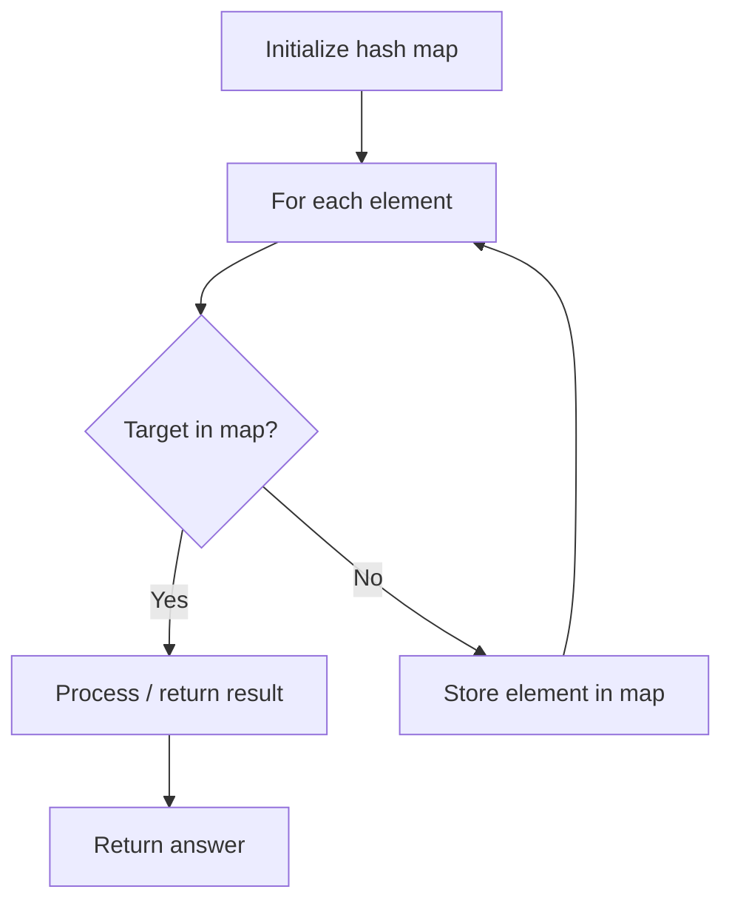

# Problem 822: Card Flipping Game

**Difficulty:** Medium  
**Tags:** Array, Hash Table  
**Pattern:** Hash Map Lookup  
**Link:** [leetcode.com/problems/card-flipping-game](https://leetcode.com/problems/card-flipping-game/)

## Description

You are given two **0-indexed** integer arrays `fronts` and `backs` of length `n`, where the `i^th` card has the positive integer `fronts[i]` printed on the front and `backs[i]` printed on the back. Initially, each card is placed on a table such that the front number is facing up and the other is facing down. You may flip over any number of cards (possibly zero).

After flipping the cards, an integer is considered **good** if it is facing down on some card and **not** facing up on any card.

Return *the minimum possible good integer after flipping the cards*. If there are no good integers, return `0`.

 

Example 1:

```

**Input:** fronts = [1,2,4,4,7], backs = [1,3,4,1,3]
**Output:** 2
**Explanation:**
If we flip the second card, the face up numbers are [1,3,4,4,7] and the face down are [1,2,4,1,3].
2 is the minimum good integer as it appears facing down but not facing up.
It can be shown that 2 is the minimum possible good integer obtainable after flipping some cards.

```

Example 2:

```

**Input:** fronts = [1], backs = [1]
**Output:** 0
**Explanation:**
There are no good integers no matter how we flip the cards, so we return 0.

```

 

**Constraints:**

	- `n == fronts.length == backs.length`
	- `1 <= n <= 1000`
	- `1 <= fronts[i], backs[i] <= 2000`

## Approach: Hash Map Lookup

Use a hash map (dictionary) to store elements for O(1) lookup. Iterate through the input, checking membership or counting frequencies in the map.

## Pseudocode

```
1. Initialize hash map
2. Iterate through elements:
   a. Check if target/complement exists in map
   b. If found: process result
   c. Otherwise: store element in map
3. Return result
```

## Algorithm Flow



## Complexity Analysis

- **Time:** O(n)
- **Space:** O(n)

## Solution (Python3)

```python
class Solution:
    def flipgame(self, fronts: List[int], backs: List[int]) -> int:
        # Hash map approach - O(n) time, O(n) space
        seen = {}
        for i, val in enumerate(fronts):
            complement = backs - val
            if complement in seen:
                return [seen[complement], i]
            seen[val] = i
        return 0
```

## Solution (C++)

```cpp
#include <string>
#include <unordered_map>
#include <vector>
using namespace std;

class Solution {
public:
    int flipgame(vector<int>& fronts, vector<int>& backs) {
        // Hash map approach - O(n) time, O(n) space
        unordered_map<int, int> seen;
        for (int i = 0; i < fronts.size(); i++) {
            int complement = backs - fronts[i];
            if (seen.count(complement)) {
                return {seen[complement], i};
            }
            seen[fronts[i]] = i;
        }
        return 0;
    }
};
```
