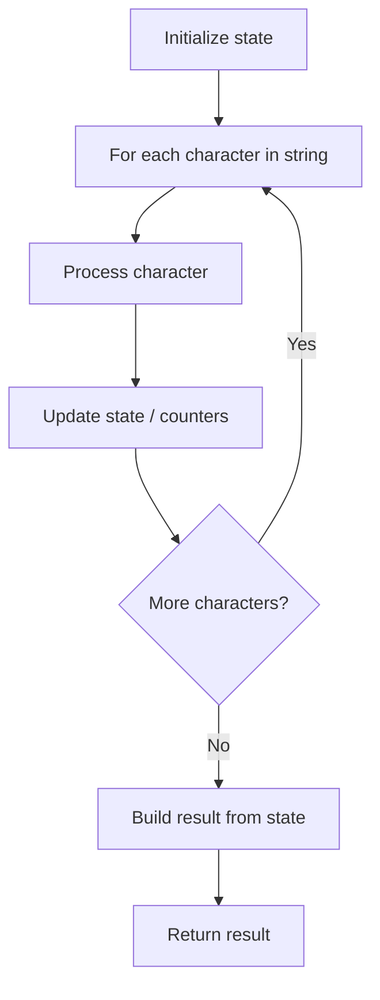

# Problem 824: Goat Latin

**Difficulty:** Easy  
**Tags:** String  
**Pattern:** String Processing  
**Link:** [leetcode.com/problems/goat-latin](https://leetcode.com/problems/goat-latin/)

## Description

You are given a string `sentence` that consist of words separated by spaces. Each word consists of lowercase and uppercase letters only.

We would like to convert the sentence to "Goat Latin" (a made-up language similar to Pig Latin.) The rules of Goat Latin are as follows:

	- If a word begins with a vowel (`'a'`, `'e'`, `'i'`, `'o'`, or `'u'`), append `"ma"` to the end of the word.

	
		For example, the word `"apple"` becomes `"applema"`.
	
	
	- If a word begins with a consonant (i.e., not a vowel), remove the first letter and append it to the end, then add `"ma"`.
	
		For example, the word `"goat"` becomes `"oatgma"`.
	
	
	- Add one letter `'a'` to the end of each word per its word index in the sentence, starting with `1`.
	
		For example, the first word gets `"a"` added to the end, the second word gets `"aa"` added to the end, and so on.
	
	

Return* the final sentence representing the conversion from sentence to Goat Latin*.

 

Example 1:

```
**Input:** sentence = "I speak Goat Latin"
**Output:** "Imaa peaksmaaa oatGmaaaa atinLmaaaaa"

```
Example 2:

```
**Input:** sentence = "The quick brown fox jumped over the lazy dog"
**Output:** "heTmaa uickqmaaa rownbmaaaa oxfmaaaaa umpedjmaaaaaa overmaaaaaaa hetmaaaaaaaa azylmaaaaaaaaa ogdmaaaaaaaaaa"

```

 

**Constraints:**

	- `1 <= sentence.length <= 150`
	- `sentence` consists of English letters and spaces.
	- `sentence` has no leading or trailing spaces.
	- All the words in `sentence` are separated by a single space.

## Approach: String Processing

Process the string character by character. Common techniques: two pointers, sliding window, hash map for frequencies, stack for matching.

## Pseudocode

```
1. Initialize result / tracking state
2. Iterate through string characters:
   a. Process character based on rules
   b. Update state (counters, pointers, stack)
3. Build and return result
```

## Algorithm Flow



## Complexity Analysis

- **Time:** O(n)
- **Space:** O(n)

## Solution (Python3)

```python
class Solution:
    def toGoatLatin(self, sentence: str) -> str:
        # String processing approach - O(n) time
        result = []
        for ch in sentence:
            if ch.isalnum():
                result.append(ch.lower())
        # Check palindrome or process
        processed = ''.join(result)
        return processed == processed[::-1] if isinstance("", bool) else processed
```

## Solution (C++)

```cpp
#include <algorithm>
#include <cctype>
#include <string>
#include <vector>
using namespace std;

class Solution {
public:
    string toGoatLatin(string& sentence) {
        // String processing approach - O(n) time
        string processed;
        for (char ch : sentence) {
            if (isalnum(ch)) {
                processed += tolower(ch);
            }
        }
        string rev = processed;
        reverse(rev.begin(), rev.end());
        return processed == rev;
    }
};
```
