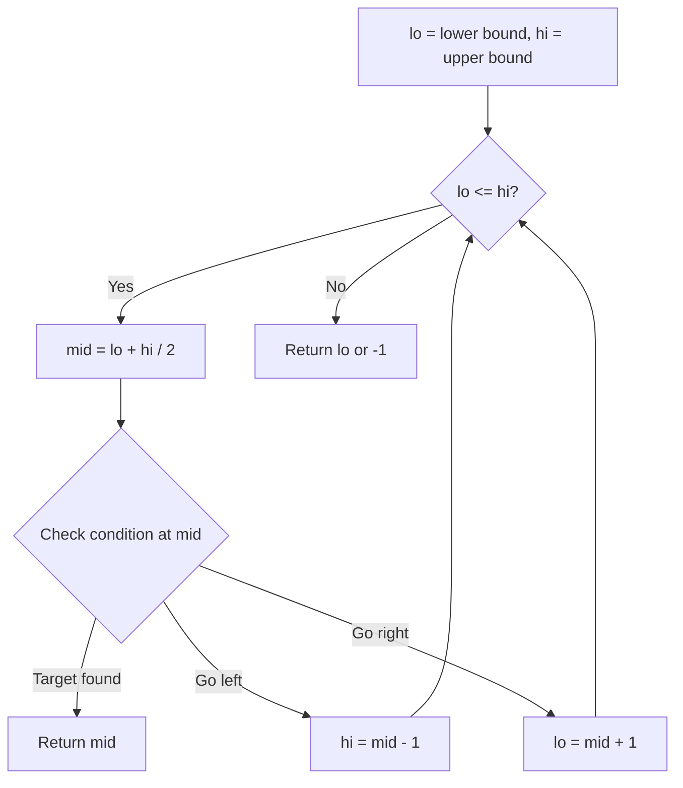
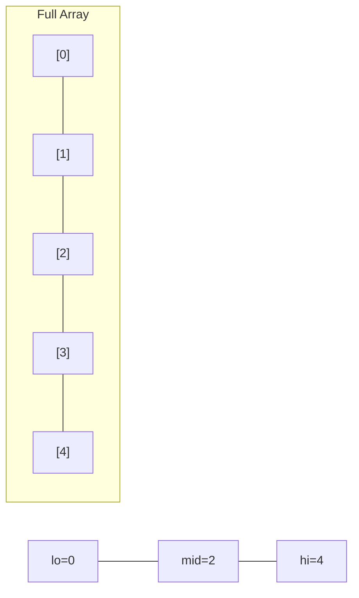
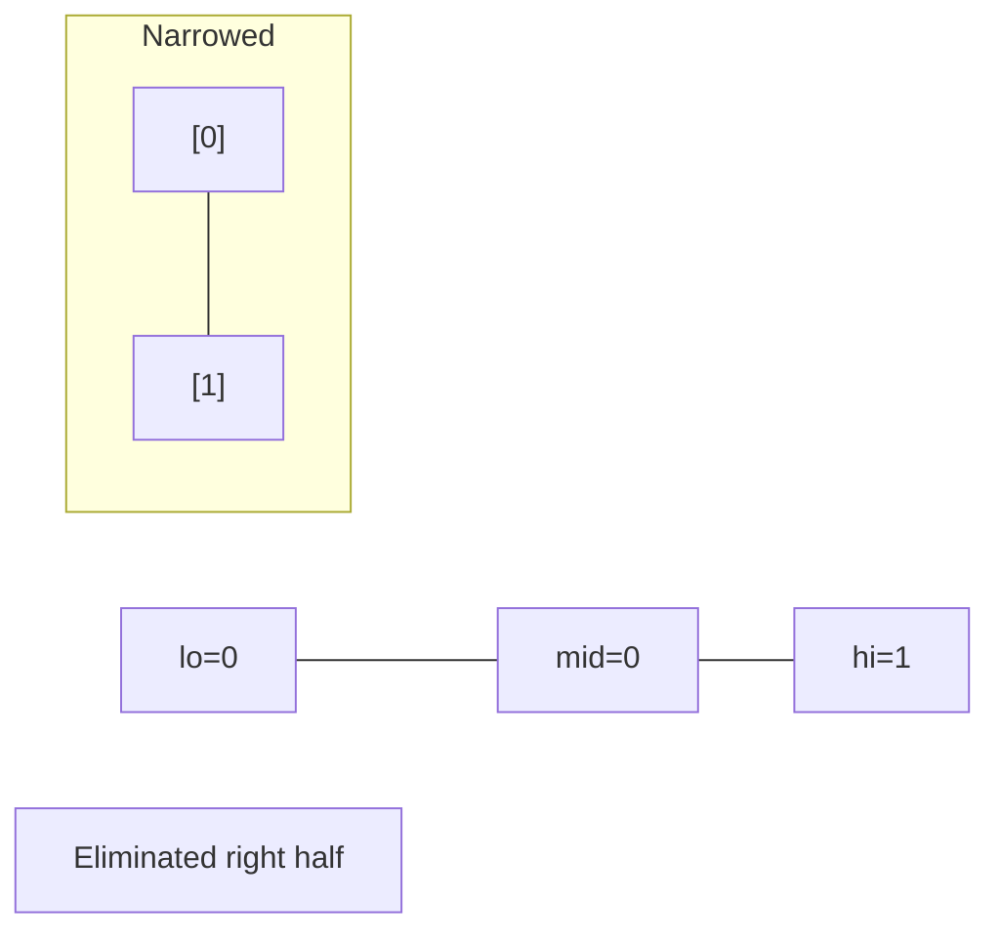
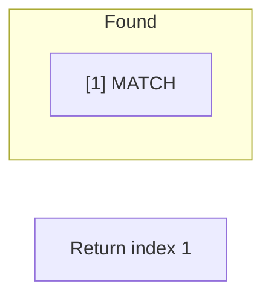

# Problem 825: Friends Of Appropriate Ages

**Difficulty:** Medium  
**Tags:** Array, Two Pointers, Binary Search, Sorting  
**Pattern:** Binary Search  
**Link:** [leetcode.com/problems/friends-of-appropriate-ages](https://leetcode.com/problems/friends-of-appropriate-ages/)

## Description

There are `n` persons on a social media website. You are given an integer array `ages` where `ages[i]` is the age of the `i^th` person.

A Person `x` will not send a friend request to a person `y` (`x != y`) if any of the following conditions is true:

	- `age[y] <= 0.5 * age[x] + 7`
	- `age[y] > age[x]`
	- `age[y] > 100 && age[x] < 100`

Otherwise, `x` will send a friend request to `y`.

Note that if `x` sends a request to `y`, `y` will not necessarily send a request to `x`. Also, a person will not send a friend request to themself.

Return *the total number of friend requests made*.

 

Example 1:

```

**Input:** ages = [16,16]
**Output:** 2
**Explanation:** 2 people friend request each other.

```

Example 2:

```

**Input:** ages = [16,17,18]
**Output:** 2
**Explanation:** Friend requests are made 17 -> 16, 18 -> 17.

```

Example 3:

```

**Input:** ages = [20,30,100,110,120]
**Output:** 3
**Explanation:** Friend requests are made 110 -> 100, 120 -> 110, 120 -> 100.

```

 

**Constraints:**

	- `n == ages.length`
	- `1 <= n <= 2 * 10^4`
	- `1 <= ages[i] <= 120`

## Approach: Binary Search

Use binary search to halve the search space each iteration. Define the search range [lo, hi], compute mid, and decide which half to keep based on the problem's monotonic condition.

## Pseudocode

```
1. lo = lower_bound, hi = upper_bound
2. While lo <= hi (or lo < hi):
   a. mid = (lo + hi) // 2
   b. If condition(mid) is satisfied: record answer, search left half
   c. Else: search right half
3. Return answer
```

## Algorithm Flow



## Visual State Transitions

**Binary Search Step-by-Step:**

**Frame 1: Initial search space**


**Frame 2: Compare mid, narrow search**


**Frame 3: Found target**



## Complexity Analysis

- **Time:** O(log n)
- **Space:** O(1)

## Solution (Python3)

```python
class Solution:
    def numFriendRequests(self, ages: List[int]) -> int:
        # Binary search - O(log n) time, O(1) space
        lo, hi = 0, len(ages) - 1
        while lo <= hi:
            mid = lo + (hi - lo) // 2
            if ages[mid] == ages:
                return mid
            elif ages[mid] < ages:
                lo = mid + 1
            else:
                hi = mid - 1
        return 0
```

## Solution (C++)

```cpp
#include <string>
#include <vector>
using namespace std;

class Solution {
public:
    int numFriendRequests(vector<int>& ages) {
        // Binary search - O(log n) time, O(1) space
        int lo = 0, hi = ages.size() - 1;
        while (lo <= hi) {
            int mid = lo + (hi - lo) / 2;
            if (ages[mid] == ages) {
                return mid;
            } else if (ages[mid] < ages) {
                lo = mid + 1;
            } else {
                hi = mid - 1;
            }
        }
        return 0;
    }
};
```
