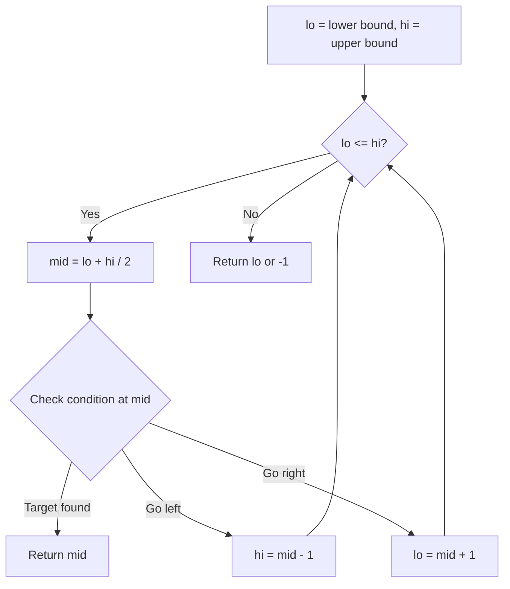
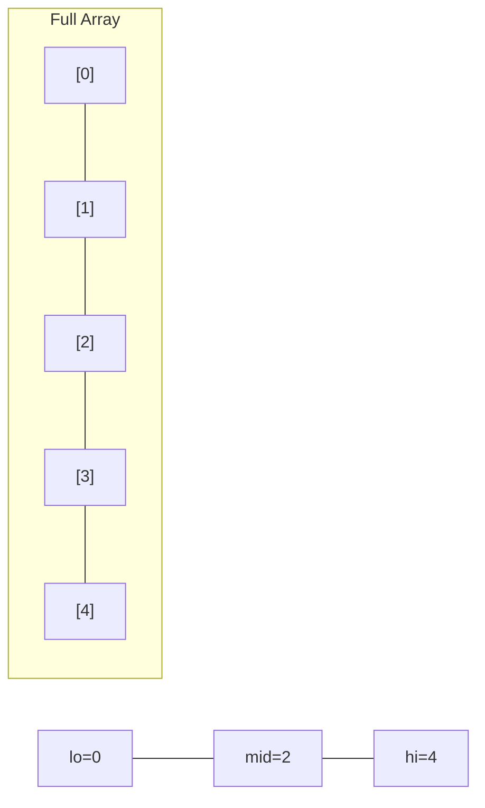
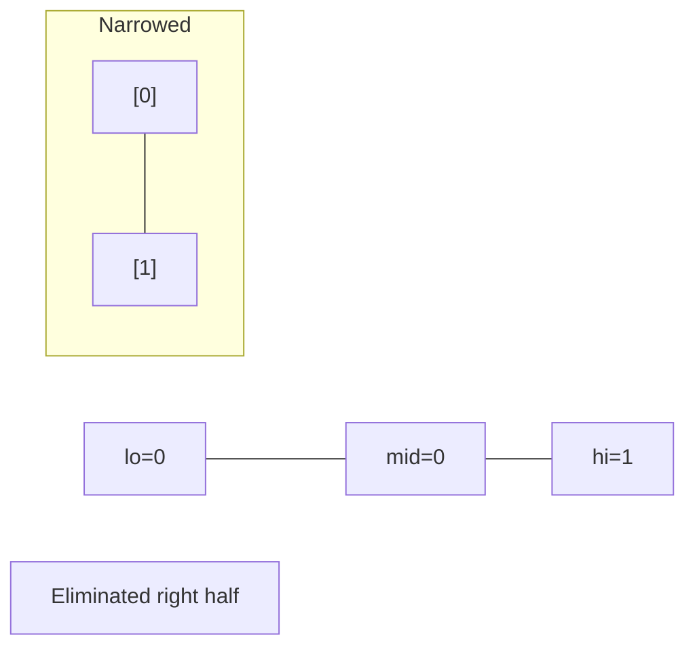
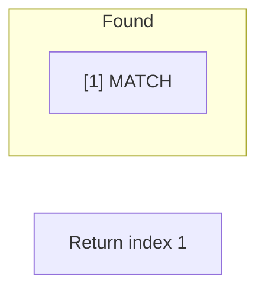

# Problem 826: Most Profit Assigning Work

**Difficulty:** Medium  
**Tags:** Array, Two Pointers, Binary Search, Greedy, Sorting  
**Pattern:** Binary Search  
**Link:** [leetcode.com/problems/most-profit-assigning-work](https://leetcode.com/problems/most-profit-assigning-work/)

## Description

You have `n` jobs and `m` workers. You are given three arrays: `difficulty`, `profit`, and `worker` where:

	- `difficulty[i]` and `profit[i]` are the difficulty and the profit of the `i^th` job, and
	- `worker[j]` is the ability of `j^th` worker (i.e., the `j^th` worker can only complete a job with difficulty at most `worker[j]`).

Every worker can be assigned **at most one job**, but one job can be **completed multiple times**.

	- For example, if three workers attempt the same job that pays `$1`, then the total profit will be `$3`. If a worker cannot complete any job, their profit is `$0`.

Return the maximum profit we can achieve after assigning the workers to the jobs.

 

Example 1:

```

**Input:** difficulty = [2,4,6,8,10], profit = [10,20,30,40,50], worker = [4,5,6,7]
**Output:** 100
**Explanation:** Workers are assigned jobs of difficulty [4,4,6,6] and they get a profit of [20,20,30,30] separately.

```

Example 2:

```

**Input:** difficulty = [85,47,57], profit = [24,66,99], worker = [40,25,25]
**Output:** 0

```

 

**Constraints:**

	- `n == difficulty.length`
	- `n == profit.length`
	- `m == worker.length`
	- `1 <= n, m <= 10^4`
	- `1 <= difficulty[i], profit[i], worker[i] <= 10^5`

## Approach: Binary Search

Use binary search to halve the search space each iteration. Define the search range [lo, hi], compute mid, and decide which half to keep based on the problem's monotonic condition.

## Pseudocode

```
1. lo = lower_bound, hi = upper_bound
2. While lo <= hi (or lo < hi):
   a. mid = (lo + hi) // 2
   b. If condition(mid) is satisfied: record answer, search left half
   c. Else: search right half
3. Return answer
```

## Algorithm Flow



## Visual State Transitions

**Binary Search Step-by-Step:**

**Frame 1: Initial search space**


**Frame 2: Compare mid, narrow search**


**Frame 3: Found target**



## Complexity Analysis

- **Time:** O(log n)
- **Space:** O(1)

## Solution (Python3)

```python
class Solution:
    def maxProfitAssignment(self, difficulty: List[int], profit: List[int], worker: List[int]) -> int:
        # Binary search - O(log n) time, O(1) space
        lo, hi = 0, len(difficulty) - 1
        while lo <= hi:
            mid = lo + (hi - lo) // 2
            if difficulty[mid] == profit:
                return mid
            elif difficulty[mid] < profit:
                lo = mid + 1
            else:
                hi = mid - 1
        return 0
```

## Solution (C++)

```cpp
#include <string>
#include <vector>
using namespace std;

class Solution {
public:
    int maxProfitAssignment(vector<int>& difficulty, vector<int>& profit, vector<int>& worker) {
        // Binary search - O(log n) time, O(1) space
        int lo = 0, hi = difficulty.size() - 1;
        while (lo <= hi) {
            int mid = lo + (hi - lo) / 2;
            if (difficulty[mid] == profit) {
                return mid;
            } else if (difficulty[mid] < profit) {
                lo = mid + 1;
            } else {
                hi = mid - 1;
            }
        }
        return 0;
    }
};
```
