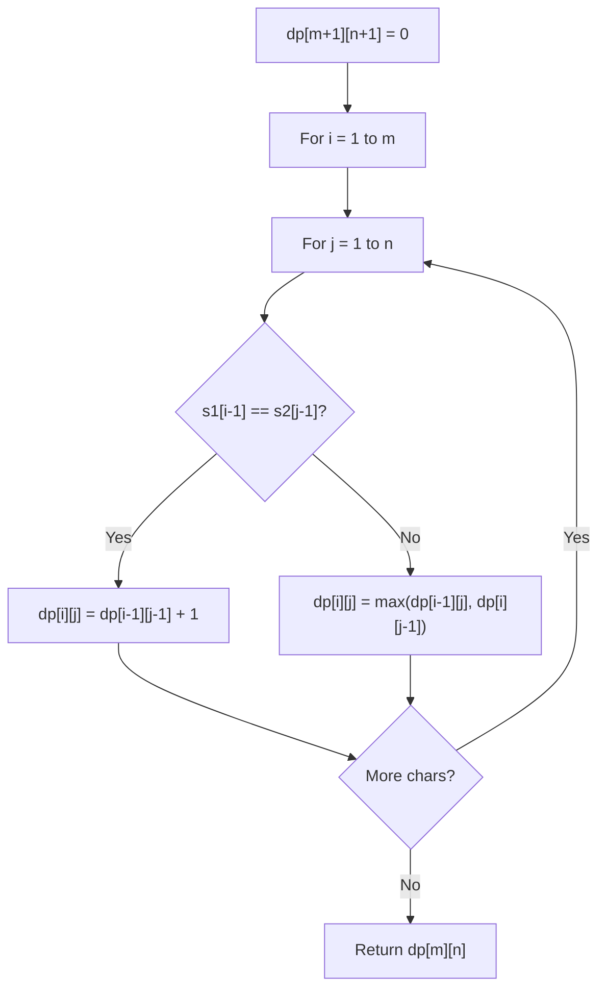

# Problem 828: Count Unique Characters of All Substrings of a Given String

**Difficulty:** Hard  
**Tags:** Hash Table, String, Dynamic Programming  
**Pattern:** Dynamic Programming (String)  
**Link:** [leetcode.com/problems/count-unique-characters-of-all-substrings-of-a-given-string](https://leetcode.com/problems/count-unique-characters-of-all-substrings-of-a-given-string/)

## Description

Let's define a function `countUniqueChars(s)` that returns the number of unique characters in `s`.

	- For example, calling `countUniqueChars(s)` if `s = "LEETCODE"` then `"L"`, `"T"`, `"C"`, `"O"`, `"D"` are the unique characters since they appear only once in `s`, therefore `countUniqueChars(s) = 5`.

Given a string `s`, return the sum of `countUniqueChars(t)` where `t` is a substring of `s`. The test cases are generated such that the answer fits in a 32-bit integer.

Notice that some substrings can be repeated so in this case you have to count the repeated ones too.

 

Example 1:

```

**Input:** s = "ABC"
**Output:** 10
**Explanation: **All possible substrings are: "A","B","C","AB","BC" and "ABC".
Every substring is composed with only unique letters.
Sum of lengths of all substring is 1 + 1 + 1 + 2 + 2 + 3 = 10

```

Example 2:

```

**Input:** s = "ABA"
**Output:** 8
**Explanation: **The same as example 1, except `countUniqueChars`("ABA") = 1.

```

Example 3:

```

**Input:** s = "LEETCODE"
**Output:** 92

```

 

**Constraints:**

	- `1 <= s.length <= 10^5`
	- `s` consists of uppercase English letters only.

## Approach: Dynamic Programming (String)

Compare or match two strings using a 2D DP table. dp[i][j] represents the answer for substrings s1[0..i-1] and s2[0..j-1]. Common patterns: LCS, edit distance, regex matching.

## Pseudocode

```
1. Create dp[m+1][n+1]
2. Initialize base cases
3. For i from 1 to m:
   For j from 1 to n:
     If s1[i-1] == s2[j-1]: dp[i][j] = dp[i-1][j-1] + 1
     Else: dp[i][j] = best of (dp[i-1][j], dp[i][j-1], dp[i-1][j-1])
4. Return dp[m][n]
```

## Algorithm Flow



## Complexity Analysis

- **Time:** O(m * n)
- **Space:** O(m * n)

## Solution (Python3)

```python
class Solution:
    def uniqueLetterString(self, s: str) -> int:
        # String DP - O(m*n) time and space
        m, n = len(s), len(s)
        dp = [[0] * (n + 1) for _ in range(m + 1)]
        for i in range(1, m + 1):
            for j in range(1, n + 1):
                if s[i-1] == s[j-1]:
                    dp[i][j] = dp[i-1][j-1] + 1
                else:
                    dp[i][j] = max(dp[i-1][j], dp[i][j-1])
        return dp[m][n]
```

## Solution (C++)

```cpp
#include <algorithm>
#include <string>
#include <vector>
using namespace std;

class Solution {
public:
    int uniqueLetterString(string& s) {
        // String DP - O(m*n) time and space
        int m = s.size(), n = s.size();
        vector<vector<int>> dp(m + 1, vector<int>(n + 1, 0));
        for (int i = 1; i <= m; i++) {
            for (int j = 1; j <= n; j++) {
                if (s[i-1] == s[j-1])
                    dp[i][j] = dp[i-1][j-1] + 1;
                else
                    dp[i][j] = max(dp[i-1][j], dp[i][j-1]);
            }
        }
        return dp[m][n];
    }
};
```
