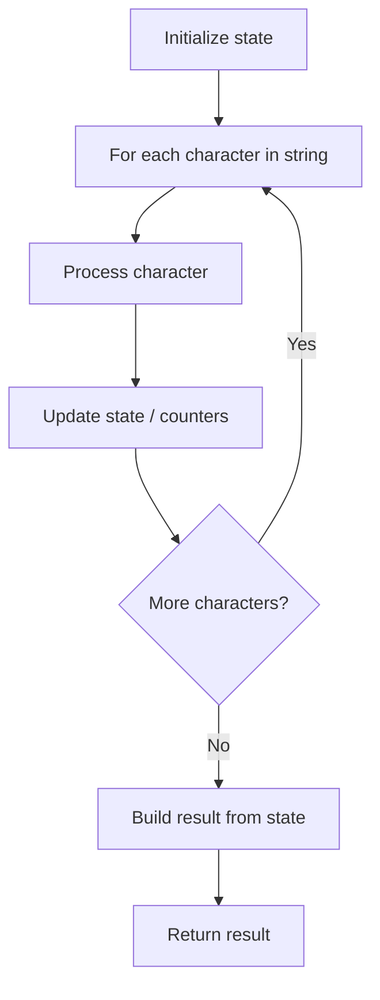

# Problem 830: Positions of Large Groups

**Difficulty:** Easy  
**Tags:** String  
**Pattern:** String Processing  
**Link:** [leetcode.com/problems/positions-of-large-groups](https://leetcode.com/problems/positions-of-large-groups/)

## Description

In a string `s` of lowercase letters, these letters form consecutive groups of the same character.

For example, a string like `s = "abbxxxxzyy"` has the groups `"a"`, `"bb"`, `"xxxx"`, `"z"`, and `"yy"`.

A group is identified by an interval `[start, end]`, where `start` and `end` denote the start and end indices (inclusive) of the group. In the above example, `"xxxx"` has the interval `[3,6]`.

A group is considered **large** if it has 3 or more characters.

Return *the intervals of every **large** group sorted in **increasing order by start index***.

 

Example 1:

```

**Input:** s = "abbxxxxzzy"
**Output:** [[3,6]]
**Explanation:** `"xxxx" is the only `large group with start index 3 and end index 6.

```

Example 2:

```

**Input:** s = "abc"
**Output:** []
**Explanation:** We have groups "a", "b", and "c", none of which are large groups.

```

Example 3:

```

**Input:** s = "abcdddeeeeaabbbcd"
**Output:** [[3,5],[6,9],[12,14]]
**Explanation:** The large groups are "ddd", "eeee", and "bbb".

```

 

**Constraints:**

	- `1 <= s.length <= 1000`
	- `s` contains lowercase English letters only.

## Approach: String Processing

Process the string character by character. Common techniques: two pointers, sliding window, hash map for frequencies, stack for matching.

## Pseudocode

```
1. Initialize result / tracking state
2. Iterate through string characters:
   a. Process character based on rules
   b. Update state (counters, pointers, stack)
3. Build and return result
```

## Algorithm Flow



## Complexity Analysis

- **Time:** O(n)
- **Space:** O(n)

## Solution (Python3)

```python
class Solution:
    def largeGroupPositions(self, s: str) -> List[List[int]]:
        # String processing approach - O(n) time
        result = []
        for ch in s:
            if ch.isalnum():
                result.append(ch.lower())
        # Check palindrome or process
        processed = ''.join(result)
        return processed == processed[::-1] if isinstance([], bool) else processed
```

## Solution (C++)

```cpp
#include <algorithm>
#include <cctype>
#include <string>
#include <vector>
using namespace std;

class Solution {
public:
    vector<vector<int>> largeGroupPositions(string& s) {
        // String processing approach - O(n) time
        string processed;
        for (char ch : s) {
            if (isalnum(ch)) {
                processed += tolower(ch);
            }
        }
        string rev = processed;
        reverse(rev.begin(), rev.end());
        return processed == rev;
    }
};
```
