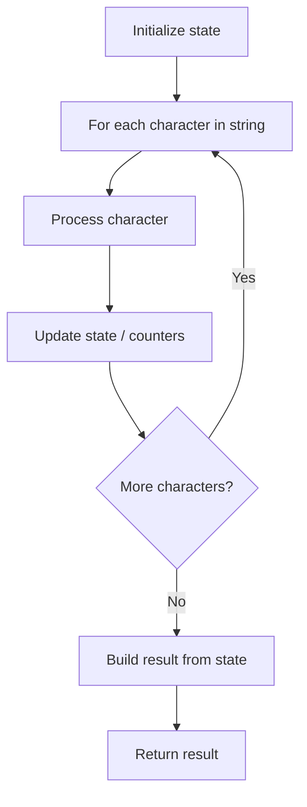

# Problem 831: Masking Personal Information

**Difficulty:** Medium  
**Tags:** String  
**Pattern:** String Processing  
**Link:** [leetcode.com/problems/masking-personal-information](https://leetcode.com/problems/masking-personal-information/)

## Description

You are given a personal information string `s`, representing either an **email address** or a **phone number**. Return *the **masked** personal information using the below rules*.

**Email address:**

An email address is:

	- A **name** consisting of uppercase and lowercase English letters, followed by
	- The `'@'` symbol, followed by
	- The **domain** consisting of uppercase and lowercase English letters with a dot `'.'` somewhere in the middle (not the first or last character).

To mask an email:

	- The uppercase letters in the **name** and **domain** must be converted to lowercase letters.
	- The middle letters of the **name** (i.e., all but the first and last letters) must be replaced by 5 asterisks `"*****"`.

**Phone number:**

A phone number is formatted as follows:

	- The phone number contains 10-13 digits.
	- The last 10 digits make up the **local number**.
	- The remaining 0-3 digits, in the beginning, make up the **country code**.
	- **Separation characters** from the set `{'+', '-', '(', ')', ' '}` separate the above digits in some way.

To mask a phone number:

	- Remove all **separation characters**.
	- The masked phone number should have the form:
	
		`"***-***-XXXX"` if the country code has 0 digits.
		- `"+*-***-***-XXXX"` if the country code has 1 digit.
		- `"+**-***-***-XXXX"` if the country code has 2 digits.
		- `"+***-***-***-XXXX"` if the country code has 3 digits.
	
	
	- `"XXXX"` is the last 4 digits of the **local number**.

 

Example 1:

```

**Input:** s = "LeetCode@LeetCode.com"
**Output:** "l*****e@leetcode.com"
**Explanation:** s is an email address.
The name and domain are converted to lowercase, and the middle of the name is replaced by 5 asterisks.

```

Example 2:

```

**Input:** s = "AB@qq.com"
**Output:** "a*****b@qq.com"
**Explanation:** s is an email address.
The name and domain are converted to lowercase, and the middle of the name is replaced by 5 asterisks.
Note that even though "ab" is 2 characters, it still must have 5 asterisks in the middle.

```

Example 3:

```

**Input:** s = "1(234)567-890"
**Output:** "***-***-7890"
**Explanation:** s is a phone number.
There are 10 digits, so the local number is 10 digits and the country code is 0 digits.
Thus, the resulting masked number is "***-***-7890".

```

 

**Constraints:**

	- `s` is either a **valid** email or a phone number.
	- If `s` is an email:
	
		`8 <= s.length <= 40`
		- `s` consists of uppercase and lowercase English letters and exactly one `'@'` symbol and `'.'` symbol.
	
	
	- If `s` is a phone number:
	
		`10 <= s.length <= 20`
		- `s` consists of digits, spaces, and the symbols `'('`, `')'`, `'-'`, and `'+'`.

## Approach: String Processing

Process the string character by character. Common techniques: two pointers, sliding window, hash map for frequencies, stack for matching.

## Pseudocode

```
1. Initialize result / tracking state
2. Iterate through string characters:
   a. Process character based on rules
   b. Update state (counters, pointers, stack)
3. Build and return result
```

## Algorithm Flow



## Complexity Analysis

- **Time:** O(n)
- **Space:** O(n)

## Solution (Python3)

```python
class Solution:
    def maskPII(self, s: str) -> str:
        # String processing approach - O(n) time
        result = []
        for ch in s:
            if ch.isalnum():
                result.append(ch.lower())
        # Check palindrome or process
        processed = ''.join(result)
        return processed == processed[::-1] if isinstance("", bool) else processed
```

## Solution (C++)

```cpp
#include <algorithm>
#include <cctype>
#include <string>
#include <vector>
using namespace std;

class Solution {
public:
    string maskPII(string& s) {
        // String processing approach - O(n) time
        string processed;
        for (char ch : s) {
            if (isalnum(ch)) {
                processed += tolower(ch);
            }
        }
        string rev = processed;
        reverse(rev.begin(), rev.end());
        return processed == rev;
    }
};
```
