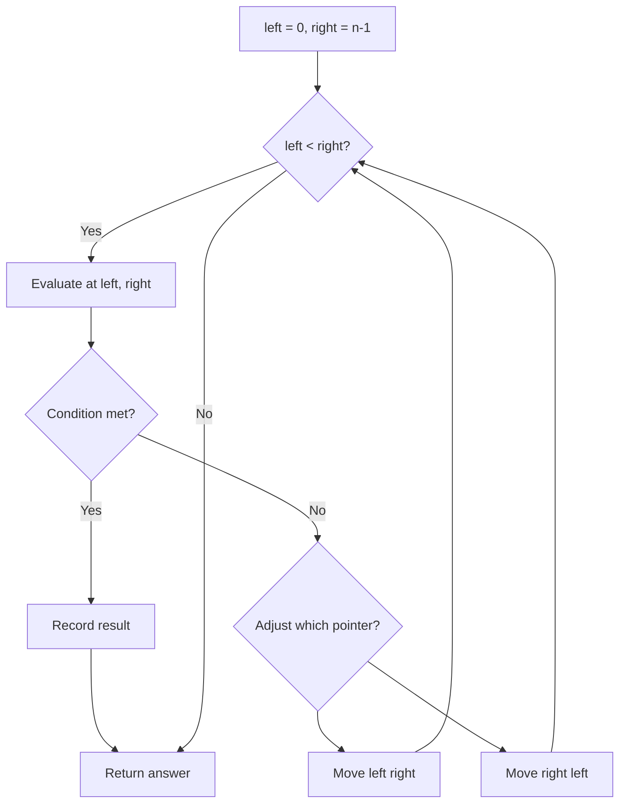
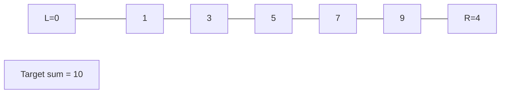
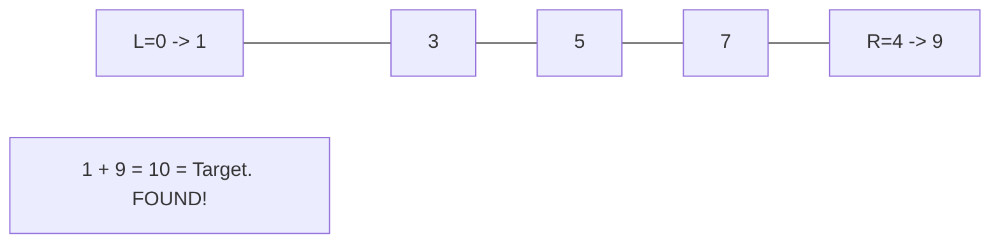

# Problem 832: Flipping an Image

**Difficulty:** Easy  
**Tags:** Array, Two Pointers, Bit Manipulation, Matrix, Simulation  
**Pattern:** Two Pointers  
**Link:** [leetcode.com/problems/flipping-an-image](https://leetcode.com/problems/flipping-an-image/)

## Description

Given an `n x n` binary matrix `image`, flip the image **horizontally**, then invert it, and return *the resulting image*.

To flip an image horizontally means that each row of the image is reversed.

	- For example, flipping `[1,1,0]` horizontally results in `[0,1,1]`.

To invert an image means that each `0` is replaced by `1`, and each `1` is replaced by `0`.

	- For example, inverting `[0,1,1]` results in `[1,0,0]`.

 

Example 1:

```

**Input:** image = [[1,1,0],[1,0,1],[0,0,0]]
**Output:** [[1,0,0],[0,1,0],[1,1,1]]
**Explanation:** First reverse each row: [[0,1,1],[1,0,1],[0,0,0]].
Then, invert the image: [[1,0,0],[0,1,0],[1,1,1]]

```

Example 2:

```

**Input:** image = [[1,1,0,0],[1,0,0,1],[0,1,1,1],[1,0,1,0]]
**Output:** [[1,1,0,0],[0,1,1,0],[0,0,0,1],[1,0,1,0]]
**Explanation:** First reverse each row: [[0,0,1,1],[1,0,0,1],[1,1,1,0],[0,1,0,1]].
Then invert the image: [[1,1,0,0],[0,1,1,0],[0,0,0,1],[1,0,1,0]]

```

 

**Constraints:**

	- `n == image.length`
	- `n == image[i].length`
	- `1 <= n <= 20`
	- `images[i][j]` is either `0` or `1`.

## Approach: Two Pointers

Use two pointers moving through the data structure. Depending on the problem, pointers may move toward each other (converging), in the same direction (fast/slow), or independently.

## Pseudocode

```
1. Initialize left = 0, right = n-1 (or two independent pointers)
2. While pointers haven't crossed:
   a. Evaluate condition at pointer positions
   b. Move left pointer right or right pointer left
3. Return result
```

## Algorithm Flow



## Visual State Transitions

**Two Pointer Convergence:**

**Frame 1: Initialize pointers**


**Frame 2: Sum = 1+9 = 10, found!**



## Complexity Analysis

- **Time:** O(n)
- **Space:** O(1)

## Solution (Python3)

```python
class Solution:
    def flipAndInvertImage(self, image: List[List[int]]) -> List[List[int]]:
        # Two pointer approach - O(n) time, O(1) space
        left, right = 0, len(image) - 1
        while left < right:
            curr = image[left] + image[right]
            if curr == image:
                return [left, right]
            elif curr < image:
                left += 1
            else:
                right -= 1
        return []
```

## Solution (C++)

```cpp
#include <string>
#include <vector>
using namespace std;

class Solution {
public:
    vector<vector<int>> flipAndInvertImage(vector<vector<int>>& image) {
        // Two pointer approach - O(n) time, O(1) space
        int left = 0, right = image.size() - 1;
        while (left < right) {
            int curr = image[left] + image[right];
            if (curr == image) {
                return {left, right};
            } else if (curr < image) {
                left++;
            } else {
                right--;
            }
        }
        return {};
    }
};
```
