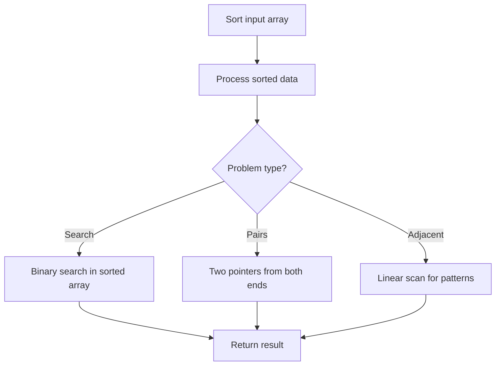

# Problem 833: Find And Replace in String

**Difficulty:** Medium  
**Tags:** Array, Hash Table, String, Sorting  
**Pattern:** Sorting  
**Link:** [leetcode.com/problems/find-and-replace-in-string](https://leetcode.com/problems/find-and-replace-in-string/)

## Description

You are given a **0-indexed** string `s` that you must perform `k` replacement operations on. The replacement operations are given as three **0-indexed** parallel arrays, `indices`, `sources`, and `targets`, all of length `k`.

To complete the `i^th` replacement operation:

	- Check if the **substring** `sources[i]` occurs at index `indices[i]` in the **original string** `s`.
	- If it does not occur, **do nothing**.
	- Otherwise if it does occur, **replace** that substring with `targets[i]`.

For example, if `s = "abcd"`, `indices[i] = 0`, `sources[i] = "ab"`, and `targets[i] = "eee"`, then the result of this replacement will be `"eeecd"`.

All replacement operations must occur **simultaneously**, meaning the replacement operations should not affect the indexing of each other. The testcases will be generated such that the replacements will **not overlap**.

	- For example, a testcase with `s = "abc"`, `indices = [0, 1]`, and `sources = ["ab","bc"]` will not be generated because the `"ab"` and `"bc"` replacements overlap.

Return *the **resulting string** after performing all replacement operations on *`s`.

A **substring** is a contiguous sequence of characters in a string.

 

Example 1:

```

**Input:** s = "abcd", indices = [0, 2], sources = ["a", "cd"], targets = ["eee", "ffff"]
**Output:** "eeebffff"
**Explanation:**
"a" occurs at index 0 in s, so we replace it with "eee".
"cd" occurs at index 2 in s, so we replace it with "ffff".

```

Example 2:

```

**Input:** s = "abcd", indices = [0, 2], sources = ["ab","ec"], targets = ["eee","ffff"]
**Output:** "eeecd"
**Explanation:**
"ab" occurs at index 0 in s, so we replace it with "eee".
"ec" does not occur at index 2 in s, so we do nothing.

```

 

**Constraints:**

	- `1 <= s.length <= 1000`
	- `k == indices.length == sources.length == targets.length`
	- `1 <= k <= 100`
	- `0 <= indexes[i] < s.length`
	- `1 <= sources[i].length, targets[i].length <= 50`
	- `s` consists of only lowercase English letters.
	- `sources[i]` and `targets[i]` consist of only lowercase English letters.

## Approach: Sorting

Sort the data to enable efficient processing. After sorting, use techniques like binary search, two pointers, or linear scan to solve the problem.

## Pseudocode

```
1. Sort the input array
2. Process sorted data:
   - Use binary search for lookups
   - Use two pointers for pair finding
   - Scan for adjacent patterns
3. Return result
```

## Algorithm Flow



## Complexity Analysis

- **Time:** O(n log n)
- **Space:** O(n)

## Solution (Python3)

```python
class Solution:
    def findReplaceString(self, s: str, indices: List[int], sources: List[str], targets: List[str]) -> str:
        # Sort-based approach - O(n log n) time
        s.sort(key=lambda x: x[0] if isinstance(x, (list, tuple)) else x)
        result = [s[0]]
        for i in range(1, len(s)):
            curr = s[i]
            if isinstance(curr, (list, tuple)) and isinstance(result[-1], (list, tuple)):
                if curr[0] <= result[-1][1]:
                    result[-1] = [result[-1][0], max(result[-1][1], curr[1])]
                else:
                    result.append(curr)
            else:
                result.append(curr)
        return result
```

## Solution (C++)

```cpp
#include <algorithm>
#include <string>
#include <vector>
using namespace std;

class Solution {
public:
    string findReplaceString(string& s, vector<int>& indices, vector<string>& sources, vector<string>& targets) {
        // Sort-based approach - O(n log n) time
        sort(s.begin(), s.end());
        vector<vector<int>> result;
        result.push_back(s[0]);
        for (int i = 1; i < (int)s.size(); i++) {
            if (s[i][0] <= result.back()[1]) {
                result.back()[1] = max(result.back()[1], s[i][1]);
            } else {
                result.push_back(s[i]);
            }
        }
        return result;
    }
};
```
