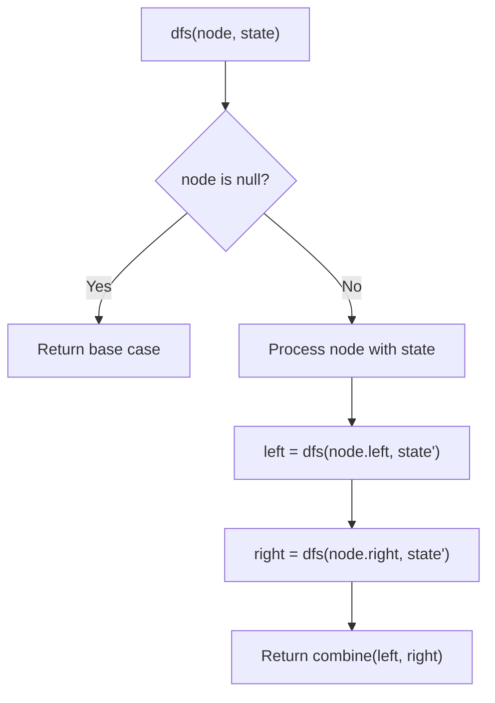
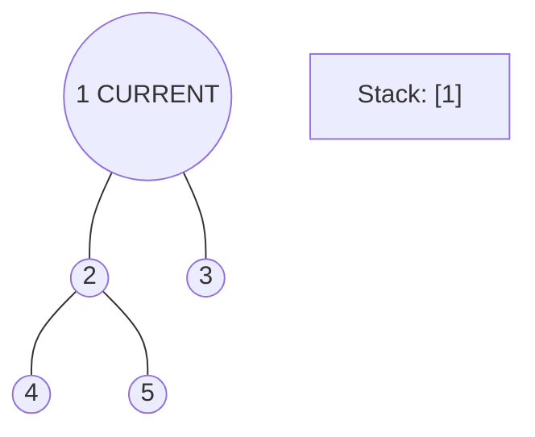
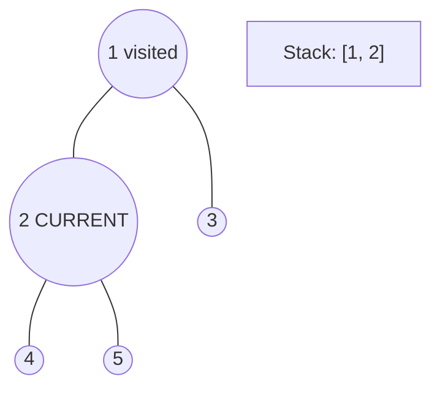
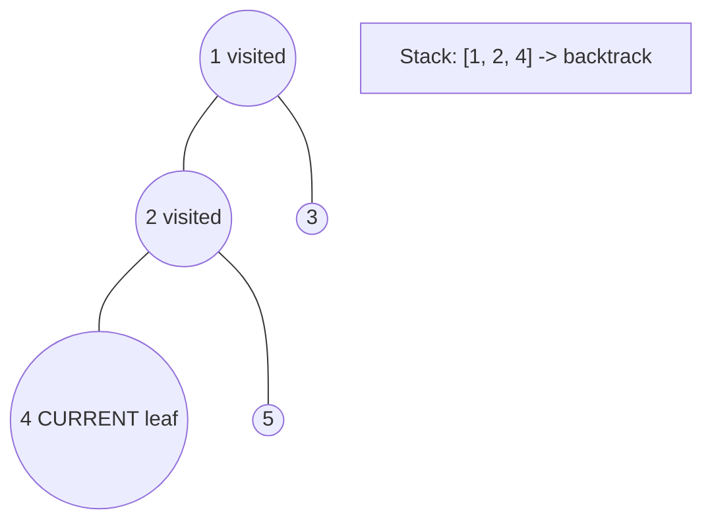
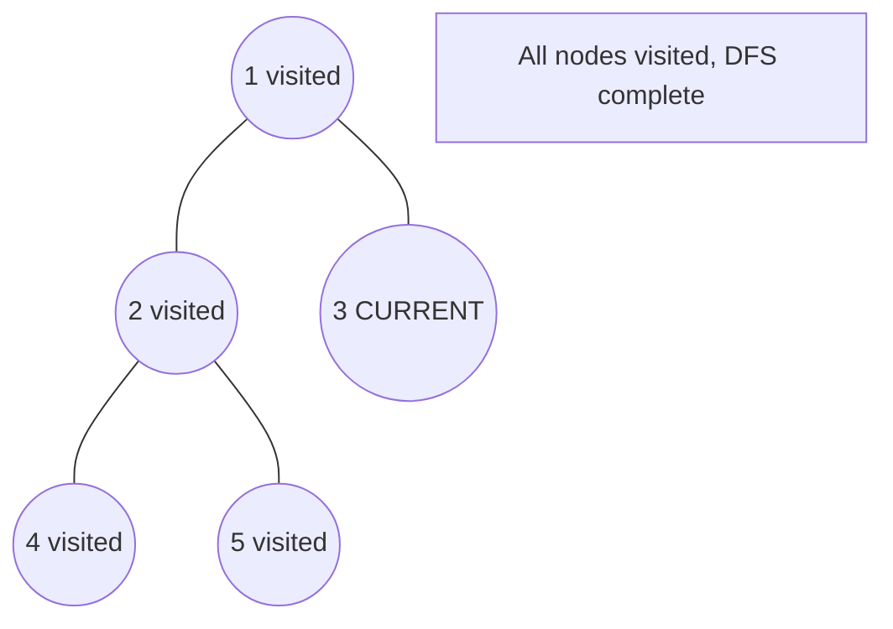

# Problem 834: Sum of Distances in Tree

**Difficulty:** Hard  
**Tags:** Dynamic Programming, Tree, Depth-First Search, Graph Theory  
**Pattern:** DFS Tree Traversal  
**Link:** [leetcode.com/problems/sum-of-distances-in-tree](https://leetcode.com/problems/sum-of-distances-in-tree/)

## Description

There is an undirected connected tree with `n` nodes labeled from `0` to `n - 1` and `n - 1` edges.

You are given the integer `n` and the array `edges` where `edges[i] = [ai, bi]` indicates that there is an edge between nodes `ai` and `bi` in the tree.

Return an array `answer` of length `n` where `answer[i]` is the sum of the distances between the `i^th` node in the tree and all other nodes.

 

Example 1:

```

**Input:** n = 6, edges = [[0,1],[0,2],[2,3],[2,4],[2,5]]
**Output:** [8,12,6,10,10,10]
**Explanation:** The tree is shown above.
We can see that dist(0,1) + dist(0,2) + dist(0,3) + dist(0,4) + dist(0,5)
equals 1 + 1 + 2 + 2 + 2 = 8.
Hence, answer[0] = 8, and so on.

```

Example 2:

```

**Input:** n = 1, edges = []
**Output:** [0]

```

Example 3:

```

**Input:** n = 2, edges = [[1,0]]
**Output:** [1,1]

```

 

**Constraints:**

	- `1 <= n <= 3 * 10^4`
	- `edges.length == n - 1`
	- `edges[i].length == 2`
	- `0 <= ai, bi < n`
	- `ai != bi`
	- The given input represents a valid tree.

## Approach: DFS Tree Traversal

Perform depth-first search on the tree. Recurse on left and right subtrees, combining results bottom-up. Track state (path, depth, sum) during traversal.

## Pseudocode

```
1. Define dfs(node, state):
   a. Base case: if null, return default
   b. Process node with current state
   c. left_result = dfs(node.left, updated_state)
   d. right_result = dfs(node.right, updated_state)
   e. Return combine(left_result, right_result)
2. Return dfs(root, initial_state)
```

## Algorithm Flow



## Visual State Transitions

**DFS Tree Traversal Step-by-Step:**

**Frame 1: Start at root**


**Frame 2: Go left - visit node 2**


**Frame 3: Go left - visit node 4 (leaf)**


**Frame 4: Backtrack, visit node 5, then node 3**



## Complexity Analysis

- **Time:** O(n)
- **Space:** O(h)

## Solution (Python3)

```python
class Solution:
    def sumOfDistancesInTree(self, n: int, edges: List[List[int]]) -> List[int]:
        # DFS on binary tree - O(n) time, O(h) space
        def dfs(node):
            if not node:
                return 0
            left = dfs(node.left)
            right = dfs(node.right)
            return 1 + max(left, right)
        
        result = dfs(n)
        return result
```

## Solution (C++)

```cpp
#include <algorithm>
#include <functional>
#include <string>
#include <vector>
using namespace std;

class Solution {
public:
    vector<int> sumOfDistancesInTree(int n, vector<vector<int>>& edges) {
        // DFS on binary tree - O(n) time, O(h) space
        function<int(TreeNode*)> dfs = [&](TreeNode* node) -> int {
            if (!node) return 0;
            int left = dfs(node->left);
            int right = dfs(node->right);
            return 1 + max(left, right);
        };
        return dfs(n);
    }
};
```
