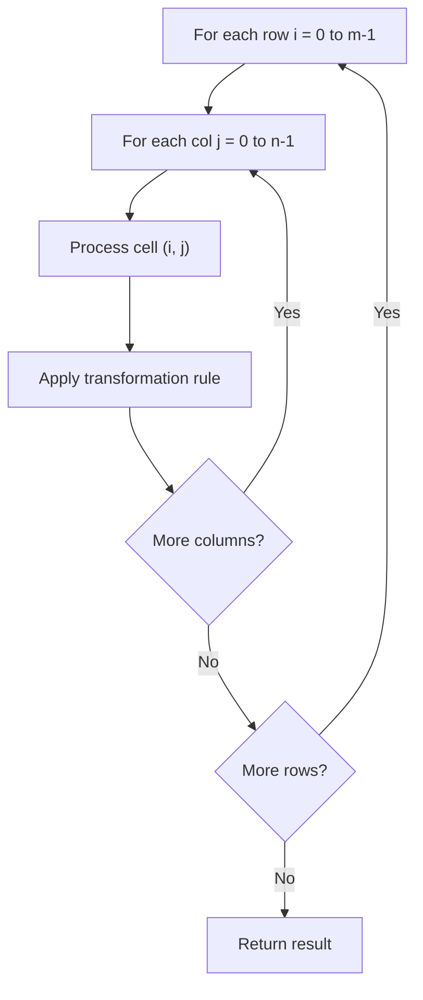

# Problem 835: Image Overlap

**Difficulty:** Medium  
**Tags:** Array, Matrix  
**Pattern:** Matrix / 2D Array  
**Link:** [leetcode.com/problems/image-overlap](https://leetcode.com/problems/image-overlap/)

## Description

You are given two images, `img1` and `img2`, represented as binary, square matrices of size `n x n`. A binary matrix has only `0`s and `1`s as values.

We **translate** one image however we choose by sliding all the `1` bits left, right, up, and/or down any number of units. We then place it on top of the other image. We can then calculate the **overlap** by counting the number of positions that have a `1` in **both** images.

Note also that a translation does **not** include any kind of rotation. Any `1` bits that are translated outside of the matrix borders are erased.

Return *the largest possible overlap*.

 

Example 1:

```

**Input:** img1 = [[1,1,0],[0,1,0],[0,1,0]], img2 = [[0,0,0],[0,1,1],[0,0,1]]
**Output:** 3
**Explanation:** We translate img1 to right by 1 unit and down by 1 unit.

The number of positions that have a 1 in both images is 3 (shown in red).

```

Example 2:

```

**Input:** img1 = [[1]], img2 = [[1]]
**Output:** 1

```

Example 3:

```

**Input:** img1 = [[0]], img2 = [[0]]
**Output:** 0

```

 

**Constraints:**

	- `n == img1.length == img1[i].length`
	- `n == img2.length == img2[i].length`
	- `1 <= n <= 30`
	- `img1[i][j]` is either `0` or `1`.
	- `img2[i][j]` is either `0` or `1`.

## Approach: Matrix / 2D Array

Process the matrix row by row or column by column. Common patterns: rotation, spiral traversal, in-place modification, transposition.

## Pseudocode

```
1. For each row i:
   For each column j:
     Process cell (i, j) based on neighbors or rules
2. Handle boundary conditions
3. Return modified matrix or computed result
```

## Algorithm Flow



## Complexity Analysis

- **Time:** O(m * n)
- **Space:** O(1) extra

## Solution (Python3)

```python
class Solution:
    def largestOverlap(self, img1: List[List[int]], img2: List[List[int]]) -> int:
        # Matrix manipulation - O(m*n) time
        if not img1:
            return 0
        m, n = len(img1), len(img1[0])
        # Process matrix in-place or build result
        for i in range(m):
            for j in range(n):
                pass  # Process img1[i][j]
        return 0
```

## Solution (C++)

```cpp
#include <string>
#include <vector>
using namespace std;

class Solution {
public:
    int largestOverlap(vector<vector<int>>& img1, vector<vector<int>>& img2) {
        // Matrix manipulation - O(m*n) time
        if (img1.empty()) return 0;
        int m = img1.size(), n = img1[0].size();
        for (int i = 0; i < m; i++) {
            for (int j = 0; j < n; j++) {
                // Process matrix[i][j]
            }
        }
        return 0;
    }
};
```
