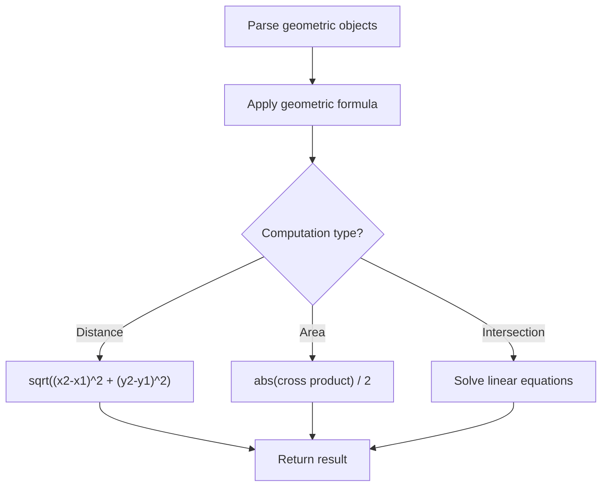

# Problem 836: Rectangle Overlap

**Difficulty:** Easy  
**Tags:** Math, Geometry  
**Pattern:** Geometry  
**Link:** [leetcode.com/problems/rectangle-overlap](https://leetcode.com/problems/rectangle-overlap/)

## Description

An axis-aligned rectangle is represented as a list `[x1, y1, x2, y2]`, where `(x1, y1)` is the coordinate of its bottom-left corner, and `(x2, y2)` is the coordinate of its top-right corner. Its top and bottom edges are parallel to the X-axis, and its left and right edges are parallel to the Y-axis.

Two rectangles overlap if the area of their intersection is **positive**. To be clear, two rectangles that only touch at the corner or edges do not overlap.

Given two axis-aligned rectangles `rec1` and `rec2`, return `true`* if they overlap, otherwise return *`false`.

 

Example 1:

```
**Input:** rec1 = [0,0,2,2], rec2 = [1,1,3,3]
**Output:** true

```
Example 2:

```
**Input:** rec1 = [0,0,1,1], rec2 = [1,0,2,1]
**Output:** false

```
Example 3:

```
**Input:** rec1 = [0,0,1,1], rec2 = [2,2,3,3]
**Output:** false

```

 

**Constraints:**

	- `rec1.length == 4`
	- `rec2.length == 4`
	- `-10^9 <= rec1[i], rec2[i] <= 10^9`
	- `rec1` and `rec2` represent a valid rectangle with a non-zero area.

## Approach: Geometry

Apply geometric formulas: distance, area, cross product, convex hull, line intersection. Handle floating-point precision carefully.

## Pseudocode

```
1. Parse geometric objects (points, lines, shapes)
2. Apply geometric operations:
   - Distance formula
   - Cross/dot product
   - Area computation
3. Handle precision and edge cases
4. Return result
```

## Algorithm Flow



## Complexity Analysis

- **Time:** O(n^2) or O(n log n)
- **Space:** O(n)

## Solution (Python3)

```python
class Solution:
    def isRectangleOverlap(self, rec1: List[int], rec2: List[int]) -> bool:
        # Geometry approach
        import math
        result = 0
        for i in range(len(rec1)):
            for j in range(i + 1, len(rec1)):
                dx = rec1[i][0] - rec1[j][0]
                dy = rec1[i][1] - rec1[j][1]
                dist = math.sqrt(dx*dx + dy*dy)
                result = max(result, dist)
        return result
```

## Solution (C++)

```cpp
#include <algorithm>
#include <cmath>
#include <string>
#include <vector>
using namespace std;

class Solution {
public:
    bool isRectangleOverlap(vector<int>& rec1, vector<int>& rec2) {
        // Geometry approach
        double result = 0;
        for (int i = 0; i < (int)rec1.size(); i++) {
            for (int j = i + 1; j < (int)rec1.size(); j++) {
                double dx = rec1[i][0] - rec1[j][0];
                double dy = rec1[i][1] - rec1[j][1];
                result = max(result, sqrt(dx*dx + dy*dy));
            }
        }
        return result;
    }
};
```
