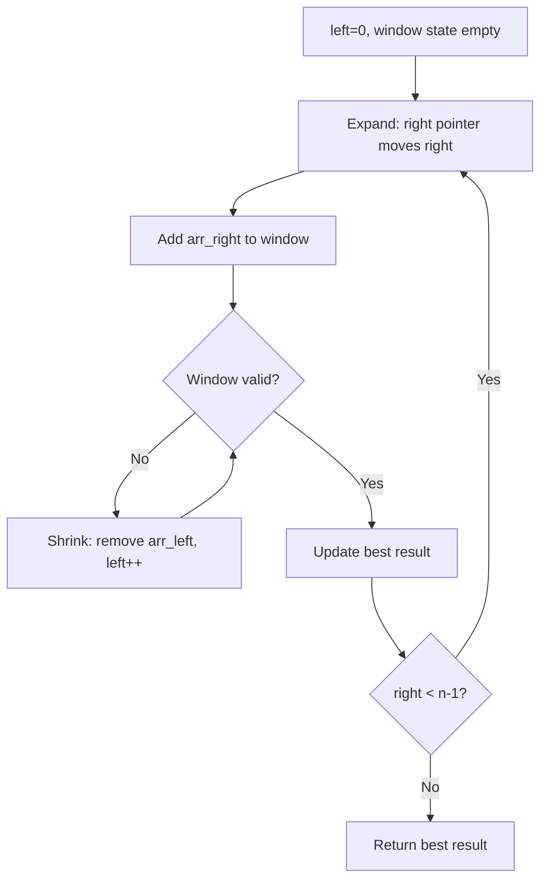
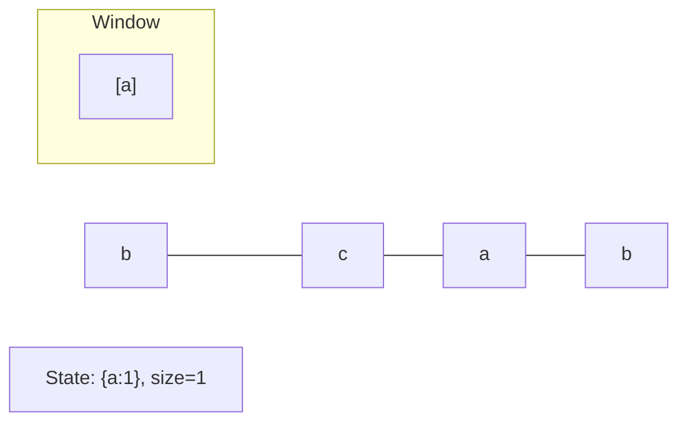
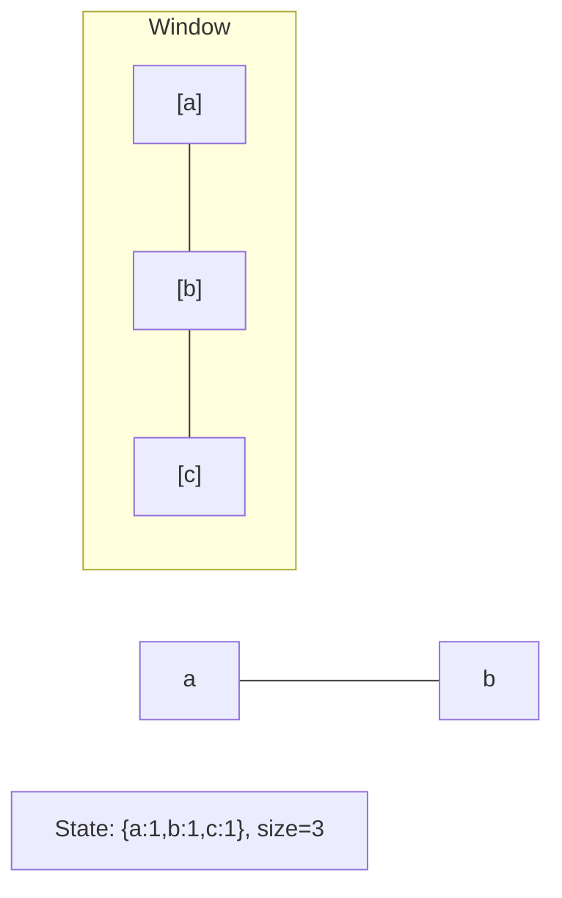
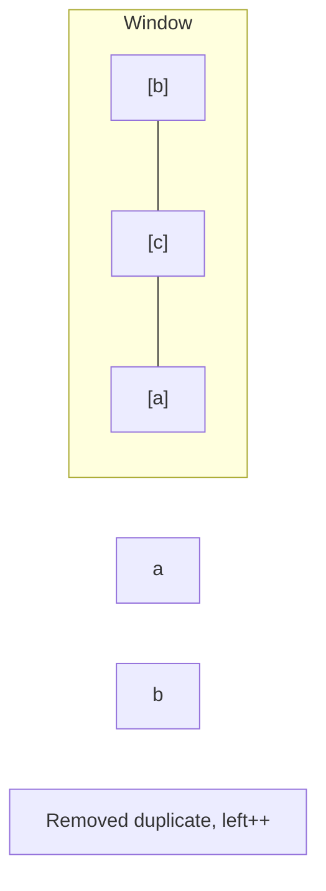
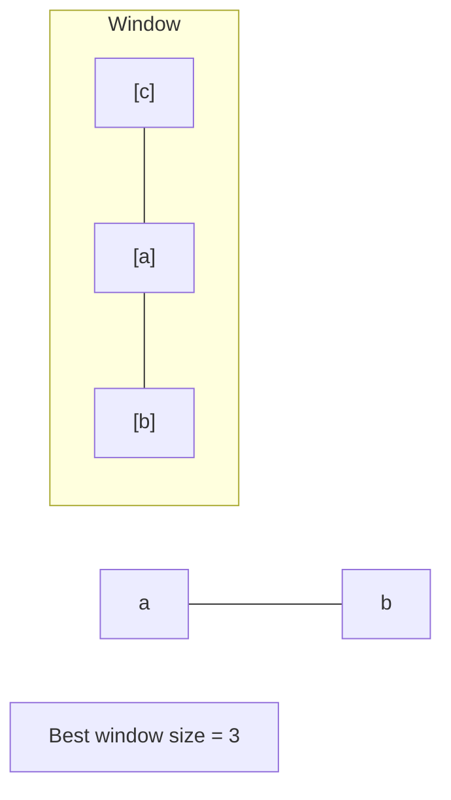

# Problem 837: New 21 Game

**Difficulty:** Medium  
**Tags:** Math, Dynamic Programming, Sliding Window, Probability and Statistics  
**Pattern:** Sliding Window  
**Link:** [leetcode.com/problems/new-21-game](https://leetcode.com/problems/new-21-game/)

## Description

Alice plays the following game, loosely based on the card game **"21"**.

Alice starts with `0` points and draws numbers while she has less than `k` points. During each draw, she gains an integer number of points randomly from the range `[1, maxPts]`, where `maxPts` is an integer. Each draw is independent and the outcomes have equal probabilities.

Alice stops drawing numbers when she gets `k` **or more points**.

Return the probability that Alice has `n` or fewer points.

Answers within `10^-5` of the actual answer are considered accepted.

 

Example 1:

```

**Input:** n = 10, k = 1, maxPts = 10
**Output:** 1.00000
**Explanation:** Alice gets a single card, then stops.

```

Example 2:

```

**Input:** n = 6, k = 1, maxPts = 10
**Output:** 0.60000
**Explanation:** Alice gets a single card, then stops.
In 6 out of 10 possibilities, she is at or below 6 points.

```

Example 3:

```

**Input:** n = 21, k = 17, maxPts = 10
**Output:** 0.73278

```

 

**Constraints:**

	- `0 <= k <= n <= 10^4`
	- `1 <= maxPts <= 10^4`

## Approach: Sliding Window

Maintain a window over the data using two pointers. Expand the right boundary to include new elements, and shrink the left boundary when the window constraint is violated. Track the optimal window.

## Pseudocode

```
1. Initialize left = 0, result = initial_value
2. For right in range(n):
   a. Add element at right to window state
   b. While window is invalid:
      - Remove element at left from window state
      - left++
   c. Update result = best of (result, window size/value)
3. Return result
```

## Algorithm Flow



## Visual State Transitions

**Sliding Window Step-by-Step:**

**Frame 1: Initial window (left=0, right=0)**


**Frame 2: Expand right (right=2)**


**Frame 3: Violation - shrink left**


**Frame 4: Continue expanding**



## Complexity Analysis

- **Time:** O(n)
- **Space:** O(k)

## Solution (Python3)

```python
class Solution:
    def new21Game(self, n: int, k: int, maxPts: int) -> float:
        # Sliding window approach - O(n) time, O(k) space
        from collections import defaultdict
        window = defaultdict(int)
        left = 0
        result = 0
        for right in range(len(n)):
            window[n[right]] += 1
            while len(window) > (k if isinstance(k, int) else len(n)):
                window[n[left]] -= 1
                if window[n[left]] == 0:
                    del window[n[left]]
                left += 1
            result = max(result, right - left + 1)
        return result
```

## Solution (C++)

```cpp
#include <algorithm>
#include <string>
#include <unordered_map>
#include <vector>
using namespace std;

class Solution {
public:
    double new21Game(int n, int k, int maxPts) {
        // Sliding window approach - O(n) time, O(k) space
        unordered_map<char, int> window;
        int left = 0, result = 0;
        for (int right = 0; right < n.size(); right++) {
            window[n[right]]++;
            while ((int)window.size() > k) {
                window[n[left]]--;
                if (window[n[left]] == 0)
                    window.erase(n[left]);
                left++;
            }
            result = max(result, right - left + 1);
        }
        return result;
    }
};
```
