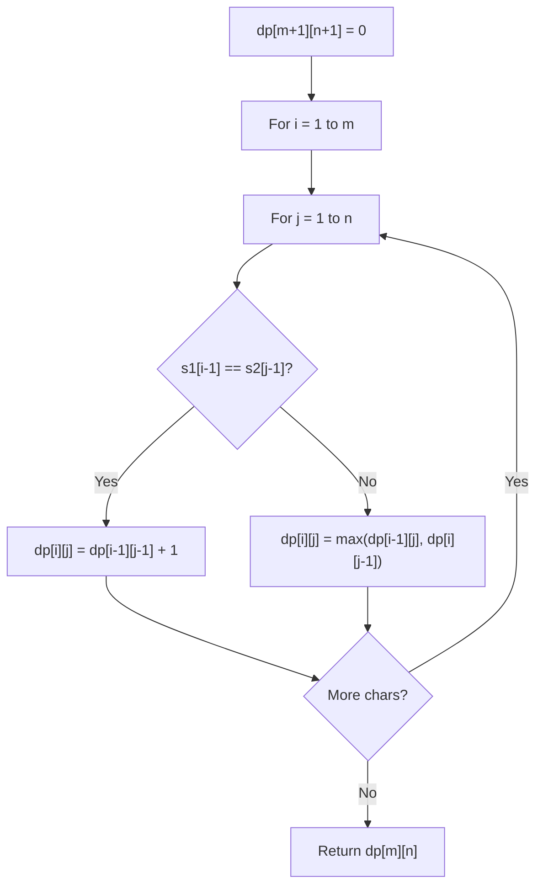

# Problem 838: Push Dominoes

**Difficulty:** Medium  
**Tags:** Two Pointers, String, Dynamic Programming  
**Pattern:** Two Pass Simulation  
**Link:** [leetcode.com/problems/push-dominoes](https://leetcode.com/problems/push-dominoes/)

## Description

There are `n` dominoes in a line, and we place each domino vertically upright. In the beginning, we simultaneously push some of the dominoes either to the left or to the right.

After each second, each domino that is falling to the left pushes the adjacent domino on the left. Similarly, the dominoes falling to the right push their adjacent dominoes standing on the right.

When a vertical domino has dominoes falling on it from both sides, it stays still due to the balance of the forces.

For the purposes of this question, we will consider that a falling domino expends no additional force to a falling or already fallen domino.

You are given a string `dominoes` representing the initial state where:

	- `dominoes[i] = 'L'`, if the `i^th` domino has been pushed to the left,
	- `dominoes[i] = 'R'`, if the `i^th` domino has been pushed to the right, and
	- `dominoes[i] = '.'`, if the `i^th` domino has not been pushed.

Return *a string representing the final state*.

 

Example 1:

```

**Input:** dominoes = "RR.L"
**Output:** "RR.L"
**Explanation:** The first domino expends no additional force on the second domino.

```

Example 2:

```

**Input:** dominoes = ".L.R...LR..L.."
**Output:** "LL.RR.LLRRLL.."

```

 

**Constraints:**

	- `n == dominoes.length`
	- `1 <= n <= 10^5`
	- `dominoes[i]` is either `'L'`, `'R'`, or `'.'`.

## Approach: Two Pass Simulation

Two passes: left-to-right for R forces, right-to-left for L forces. Net force determines direction.

## Pseudocode

```
1. Create dp[m+1][n+1]
2. Initialize base cases
3. For i from 1 to m:
   For j from 1 to n:
     If s1[i-1] == s2[j-1]: dp[i][j] = dp[i-1][j-1] + 1
     Else: dp[i][j] = best of (dp[i-1][j], dp[i][j-1], dp[i-1][j-1])
4. Return dp[m][n]
```

## Algorithm Flow



## Complexity Analysis

- **Time:** O(n)
- **Space:** O(n)

## Solution (Python3)

```python
class Solution:
    def pushDominoes(self, dominoes: str) -> str:
        d = list(dominoes)
        n = len(d)
        forces = [0] * n
        f = 0
        for i in range(n):
            if d[i] == 'R':
                f = n
            elif d[i] == 'L':
                f = 0
            else:
                f = max(f - 1, 0)
            forces[i] += f
        f = 0
        for i in range(n - 1, -1, -1):
            if d[i] == 'L':
                f = n
            elif d[i] == 'R':
                f = 0
            else:
                f = max(f - 1, 0)
            forces[i] -= f
        return ''.join('R' if f > 0 else 'L' if f < 0 else '.' for f in forces)
```

## Solution (C++)

```cpp
#include <algorithm>
#include <string>
#include <vector>
using namespace std;

class Solution {
public:
    string pushDominoes(string& dominoes) {
        // String DP - O(m*n) time and space
        int m = dominoes.size(), n = dominoes.size();
        vector<vector<int>> dp(m + 1, vector<int>(n + 1, 0));
        for (int i = 1; i <= m; i++) {
            for (int j = 1; j <= n; j++) {
                if (dominoes[i-1] == dominoes[j-1])
                    dp[i][j] = dp[i-1][j-1] + 1;
                else
                    dp[i][j] = max(dp[i-1][j], dp[i][j-1]);
            }
        }
        return dp[m][n];
    }
};
```
