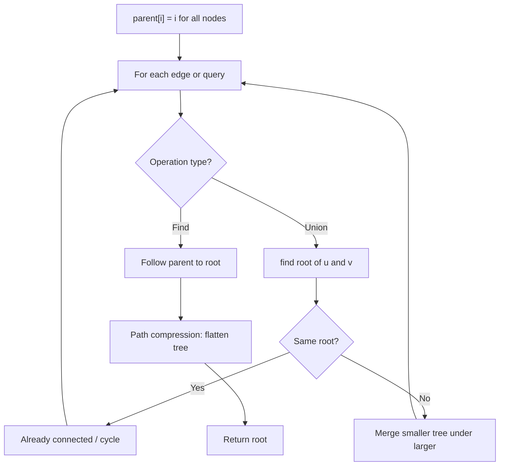
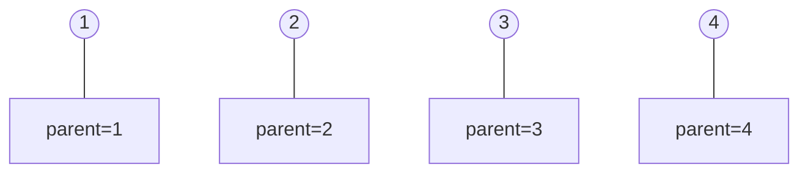
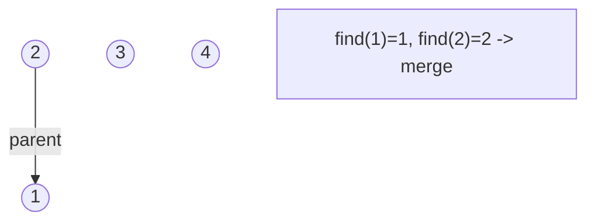
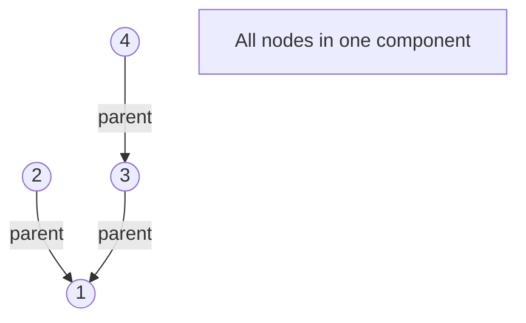
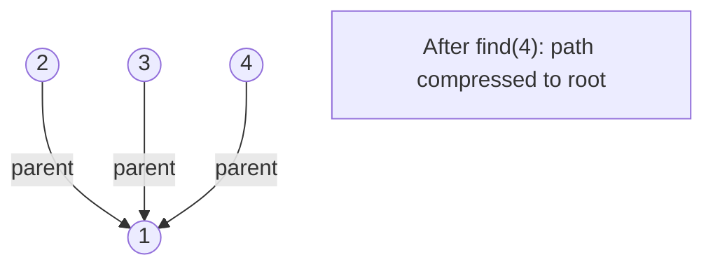

# Problem 839: Similar String Groups

**Difficulty:** Hard  
**Tags:** Array, Hash Table, String, Depth-First Search, Breadth-First Search, Union-Find  
**Pattern:** Union-Find / Disjoint Set  
**Link:** [leetcode.com/problems/similar-string-groups](https://leetcode.com/problems/similar-string-groups/)

## Description

Two strings, `X` and `Y`, are considered similar if either they are identical or we can make them equivalent by swapping at most two letters (in distinct positions) within the string `X`.

For example, `"tars"` and `"rats"` are similar (swapping at positions `0` and `2`), and `"rats"` and `"arts"` are similar, but `"star"` is not similar to `"tars"`, `"rats"`, or `"arts"`.

Together, these form two connected groups by similarity: `{"tars", "rats", "arts"}` and `{"star"}`.  Notice that `"tars"` and `"arts"` are in the same group even though they are not similar.  Formally, each group is such that a word is in the group if and only if it is similar to at least one other word in the group.

We are given a list `strs` of strings where every string in `strs` is an anagram of every other string in `strs`. How many groups are there?

 

Example 1:

```

**Input:** strs = ["tars","rats","arts","star"]
**Output:** 2

```

Example 2:

```

**Input:** strs = ["omv","ovm"]
**Output:** 1

```

 

**Constraints:**

	- `1 <= strs.length <= 300`
	- `1 <= strs[i].length <= 300`
	- `strs[i]` consists of lowercase letters only.
	- All words in `strs` have the same length and are anagrams of each other.

## Approach: Union-Find / Disjoint Set

Use Union-Find with path compression and union by rank to efficiently manage connected components. Find(x) returns the root of x's component; Union(x,y) merges two components.

## Pseudocode

```
1. parent[i] = i for all nodes (each is its own set)
2. find(x): follow parent pointers to root (with path compression)
3. union(x, y): merge sets of x and y by rank
4. Process edges/operations:
   a. For each edge (u, v): union(u, v)
5. Answer queries using find()
```

## Algorithm Flow



## Visual State Transitions

**Union-Find Step-by-Step:**

**Frame 1: Initial - each node is own parent**


**Frame 2: Union(1,2) - merge components**


**Frame 3: Union(3,4) then Union(2,3)**


**Frame 4: Path compression on find(4)**



## Complexity Analysis

- **Time:** O(n * alpha(n))
- **Space:** O(n)

## Solution (Python3)

```python
class Solution:
    def numSimilarGroups(self, strs: List[str]) -> int:
        # Union Find (Disjoint Set Union) - O(n * alpha(n))
        parent = list(range(len(strs) + 1 if isinstance(strs, list) else strs + 1))
        rank = [0] * len(parent)
        
        def find(x):
            if parent[x] != x:
                parent[x] = find(parent[x])
            return parent[x]
        
        def union(x, y):
            px, py = find(x), find(y)
            if px == py:
                return False
            if rank[px] < rank[py]:
                px, py = py, px
            parent[py] = px
            if rank[px] == rank[py]:
                rank[px] += 1
            return True
        
        components = len(parent)
        # Process edges/connections
        return components
```

## Solution (C++)

```cpp
#include <functional>
#include <numeric>
#include <string>
#include <vector>
using namespace std;

class Solution {
public:
    int numSimilarGroups(vector<string>& strs) {
        // Union Find (DSU) - O(n * alpha(n))
        int n = strs.size();
        vector<int> parent(n + 1), rnk(n + 1, 0);
        iota(parent.begin(), parent.end(), 0);
        function<int(int)> find = [&](int x) -> int {
            return parent[x] == x ? x : parent[x] = find(parent[x]);
        };
        auto unite = [&](int x, int y) -> bool {
            int px = find(x), py = find(y);
            if (px == py) return false;
            if (rnk[px] < rnk[py]) swap(px, py);
            parent[py] = px;
            if (rnk[px] == rnk[py]) rnk[px]++;
            return true;
        };
        int components = n;
        return components;
    }
};
```
