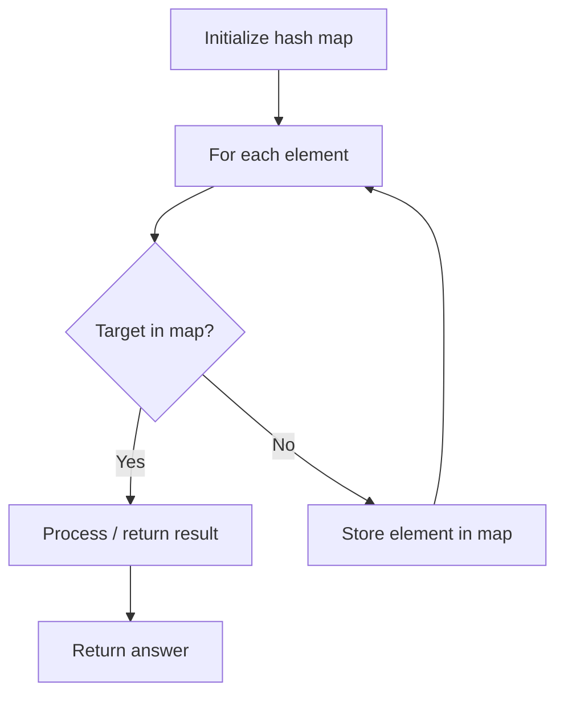

# Problem 840: Magic Squares In Grid

**Difficulty:** Medium  
**Tags:** Array, Hash Table, Math, Matrix  
**Pattern:** Hash Map Lookup  
**Link:** [leetcode.com/problems/magic-squares-in-grid](https://leetcode.com/problems/magic-squares-in-grid/)

## Description

A `3 x 3` **magic square** is a `3 x 3` grid filled with distinct numbers **from **1** to **9 such that each row, column, and both diagonals all have the same sum.

Given a `row x col` `grid` of integers, how many `3 x 3` magic square subgrids are there?

Note: while a magic square can only contain numbers from 1 to 9, `grid` may contain numbers up to 15.

 

Example 1:

```

**Input:** grid = [[4,3,8,4],[9,5,1,9],[2,7,6,2]]
**Output:** 1
**Explanation: **
The following subgrid is a 3 x 3 magic square:

while this one is not:

In total, there is only one magic square inside the given grid.

```

Example 2:

```

**Input:** grid = [[8]]
**Output:** 0

```

 

**Constraints:**

	- `row == grid.length`
	- `col == grid[i].length`
	- `1 <= row, col <= 10`
	- `0 <= grid[i][j] <= 15`

## Approach: Hash Map Lookup

Use a hash map (dictionary) to store elements for O(1) lookup. Iterate through the input, checking membership or counting frequencies in the map.

## Pseudocode

```
1. Initialize hash map
2. Iterate through elements:
   a. Check if target/complement exists in map
   b. If found: process result
   c. Otherwise: store element in map
3. Return result
```

## Algorithm Flow



## Complexity Analysis

- **Time:** O(n)
- **Space:** O(n)

## Solution (Python3)

```python
class Solution:
    def numMagicSquaresInside(self, grid: List[List[int]]) -> int:
        # Hash map approach - O(n) time, O(n) space
        seen = {}
        for i, val in enumerate(grid):
            complement = grid - val
            if complement in seen:
                return [seen[complement], i]
            seen[val] = i
        return 0
```

## Solution (C++)

```cpp
#include <string>
#include <unordered_map>
#include <vector>
using namespace std;

class Solution {
public:
    int numMagicSquaresInside(vector<vector<int>>& grid) {
        // Hash map approach - O(n) time, O(n) space
        unordered_map<int, int> seen;
        for (int i = 0; i < grid.size(); i++) {
            int complement = grid - grid[i];
            if (seen.count(complement)) {
                return {seen[complement], i};
            }
            seen[grid[i]] = i;
        }
        return 0;
    }
};
```
