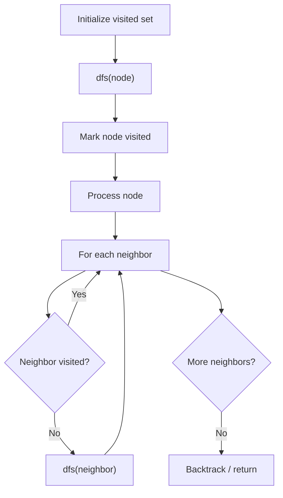

# Problem 841: Keys and Rooms

**Difficulty:** Medium  
**Tags:** Depth-First Search, Breadth-First Search, Graph Theory  
**Pattern:** DFS / Graph  
**Link:** [leetcode.com/problems/keys-and-rooms](https://leetcode.com/problems/keys-and-rooms/)

## Description

There are `n` rooms labeled from `0` to `n - 1` and all the rooms are locked except for room `0`. Your goal is to visit all the rooms. However, you cannot enter a locked room without having its key.

When you visit a room, you may find a set of **distinct keys** in it. Each key has a number on it, denoting which room it unlocks, and you can take all of them with you to unlock the other rooms.

Given an array `rooms` where `rooms[i]` is the set of keys that you can obtain if you visited room `i`, return `true` *if you can visit **all** the rooms, or* `false` *otherwise*.

 

Example 1:

```

**Input:** rooms = [[1],[2],[3],[]]
**Output:** true
**Explanation:** 
We visit room 0 and pick up key 1.
We then visit room 1 and pick up key 2.
We then visit room 2 and pick up key 3.
We then visit room 3.
Since we were able to visit every room, we return true.

```

Example 2:

```

**Input:** rooms = [[1,3],[3,0,1],[2],[0]]
**Output:** false
**Explanation:** We can not enter room number 2 since the only key that unlocks it is in that room.

```

 

**Constraints:**

	- `n == rooms.length`
	- `2 <= n <= 1000`
	- `0 <= rooms[i].length <= 1000`
	- `1 <= sum(rooms[i].length) <= 3000`
	- `0 <= rooms[i][j] < n`
	- All the values of `rooms[i]` are **unique**.

## Approach: DFS / Graph

DFS/BFS from room 0. Check if all rooms visited.

## Pseudocode

```
1. Initialize visited set
2. Define dfs(node):
   a. Mark node as visited
   b. Process node
   c. For each neighbor of node:
      - If not visited: dfs(neighbor)
3. Call dfs(start) for each unvisited node
```

## Algorithm Flow



## Complexity Analysis

- **Time:** O(V + E)
- **Space:** O(V)

## Solution (Python3)

```python
class Solution:
    def canVisitAllRooms(self, rooms: list[list[int]]) -> bool:
        visited = set([0])
        stack = [0]
        while stack:
            room = stack.pop()
            for key in rooms[room]:
                if key not in visited:
                    visited.add(key)
                    stack.append(key)
        return len(visited) == len(rooms)
```

## Solution (C++)

```cpp
#include <functional>
#include <string>
#include <vector>
using namespace std;

class Solution {
public:
    bool canVisitAllRooms(vector<vector<int>>& rooms) {
        // DFS on graph - O(V+E) time
        vector<bool> visited(rooms.size(), false);
        vector<int> result;
        function<void(int)> dfs = [&](int node) {
            if (visited[node]) return;
            visited[node] = true;
            result.push_back(node);
            // Traverse neighbors
        };
        dfs(0);
        return result;
    }
};
```
