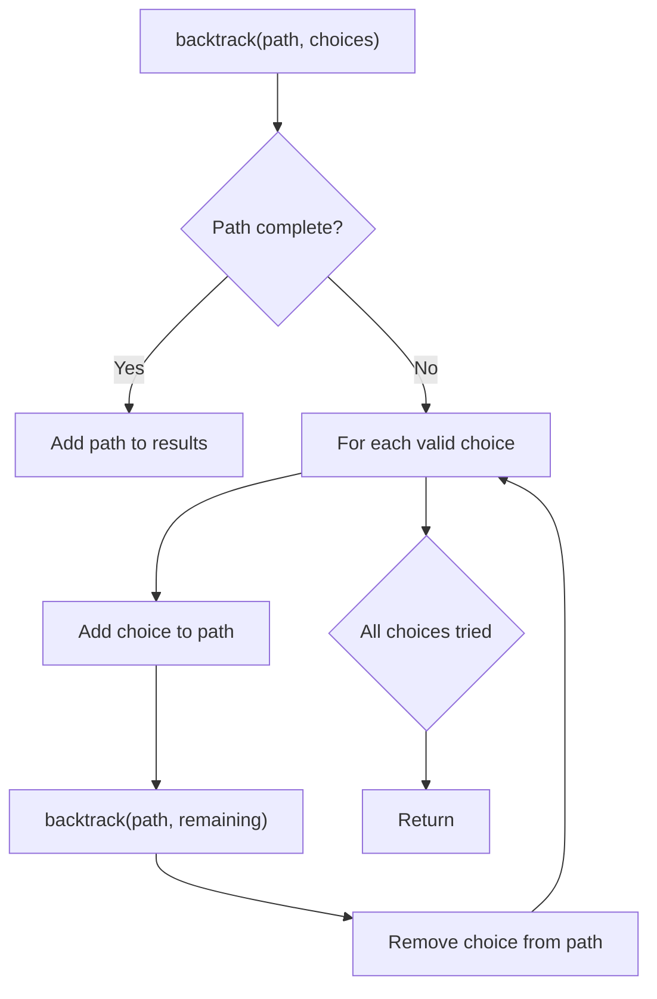
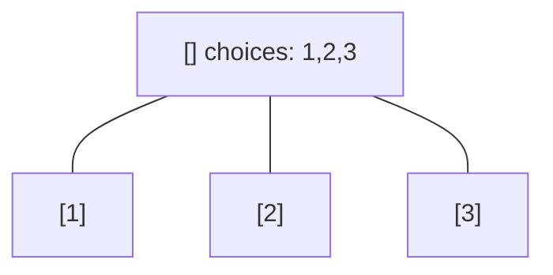
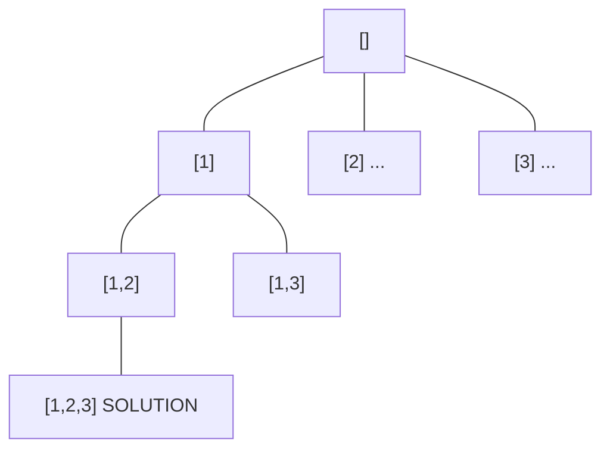
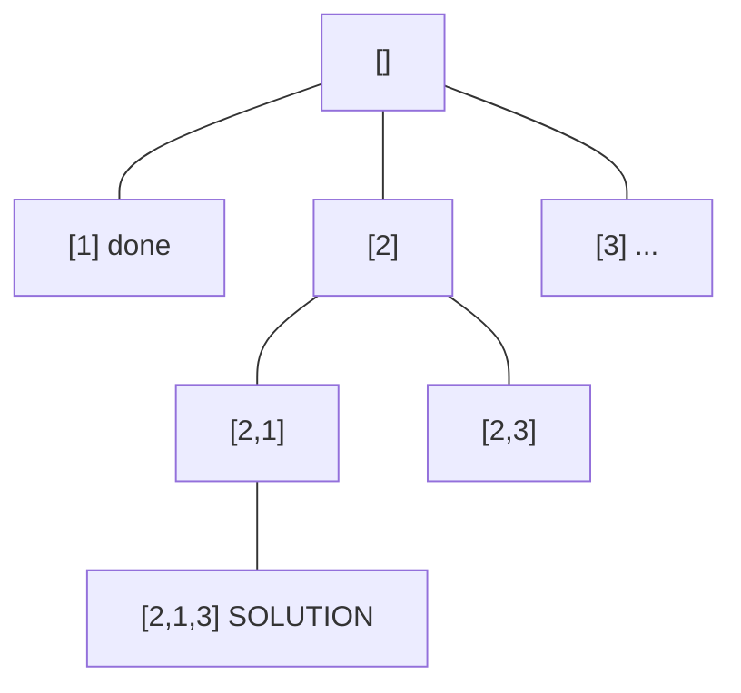
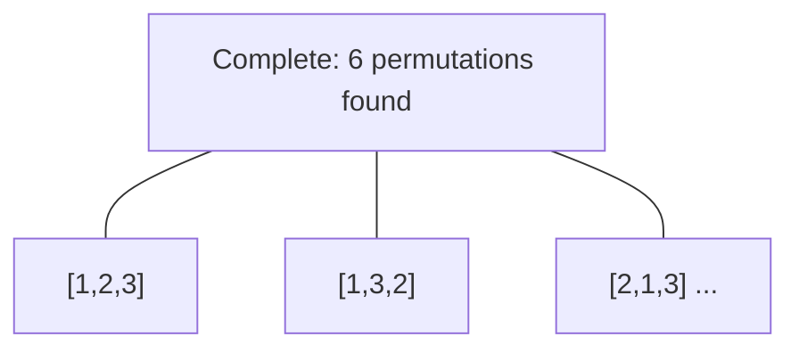

# Problem 842: Split Array into Fibonacci Sequence

**Difficulty:** Medium  
**Tags:** String, Backtracking  
**Pattern:** Backtracking  
**Link:** [leetcode.com/problems/split-array-into-fibonacci-sequence](https://leetcode.com/problems/split-array-into-fibonacci-sequence/)

## Description

You are given a string of digits `num`, such as `"123456579"`. We can split it into a Fibonacci-like sequence `[123, 456, 579]`.

Formally, a **Fibonacci-like** sequence is a list `f` of non-negative integers such that:

	- `0 <= f[i] < 2^31`, (that is, each integer fits in a **32-bit** signed integer type),
	- `f.length >= 3`, and
	- `f[i] + f[i + 1] == f[i + 2]` for all `0 <= i < f.length - 2`.

Note that when splitting the string into pieces, each piece must not have extra leading zeroes, except if the piece is the number `0` itself.

Return any Fibonacci-like sequence split from `num`, or return `[]` if it cannot be done.

 

Example 1:

```

**Input:** num = "1101111"
**Output:** [11,0,11,11]
**Explanation:** The output [110, 1, 111] would also be accepted.

```

Example 2:

```

**Input:** num = "112358130"
**Output:** []
**Explanation:** The task is impossible.

```

Example 3:

```

**Input:** num = "0123"
**Output:** []
**Explanation:** Leading zeroes are not allowed, so "01", "2", "3" is not valid.

```

 

**Constraints:**

	- `1 <= num.length <= 200`
	- `num` contains only digits.

## Approach: Backtracking

Explore all possible solutions by building candidates incrementally. At each step, make a choice and recurse. If the choice leads to a dead end, undo the choice (backtrack) and try the next option.

## Pseudocode

```
1. Define backtrack(path, choices):
   a. If path is a complete solution: add to results
   b. For each choice in choices:
      - If choice is valid:
        * Add choice to path
        * backtrack(path, remaining_choices)
        * Remove choice from path (backtrack)
2. Call backtrack([], all_choices)
```

## Algorithm Flow



## Visual State Transitions

**Backtracking Decision Tree:**

**Frame 1: Root - start with empty path**


**Frame 2: Explore branch [1]**


**Frame 3: Backtrack, explore [2]**


**Frame 4: All solutions found**



## Complexity Analysis

- **Time:** O(k^n) or O(n!)
- **Space:** O(n)

## Solution (Python3)

```python
class Solution:
    def splitIntoFibonacci(self, num: str) -> List[int]:
        # Backtracking - O(2^n) or O(n!) time
        result = []
        
        def backtrack(path, start):
            result.append(path[:])
            for i in range(start, len(num)):
                path.append(num[i])
                backtrack(path, i + 1)
                path.pop()
        
        backtrack([], 0)
        return result
```

## Solution (C++)

```cpp
#include <functional>
#include <string>
#include <vector>
using namespace std;

class Solution {
public:
    vector<int> splitIntoFibonacci(string& num) {
        // Backtracking - O(2^n) or O(n!) time
        vector<vector<int>> result;
        vector<int> path;
        function<void(int)> backtrack = [&](int start) {
            result.push_back(path);
            for (int i = start; i < (int)num.size(); i++) {
                path.push_back(num[i]);
                backtrack(i + 1);
                path.pop_back();
            }
        };
        backtrack(0);
        return result;
    }
};
```
