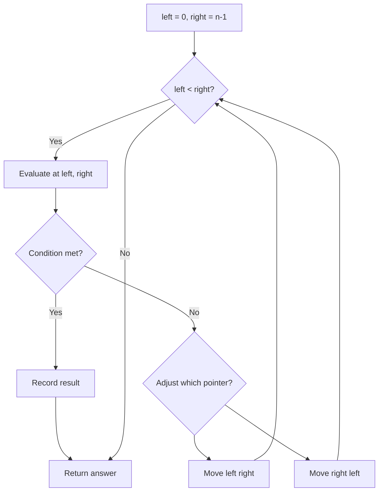
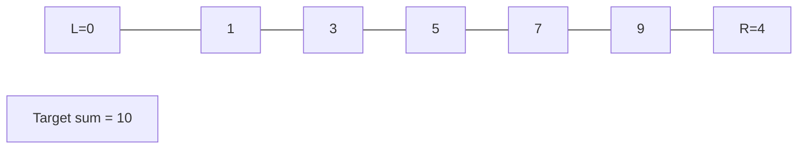
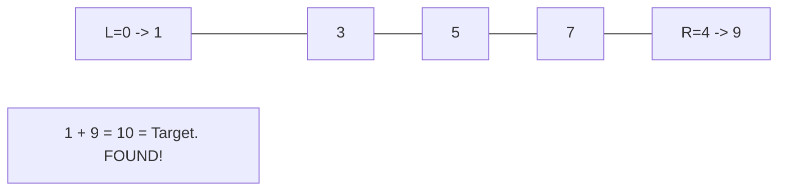

# Problem 844: Backspace String Compare

**Difficulty:** Easy  
**Tags:** Two Pointers, String, Stack, Simulation  
**Pattern:** Two Pointers  
**Link:** [leetcode.com/problems/backspace-string-compare](https://leetcode.com/problems/backspace-string-compare/)

## Description

Given two strings `s` and `t`, return `true` *if they are equal when both are typed into empty text editors*. `'#'` means a backspace character.

Note that after backspacing an empty text, the text will continue empty.

 

Example 1:

```

**Input:** s = "ab#c", t = "ad#c"
**Output:** true
**Explanation:** Both s and t become "ac".

```

Example 2:

```

**Input:** s = "ab##", t = "c#d#"
**Output:** true
**Explanation:** Both s and t become "".

```

Example 3:

```

**Input:** s = "a#c", t = "b"
**Output:** false
**Explanation:** s becomes "c" while t becomes "b".

```

 

**Constraints:**

	- `1 <= s.length, t.length <= 200`
	- `s` and `t` only contain lowercase letters and `'#'` characters.

 

**Follow up:** Can you solve it in `O(n)` time and `O(1)` space?

## Approach: Two Pointers

Use two pointers moving through the data structure. Depending on the problem, pointers may move toward each other (converging), in the same direction (fast/slow), or independently.

## Pseudocode

```
1. Initialize left = 0, right = n-1 (or two independent pointers)
2. While pointers haven't crossed:
   a. Evaluate condition at pointer positions
   b. Move left pointer right or right pointer left
3. Return result
```

## Algorithm Flow



## Visual State Transitions

**Two Pointer Convergence:**

**Frame 1: Initialize pointers**


**Frame 2: Sum = 1+9 = 10, found!**



## Complexity Analysis

- **Time:** O(n)
- **Space:** O(1)

## Solution (Python3)

```python
class Solution:
    def backspaceCompare(self, s: str, t: str) -> bool:
        # Two pointer approach - O(n) time, O(1) space
        left, right = 0, len(s) - 1
        while left < right:
            curr = s[left] + s[right]
            if curr == t:
                return [left, right]
            elif curr < t:
                left += 1
            else:
                right -= 1
        return False
```

## Solution (C++)

```cpp
#include <string>
#include <vector>
using namespace std;

class Solution {
public:
    bool backspaceCompare(string& s, string& t) {
        // Two pointer approach - O(n) time, O(1) space
        int left = 0, right = s.size() - 1;
        while (left < right) {
            int curr = s[left] + s[right];
            if (curr == t) {
                return {left, right};
            } else if (curr < t) {
                left++;
            } else {
                right--;
            }
        }
        return false;
    }
};
```
