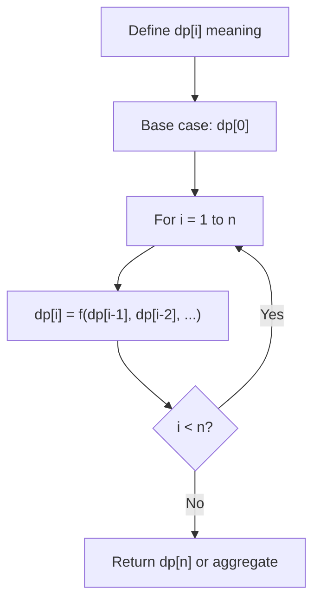
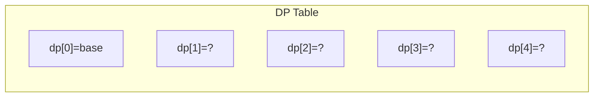
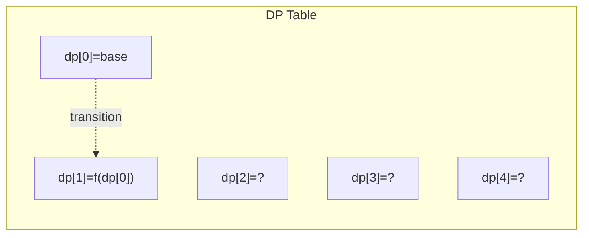
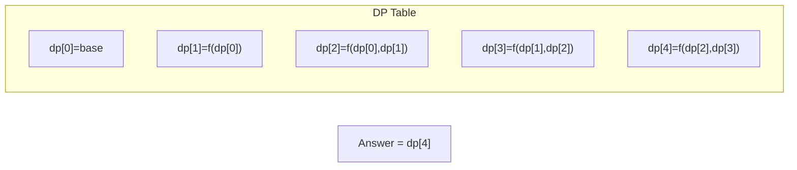

# Problem 845: Longest Mountain in Array

**Difficulty:** Medium  
**Tags:** Array, Two Pointers, Dynamic Programming, Enumeration  
**Pattern:** Dynamic Programming (1D)  
**Link:** [leetcode.com/problems/longest-mountain-in-array](https://leetcode.com/problems/longest-mountain-in-array/)

## Description

You may recall that an array `arr` is a **mountain array** if and only if:

	- `arr.length >= 3`
	- There exists some index `i` (**0-indexed**) with `0 < i < arr.length - 1` such that:
	
		`arr[0] < arr[1] < ... < arr[i - 1] < arr[i]`
		- `arr[i] > arr[i + 1] > ... > arr[arr.length - 1]`
	
	

Given an integer array `arr`, return *the length of the longest subarray, which is a mountain*. Return `0` if there is no mountain subarray.

 

Example 1:

```

**Input:** arr = [2,1,4,7,3,2,5]
**Output:** 5
**Explanation:** The largest mountain is [1,4,7,3,2] which has length 5.

```

Example 2:

```

**Input:** arr = [2,2,2]
**Output:** 0
**Explanation:** There is no mountain.

```

 

**Constraints:**

	- `1 <= arr.length <= 10^4`
	- `0 <= arr[i] <= 10^4`

 

**Follow up:**

	- Can you solve it using only one pass?
	- Can you solve it in `O(1)` space?

## Approach: Dynamic Programming (1D)

Break the problem into overlapping subproblems. Define dp[i] as the optimal value for the subproblem ending at or considering index i. Build the solution bottom-up, using previously computed dp values.

## Pseudocode

```
1. Define dp[i] = optimal value for subproblem i
2. Base case: dp[0] = initial value
3. For i from 1 to n:
   a. dp[i] = recurrence(dp[i-1], dp[i-2], ...)
4. Return dp[n] or max/min of dp
```

## Algorithm Flow



## Visual State Transitions

**1D Dynamic Programming Table Build:**

**Frame 1: Initialize base cases**


**Frame 2: Fill dp[1] from dp[0]**


**Frame 3: Fill remaining cells**



## Complexity Analysis

- **Time:** O(n)
- **Space:** O(n)

## Solution (Python3)

```python
class Solution:
    def longestMountain(self, arr: List[int]) -> int:
        # Dynamic programming (1D) - O(n) time, O(n) space
        if not arr:
            return 0
        n = len(arr) if isinstance(arr, list) else arr
        dp = [0] * (n + 1)
        dp[0] = 1  # base case
        for i in range(1, n + 1):
            dp[i] = dp[i-1]  # transition (customize per problem)
            if i >= 2:
                dp[i] += dp[i-2]
        return dp[n]
```

## Solution (C++)

```cpp
#include <string>
#include <vector>
using namespace std;

class Solution {
public:
    int longestMountain(vector<int>& arr) {
        // Dynamic programming (1D) - O(n) time, O(n) space
        int n = arr;
        if (n <= 0) return 0;
        vector<int> dp(n + 1, 0);
        dp[0] = 1;
        for (int i = 1; i <= n; i++) {
            dp[i] = dp[i-1];
            if (i >= 2) dp[i] += dp[i-2];
        }
        return dp[n];
    }
};
```
