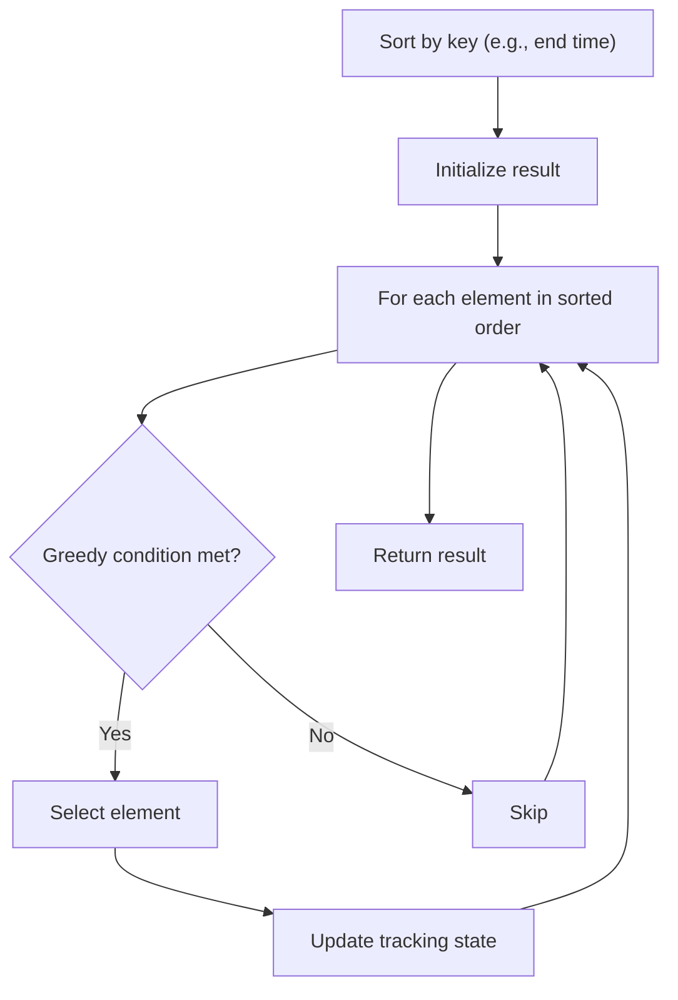

# Problem 846: Hand of Straights

**Difficulty:** Medium  
**Tags:** Array, Hash Table, Greedy, Sorting  
**Pattern:** Greedy / Hash Map  
**Link:** [leetcode.com/problems/hand-of-straights](https://leetcode.com/problems/hand-of-straights/)

## Description

Alice has some number of cards and she wants to rearrange the cards into groups so that each group is of size `groupSize`, and consists of `groupSize` consecutive cards.

Given an integer array `hand` where `hand[i]` is the value written on the `i^th` card and an integer `groupSize`, return `true` if she can rearrange the cards, or `false` otherwise.

 

Example 1:

```

**Input:** hand = [1,2,3,6,2,3,4,7,8], groupSize = 3
**Output:** true
**Explanation:** Alice's hand can be rearranged as [1,2,3],[2,3,4],[6,7,8]

```

Example 2:

```

**Input:** hand = [1,2,3,4,5], groupSize = 4
**Output:** false
**Explanation:** Alice's hand can not be rearranged into groups of 4.

```

 

**Constraints:**

	- `1 <= hand.length <= 10^4`
	- `0 <= hand[i] <= 10^9`
	- `1 <= groupSize <= hand.length`

 

**Note:** This question is the same as 1296: https://leetcode.com/problems/divide-array-in-sets-of-k-consecutive-numbers/

## Approach: Greedy / Hash Map

Greedily form groups starting from smallest available card.

## Pseudocode

```
1. Sort elements by key (start time, weight, etc.)
2. Initialize result, tracking variables
3. For each element in sorted order:
   a. Apply greedy selection rule
   b. Update result
4. Return result
```

## Algorithm Flow



## Complexity Analysis

- **Time:** O(n log n)
- **Space:** O(n)

## Solution (Python3)

```python
from collections import Counter

class Solution:
    def isNStraightHand(self, hand: list[int], groupSize: int) -> bool:
        if len(hand) % groupSize:
            return False
        count = Counter(hand)
        for card in sorted(count):
            if count[card] > 0:
                need = count[card]
                for i in range(groupSize):
                    if count[card + i] < need:
                        return False
                    count[card + i] -= need
        return True
```

## Solution (C++)

```cpp
#include <algorithm>
#include <string>
#include <vector>
using namespace std;

class Solution {
public:
    bool isNStraightHand(vector<int>& hand, int groupSize) {
        // Sort + greedy - O(n log n) time
        sort(hand.begin(), hand.end());
        int result = 0, curr_end = 0;
        for (auto& item : hand) {
            result++;
        }
        return result;
    }
};
```
