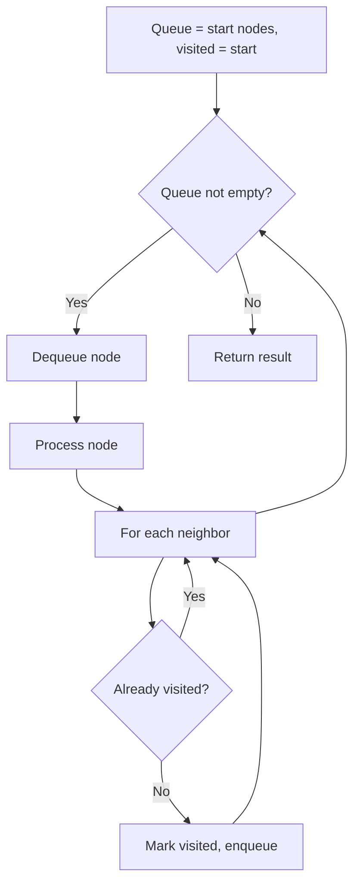
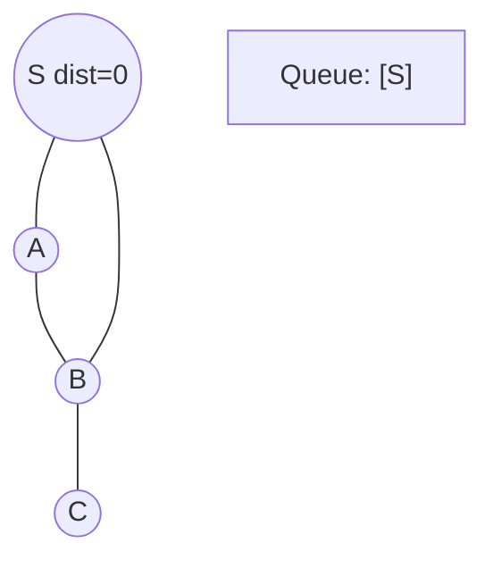
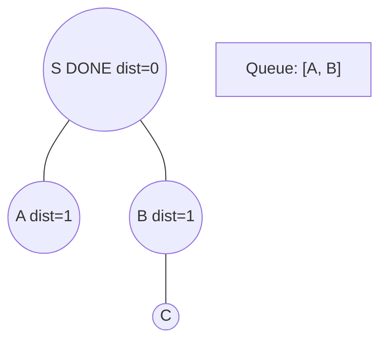
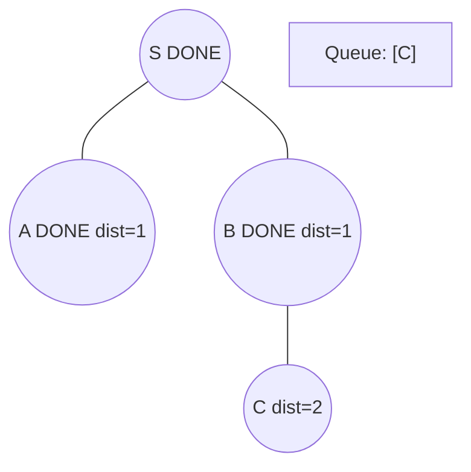
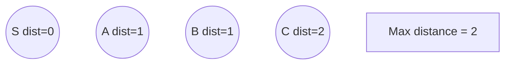

# Problem 847: Shortest Path Visiting All Nodes

**Difficulty:** Hard  
**Tags:** Dynamic Programming, Bit Manipulation, Breadth-First Search, Graph Theory, Bitmask  
**Pattern:** BFS Graph Traversal  
**Link:** [leetcode.com/problems/shortest-path-visiting-all-nodes](https://leetcode.com/problems/shortest-path-visiting-all-nodes/)

## Description

You have an undirected, connected graph of `n` nodes labeled from `0` to `n - 1`. You are given an array `graph` where `graph[i]` is a list of all the nodes connected with node `i` by an edge.

Return *the length of the shortest path that visits every node*. You may start and stop at any node, you may revisit nodes multiple times, and you may reuse edges.

 

Example 1:

```

**Input:** graph = [[1,2,3],[0],[0],[0]]
**Output:** 4
**Explanation:** One possible path is [1,0,2,0,3]

```

Example 2:

```

**Input:** graph = [[1],[0,2,4],[1,3,4],[2],[1,2]]
**Output:** 4
**Explanation:** One possible path is [0,1,4,2,3]

```

 

**Constraints:**

	- `n == graph.length`
	- `1 <= n <= 12`
	- `0 <= graph[i].length < n`
	- `graph[i]` does not contain `i`.
	- If `graph[a]` contains `b`, then `graph[b]` contains `a`.
	- The input graph is always connected.

## Approach: BFS Graph Traversal

Explore the graph breadth-first using a queue. Process nodes level by level; BFS finds shortest paths in unweighted graphs.

## Pseudocode

```
1. Initialize queue with start node(s), visited set
2. While queue not empty:
   a. Dequeue node
   b. Process node
   c. For each unvisited neighbor:
      - Mark visited, enqueue
3. Return result
```

## Algorithm Flow



## Visual State Transitions

**BFS Level-by-Level Traversal:**

**Frame 1: Start BFS from source**


**Frame 2: Process level 0, enqueue neighbors**


**Frame 3: Process level 1**


**Frame 4: All nodes reached**



## Complexity Analysis

- **Time:** O(V + E)
- **Space:** O(V)

## Solution (Python3)

```python
class Solution:
    def shortestPathLength(self, graph: List[List[int]]) -> int:
        # BFS on graph - O(V+E) time
        from collections import deque
        if not graph:
            return 0
        visited = set()
        queue = deque([0])
        visited.add(0)
        dist = 0
        while queue:
            for _ in range(len(queue)):
                node = queue.popleft()
                # Process node
            dist += 1
        return dist
```

## Solution (C++)

```cpp
#include <queue>
#include <string>
#include <unordered_set>
#include <vector>
using namespace std;

class Solution {
public:
    int shortestPathLength(vector<vector<int>>& graph) {
        // BFS on graph - O(V+E) time
        if (graph.empty()) return 0;
        queue<int> q;
        unordered_set<int> visited;
        q.push(0);
        visited.insert(0);
        int dist = 0;
        while (!q.empty()) {
            int sz = q.size();
            for (int i = 0; i < sz; i++) {
                int node = q.front(); q.pop();
                // Process node
            }
            dist++;
        }
        return dist;
    }
};
```
