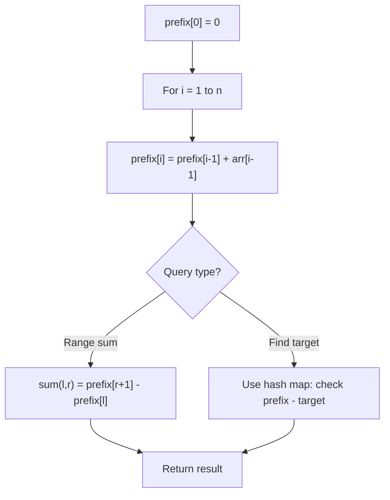

# Problem 848: Shifting Letters

**Difficulty:** Medium  
**Tags:** Array, String, Prefix Sum  
**Pattern:** Prefix Sum  
**Link:** [leetcode.com/problems/shifting-letters](https://leetcode.com/problems/shifting-letters/)

## Description

You are given a string `s` of lowercase English letters and an integer array `shifts` of the same length.

Call the `shift()` of a letter, the next letter in the alphabet, (wrapping around so that `'z'` becomes `'a'`).

	- For example, `shift('a') = 'b'`, `shift('t') = 'u'`, and `shift('z') = 'a'`.

Now for each `shifts[i] = x`, we want to shift the first `i + 1` letters of `s`, `x` times.

Return *the final string after all such shifts to s are applied*.

 

Example 1:

```

**Input:** s = "abc", shifts = [3,5,9]
**Output:** "rpl"
**Explanation:** We start with "abc".
After shifting the first 1 letters of s by 3, we have "dbc".
After shifting the first 2 letters of s by 5, we have "igc".
After shifting the first 3 letters of s by 9, we have "rpl", the answer.

```

Example 2:

```

**Input:** s = "aaa", shifts = [1,2,3]
**Output:** "gfd"

```

 

**Constraints:**

	- `1 <= s.length <= 10^5`
	- `s` consists of lowercase English letters.
	- `shifts.length == s.length`
	- `0 <= shifts[i] <= 10^9`

## Approach: Prefix Sum

Build a prefix sum array where prefix[i] = sum of elements 0..i-1. Any subarray sum [l..r] = prefix[r+1] - prefix[l]. Combine with hash map for O(n) subarray sum queries.

## Pseudocode

```
1. Build prefix sum array: prefix[0]=0, prefix[i]=prefix[i-1]+arr[i-1]
2. Use prefix sums to answer queries:
   - Subarray sum [l..r] = prefix[r+1] - prefix[l]
   - Or use hash map to find prefix[j]-prefix[i] == target
3. Return result
```

## Algorithm Flow



## Complexity Analysis

- **Time:** O(n)
- **Space:** O(n)

## Solution (Python3)

```python
class Solution:
    def shiftingLetters(self, s: str, shifts: List[int]) -> str:
        # Prefix sum approach - O(n) time, O(n) space
        prefix = {0: -1}
        curr_sum = 0
        result = 0
        target = shifts if isinstance(shifts, int) else 0
        for i, val in enumerate(s):
            curr_sum += val
            if curr_sum - target in prefix:
                result = max(result, i - prefix[curr_sum - target])
            if curr_sum not in prefix:
                prefix[curr_sum] = i
        return result
```

## Solution (C++)

```cpp
#include <algorithm>
#include <string>
#include <unordered_map>
#include <vector>
using namespace std;

class Solution {
public:
    string shiftingLetters(string& s, vector<int>& shifts) {
        // Prefix sum approach - O(n) time, O(n) space
        unordered_map<int, int> prefix;
        prefix[0] = -1;
        int curr_sum = 0, result = 0;
        int target = shifts;
        for (int i = 0; i < (int)s.size(); i++) {
            curr_sum += s[i];
            if (prefix.count(curr_sum - target)) {
                result = max(result, i - prefix[curr_sum - target]);
            }
            if (!prefix.count(curr_sum)) {
                prefix[curr_sum] = i;
            }
        }
        return result;
    }
};
```
