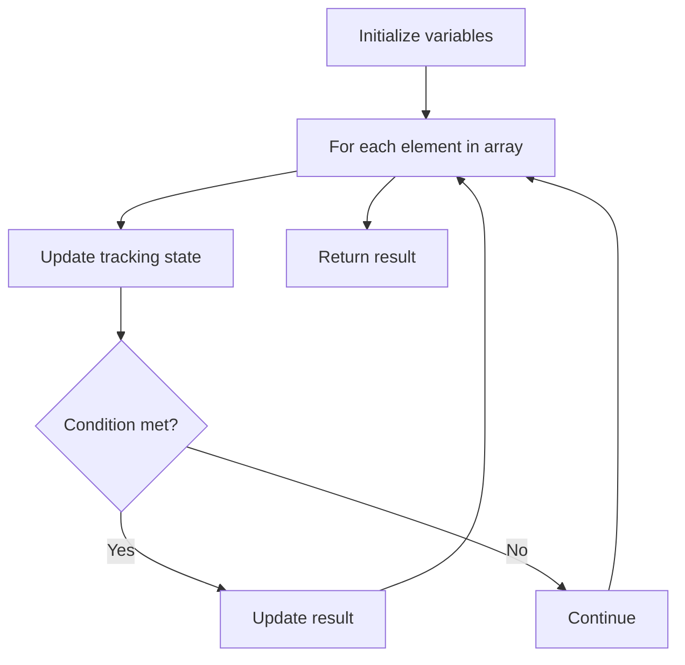

# Problem 849: Maximize Distance to Closest Person

**Difficulty:** Medium  
**Tags:** Array  
**Pattern:** Array Processing  
**Link:** [leetcode.com/problems/maximize-distance-to-closest-person](https://leetcode.com/problems/maximize-distance-to-closest-person/)

## Description

You are given an array representing a row of `seats` where `seats[i] = 1` represents a person sitting in the `i^th` seat, and `seats[i] = 0` represents that the `i^th` seat is empty **(0-indexed)**.

There is at least one empty seat, and at least one person sitting.

Alex wants to sit in the seat such that the distance between him and the closest person to him is maximized. 

Return *that maximum distance to the closest person*.

 

Example 1:

```

**Input:** seats = [1,0,0,0,1,0,1]
**Output:** 2
**Explanation: **
If Alex sits in the second open seat (i.e. seats[2]), then the closest person has distance 2.
If Alex sits in any other open seat, the closest person has distance 1.
Thus, the maximum distance to the closest person is 2.

```

Example 2:

```

**Input:** seats = [1,0,0,0]
**Output:** 3
**Explanation: **
If Alex sits in the last seat (i.e. seats[3]), the closest person is 3 seats away.
This is the maximum distance possible, so the answer is 3.

```

Example 3:

```

**Input:** seats = [0,1]
**Output:** 1

```

 

**Constraints:**

	- `2 <= seats.length <= 2 * 10^4`
	- `seats[i]` is `0` or `1`.
	- At least one seat is **empty**.
	- At least one seat is **occupied**.

## Approach: Array Processing

Process the array with a linear scan, tracking state variables. Look for patterns: running maximum/minimum, counting, or transformations.

## Pseudocode

```
1. Initialize tracking variables
2. Iterate through array:
   a. Update tracking state
   b. Check conditions
   c. Update result
3. Return result
```

## Algorithm Flow



## Complexity Analysis

- **Time:** O(n)
- **Space:** O(1)

## Solution (Python3)

```python
class Solution:
    def maxDistToClosest(self, seats: List[int]) -> int:
        # Array processing - O(n) time
        result = 0
        for i in range(len(seats)):
            # Process element
            pass
        return result
```

## Solution (C++)

```cpp
#include <string>
#include <vector>
using namespace std;

class Solution {
public:
    int maxDistToClosest(vector<int>& seats) {
        // Array processing - O(n) time
        for (int i = 0; i < (int)seats.size(); i++) {
            // Process element
        }
        return 0;
    }
};
```
