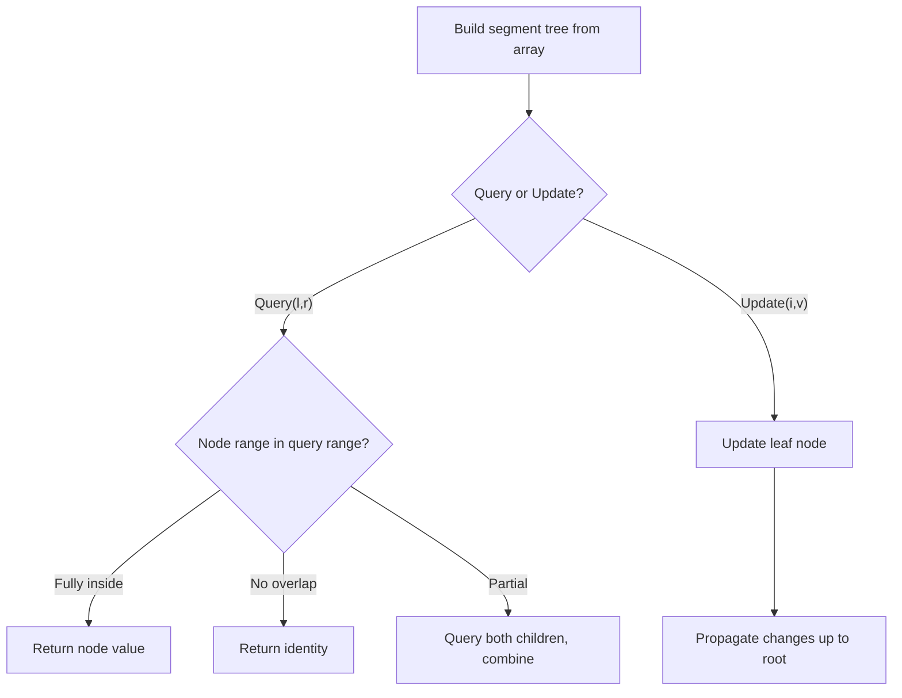

# Problem 850: Rectangle Area II

**Difficulty:** Hard  
**Tags:** Array, Segment Tree, Sweep Line, Ordered Set  
**Pattern:** Segment Tree  
**Link:** [leetcode.com/problems/rectangle-area-ii](https://leetcode.com/problems/rectangle-area-ii/)

## Description

You are given a 2D array of axis-aligned `rectangles`. Each `rectangle[i] = [xi1, yi1, xi2, yi2]` denotes the `i^th` rectangle where `(xi1, yi1)` are the coordinates of the **bottom-left corner**, and `(xi2, yi2)` are the coordinates of the **top-right corner**.

Calculate the **total area** covered by all `rectangles` in the plane. Any area covered by two or more rectangles should only be counted **once**.

Return *the **total area***. Since the answer may be too large, return it **modulo** `10^9 + 7`.

 

Example 1:

```

**Input:** rectangles = [[0,0,2,2],[1,0,2,3],[1,0,3,1]]
**Output:** 6
**Explanation:** A total area of 6 is covered by all three rectangles, as illustrated in the picture.
From (1,1) to (2,2), the green and red rectangles overlap.
From (1,0) to (2,3), all three rectangles overlap.

```

Example 2:

```

**Input:** rectangles = [[0,0,1000000000,1000000000]]
**Output:** 49
**Explanation:** The answer is 1018 modulo (109 + 7), which is 49.

```

 

**Constraints:**

	- `1 <= rectangles.length <= 200`
	- `rectanges[i].length == 4`
	- `0 <= xi1, yi1, xi2, yi2 <= 10^9`
	- `xi1 <= xi2`
	- `yi1 <= yi2`
	- All rectangles have non zero area.

## Approach: Segment Tree

Build a segment tree for range queries (sum, min, max) with point or range updates. Each node covers a range; queries are answered by combining relevant segments.

## Pseudocode

```
1. Build segment tree from array (O(n))
2. Query(l, r):
   - If node range within [l,r]: return node value
   - If no overlap: return identity
   - Else: combine query(left_child) and query(right_child)
3. Update(i, val): update leaf and propagate up
```

## Algorithm Flow



## Complexity Analysis

- **Time:** O(n log n) build, O(log n) query/update
- **Space:** O(n)

## Solution (Python3)

```python
class Solution:
    def rectangleArea(self, rectangles: List[List[int]]) -> int:
        # Segment tree for range queries - O(n log n) build, O(log n) query
        n = len(rectangles)
        tree = [0] * (4 * n)
        
        def build(node, start, end):
            if start == end:
                tree[node] = rectangles[start]
                return
            mid = (start + end) // 2
            build(2*node, start, mid)
            build(2*node+1, mid+1, end)
            tree[node] = tree[2*node] + tree[2*node+1]
        
        def query(node, start, end, l, r):
            if r < start or end < l:
                return 0
            if l <= start and end <= r:
                return tree[node]
            mid = (start + end) // 2
            return query(2*node, start, mid, l, r) + query(2*node+1, mid+1, end, l, r)
        
        build(1, 0, n-1)
        return 0
```

## Solution (C++)

```cpp
#include <functional>
#include <string>
#include <vector>
using namespace std;

class Solution {
public:
    int rectangleArea(vector<vector<int>>& rectangles) {
        // Segment tree for range queries
        int n = rectangles.size();
        vector<int> tree(4 * n, 0);
        function<void(int, int, int)> build = [&](int node, int s, int e) {
            if (s == e) { tree[node] = rectangles[s]; return; }
            int mid = (s + e) / 2;
            build(2*node, s, mid);
            build(2*node+1, mid+1, e);
            tree[node] = tree[2*node] + tree[2*node+1];
        };
        function<int(int, int, int, int, int)> query = [&](int node, int s, int e, int l, int r) -> int {
            if (r < s || e < l) return 0;
            if (l <= s && e <= r) return tree[node];
            int mid = (s + e) / 2;
            return query(2*node, s, mid, l, r) + query(2*node+1, mid+1, e, l, r);
        };
        build(1, 0, n-1);
        return 0;
    }
};
```
