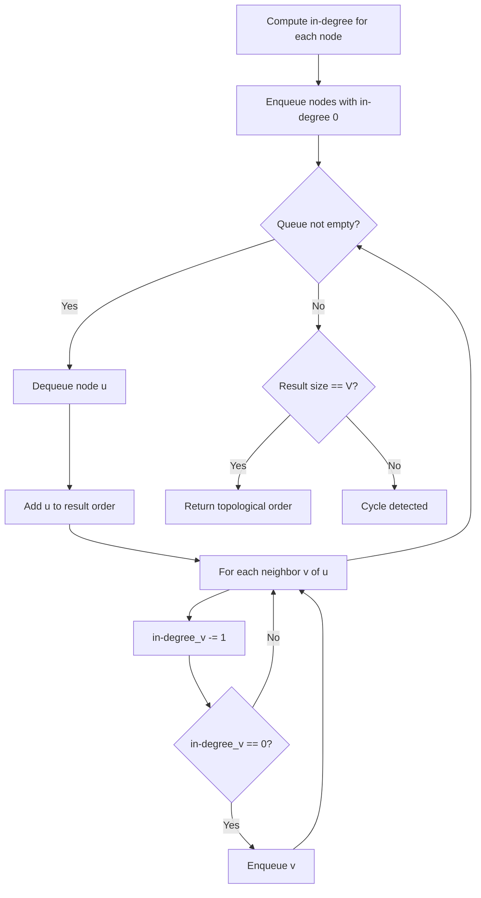
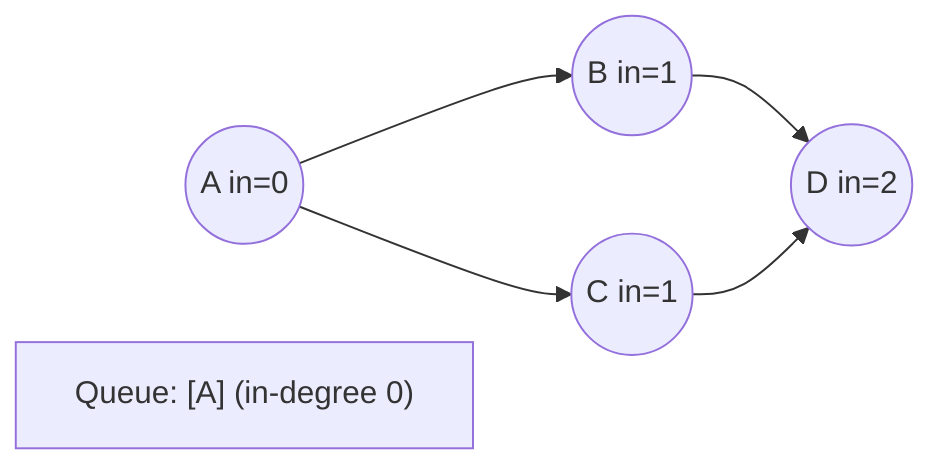
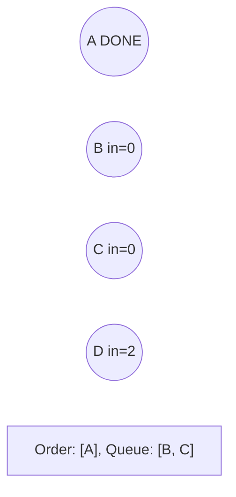
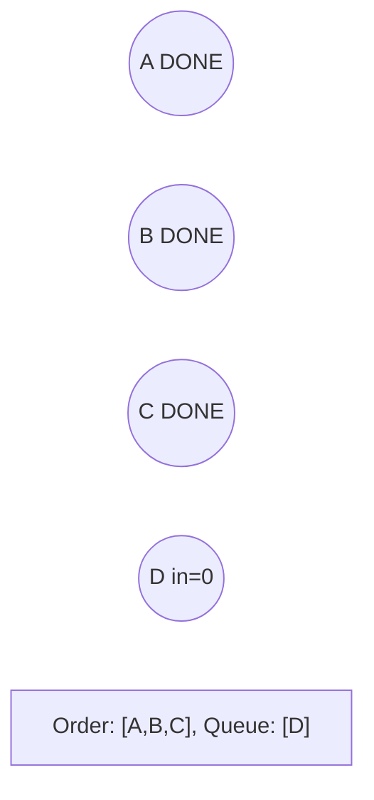
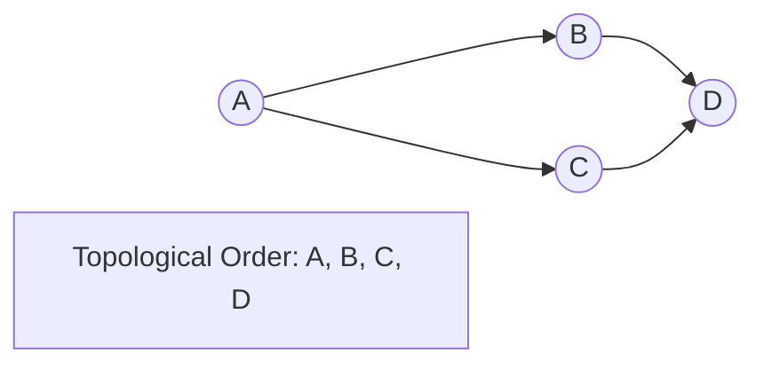

# Problem 851: Loud and Rich

**Difficulty:** Medium  
**Tags:** Array, Depth-First Search, Graph Theory, Topological Sort  
**Pattern:** Topological Sort  
**Link:** [leetcode.com/problems/loud-and-rich](https://leetcode.com/problems/loud-and-rich/)

## Description

There is a group of `n` people labeled from `0` to `n - 1` where each person has a different amount of money and a different level of quietness.

You are given an array `richer` where `richer[i] = [ai, bi]` indicates that `ai` has more money than `bi` and an integer array `quiet` where `quiet[i]` is the quietness of the `i^th` person. All the given data in richer are **logically correct** (i.e., the data will not lead you to a situation where `x` is richer than `y` and `y` is richer than `x` at the same time).

Return *an integer array *`answer`* where *`answer[x] = y`* if *`y`* is the least quiet person (that is, the person *`y`* with the smallest value of *`quiet[y]`*) among all people who definitely have equal to or more money than the person *`x`.

 

Example 1:

```

**Input:** richer = [[1,0],[2,1],[3,1],[3,7],[4,3],[5,3],[6,3]], quiet = [3,2,5,4,6,1,7,0]
**Output:** [5,5,2,5,4,5,6,7]
**Explanation:** 
answer[0] = 5.
Person 5 has more money than 3, which has more money than 1, which has more money than 0.
The only person who is quieter (has lower quiet[x]) is person 7, but it is not clear if they have more money than person 0.
answer[7] = 7.
Among all people that definitely have equal to or more money than person 7 (which could be persons 3, 4, 5, 6, or 7), the person who is the quietest (has lower quiet[x]) is person 7.
The other answers can be filled out with similar reasoning.

```

Example 2:

```

**Input:** richer = [], quiet = [0]
**Output:** [0]

```

 

**Constraints:**

	- `n == quiet.length`
	- `1 <= n <= 500`
	- `0 <= quiet[i] < n`
	- All the values of `quiet` are **unique**.
	- `0 <= richer.length <= n * (n - 1) / 2`
	- `0 <= ai, bi < n`
	- `ai != bi`
	- All the pairs of `richer` are **unique**.
	- The observations in `richer` are all logically consistent.

## Approach: Topological Sort

Order nodes in a DAG so every edge u->v has u before v. Use Kahn's algorithm (BFS with in-degree tracking) or DFS-based ordering.

## Pseudocode

```
1. Compute in-degree for every node
2. Enqueue all nodes with in-degree 0
3. While queue not empty:
   a. Dequeue node u, add to result order
   b. For each neighbor v of u:
      - Decrease in-degree of v
      - If in-degree becomes 0: enqueue v
4. If result size != V: cycle exists
5. Return topological order
```

## Algorithm Flow



## Visual State Transitions

**Topological Sort (Kahn's Algorithm):**

**Frame 1: Compute in-degrees**


**Frame 2: Process A, reduce neighbors**


**Frame 3: Process B and C**


**Frame 4: Complete**



## Complexity Analysis

- **Time:** O(V + E)
- **Space:** O(V + E)

## Solution (Python3)

```python
class Solution:
    def loudAndRich(self, richer: List[List[int]], quiet: List[int]) -> List[int]:
        # Topological sort (Kahn's algorithm) - O(V+E)
        from collections import deque, defaultdict
        graph = defaultdict(list)
        n = richer if isinstance(richer, int) else len(richer)
        indegree = [0] * n
        # Build graph from prerequisites
        prereqs = quiet if isinstance(quiet, list) else richer
        for edge in prereqs:
            if isinstance(edge, (list, tuple)) and len(edge) >= 2:
                graph[edge[1]].append(edge[0])
                indegree[edge[0]] += 1
        queue = deque([i for i in range(n) if indegree[i] == 0])
        order = []
        while queue:
            node = queue.popleft()
            order.append(node)
            for neighbor in graph[node]:
                indegree[neighbor] -= 1
                if indegree[neighbor] == 0:
                    queue.append(neighbor)
        return len(order) == n if isinstance([], bool) else order
```

## Solution (C++)

```cpp
#include <queue>
#include <string>
#include <vector>
using namespace std;

class Solution {
public:
    vector<int> loudAndRich(vector<vector<int>>& richer, vector<int>& quiet) {
        // Topological sort (Kahn's) - O(V+E)
        int n = richer;
        vector<vector<int>> graph(n);
        vector<int> indegree(n, 0);
        for (auto& edge : quiet) {
            graph[edge[1]].push_back(edge[0]);
            indegree[edge[0]]++;
        }
        queue<int> q;
        for (int i = 0; i < n; i++)
            if (indegree[i] == 0) q.push(i);
        vector<int> order;
        while (!q.empty()) {
            int node = q.front(); q.pop();
            order.push_back(node);
            for (int neighbor : graph[node]) {
                if (--indegree[neighbor] == 0) q.push(neighbor);
            }
        }
        return order.size() == n;
    }
};
```
