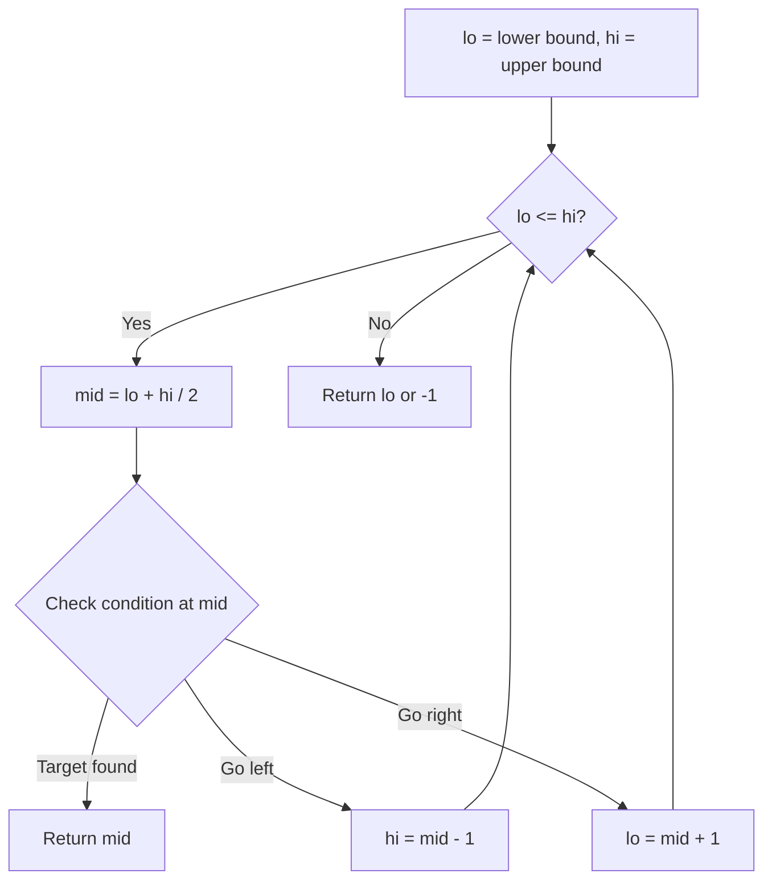
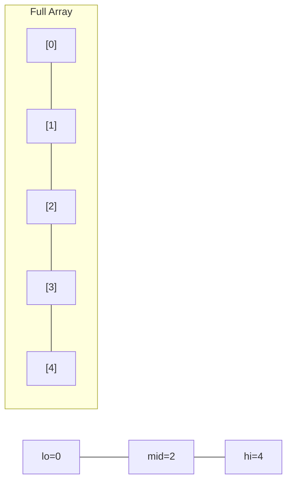
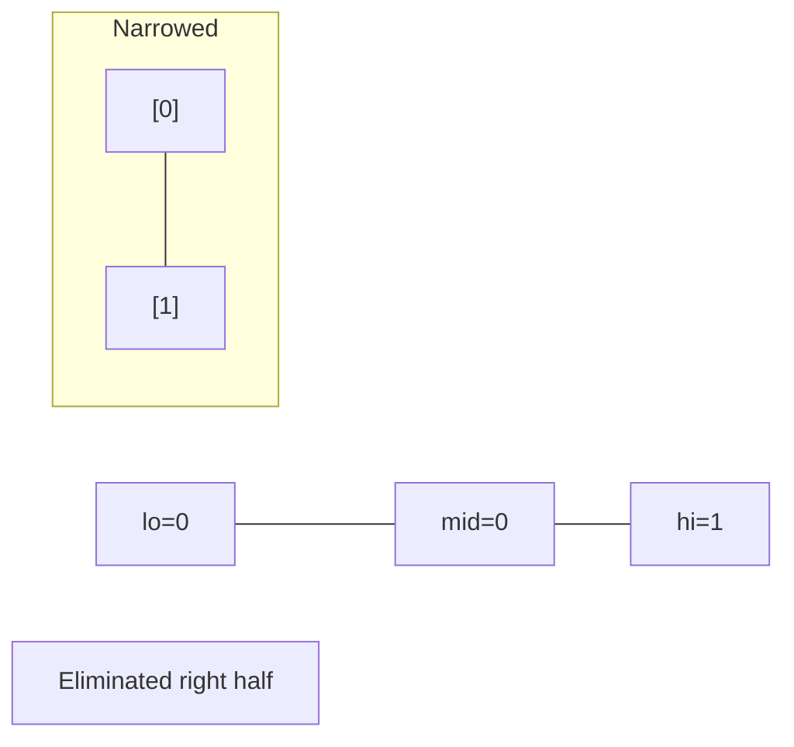
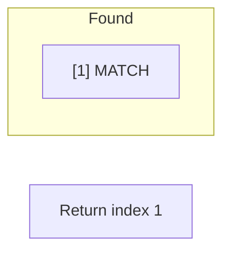

# Problem 852: Peak Index in a Mountain Array

**Difficulty:** Medium  
**Tags:** Array, Binary Search  
**Pattern:** Binary Search  
**Link:** [leetcode.com/problems/peak-index-in-a-mountain-array](https://leetcode.com/problems/peak-index-in-a-mountain-array/)

## Description

You are given an integer **mountain** array `arr` of length `n` where the values increase to a **peak element** and then decrease.

Return the index of the peak element.

Your task is to solve it in `O(log(n))` time complexity.

 

Example 1:

**Input:** arr = [0,1,0]

**Output:** 1

Example 2:

**Input:** arr = [0,2,1,0]

**Output:** 1

Example 3:

**Input:** arr = [0,10,5,2]

**Output:** 1

 

**Constraints:**

	- `3 <= arr.length <= 10^5`
	- `0 <= arr[i] <= 10^6`
	- `arr` is **guaranteed** to be a mountain array.

## Approach: Binary Search

Use binary search to halve the search space each iteration. Define the search range [lo, hi], compute mid, and decide which half to keep based on the problem's monotonic condition.

## Pseudocode

```
1. lo = lower_bound, hi = upper_bound
2. While lo <= hi (or lo < hi):
   a. mid = (lo + hi) // 2
   b. If condition(mid) is satisfied: record answer, search left half
   c. Else: search right half
3. Return answer
```

## Algorithm Flow



## Visual State Transitions

**Binary Search Step-by-Step:**

**Frame 1: Initial search space**


**Frame 2: Compare mid, narrow search**


**Frame 3: Found target**



## Complexity Analysis

- **Time:** O(log n)
- **Space:** O(1)

## Solution (Python3)

```python
class Solution:
    def peakIndexInMountainArray(self, arr: List[int]) -> int:
        # Binary search - O(log n) time, O(1) space
        lo, hi = 0, len(arr) - 1
        while lo <= hi:
            mid = lo + (hi - lo) // 2
            if arr[mid] == arr:
                return mid
            elif arr[mid] < arr:
                lo = mid + 1
            else:
                hi = mid - 1
        return 0
```

## Solution (C++)

```cpp
#include <string>
#include <vector>
using namespace std;

class Solution {
public:
    int peakIndexInMountainArray(vector<int>& arr) {
        // Binary search - O(log n) time, O(1) space
        int lo = 0, hi = arr.size() - 1;
        while (lo <= hi) {
            int mid = lo + (hi - lo) / 2;
            if (arr[mid] == arr) {
                return mid;
            } else if (arr[mid] < arr) {
                lo = mid + 1;
            } else {
                hi = mid - 1;
            }
        }
        return 0;
    }
};
```
