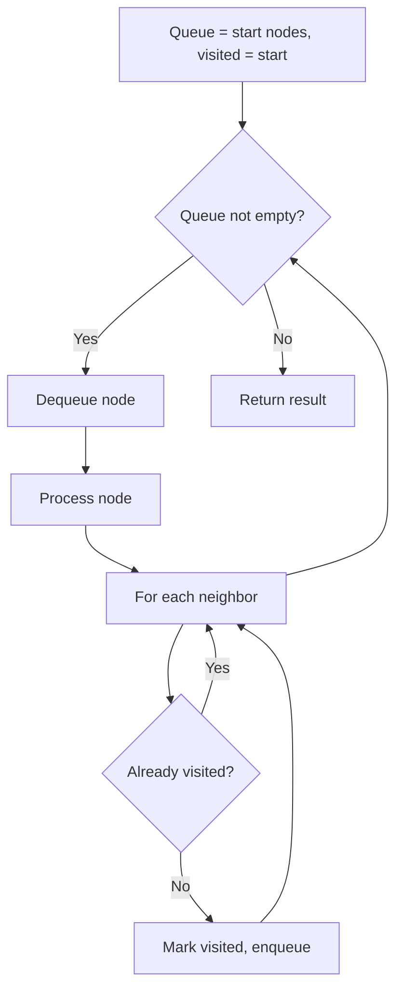
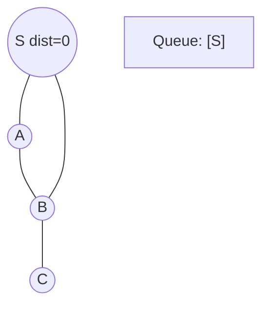
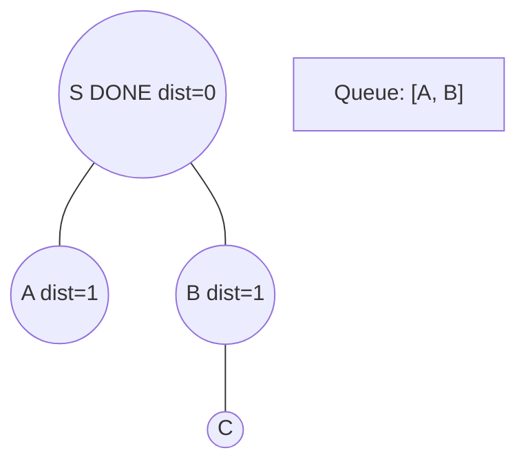
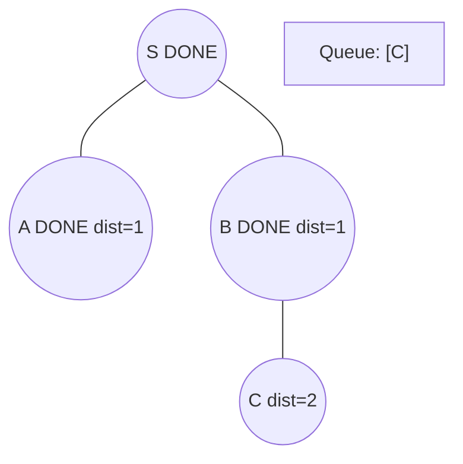
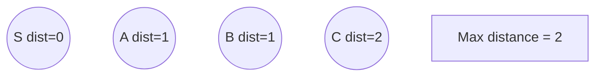

# Problem 854: K-Similar Strings

**Difficulty:** Hard  
**Tags:** Hash Table, String, Breadth-First Search  
**Pattern:** BFS Graph Traversal  
**Link:** [leetcode.com/problems/k-similar-strings](https://leetcode.com/problems/k-similar-strings/)

## Description

Strings `s1` and `s2` are `k`**-similar** (for some non-negative integer `k`) if we can swap the positions of two letters in `s1` exactly `k` times so that the resulting string equals `s2`.

Given two anagrams `s1` and `s2`, return the smallest `k` for which `s1` and `s2` are `k`**-similar**.

 

Example 1:

```

**Input:** s1 = "ab", s2 = "ba"
**Output:** 1
**Explanation:** The two string are 1-similar because we can use one swap to change s1 to s2: "ab" --> "ba".

```

Example 2:

```

**Input:** s1 = "abc", s2 = "bca"
**Output:** 2
**Explanation:** The two strings are 2-similar because we can use two swaps to change s1 to s2: "abc" --> "bac" --> "bca".

```

 

**Constraints:**

	- `1 <= s1.length <= 20`
	- `s2.length == s1.length`
	- `s1` and `s2` contain only lowercase letters from the set `{'a', 'b', 'c', 'd', 'e', 'f'}`.
	- `s2` is an anagram of `s1`.

## Approach: BFS Graph Traversal

Explore the graph breadth-first using a queue. Process nodes level by level; BFS finds shortest paths in unweighted graphs.

## Pseudocode

```
1. Initialize queue with start node(s), visited set
2. While queue not empty:
   a. Dequeue node
   b. Process node
   c. For each unvisited neighbor:
      - Mark visited, enqueue
3. Return result
```

## Algorithm Flow



## Visual State Transitions

**BFS Level-by-Level Traversal:**

**Frame 1: Start BFS from source**


**Frame 2: Process level 0, enqueue neighbors**


**Frame 3: Process level 1**


**Frame 4: All nodes reached**



## Complexity Analysis

- **Time:** O(V + E)
- **Space:** O(V)

## Solution (Python3)

```python
class Solution:
    def kSimilarity(self, s1: str, s2: str) -> int:
        # BFS on graph - O(V+E) time
        from collections import deque
        if not s1:
            return 0
        visited = set()
        queue = deque([0])
        visited.add(0)
        dist = 0
        while queue:
            for _ in range(len(queue)):
                node = queue.popleft()
                # Process node
            dist += 1
        return dist
```

## Solution (C++)

```cpp
#include <queue>
#include <string>
#include <unordered_set>
#include <vector>
using namespace std;

class Solution {
public:
    int kSimilarity(string& s1, string& s2) {
        // BFS on graph - O(V+E) time
        if (s1.empty()) return 0;
        queue<int> q;
        unordered_set<int> visited;
        q.push(0);
        visited.insert(0);
        int dist = 0;
        while (!q.empty()) {
            int sz = q.size();
            for (int i = 0; i < sz; i++) {
                int node = q.front(); q.pop();
                // Process node
            }
            dist++;
        }
        return dist;
    }
};
```
