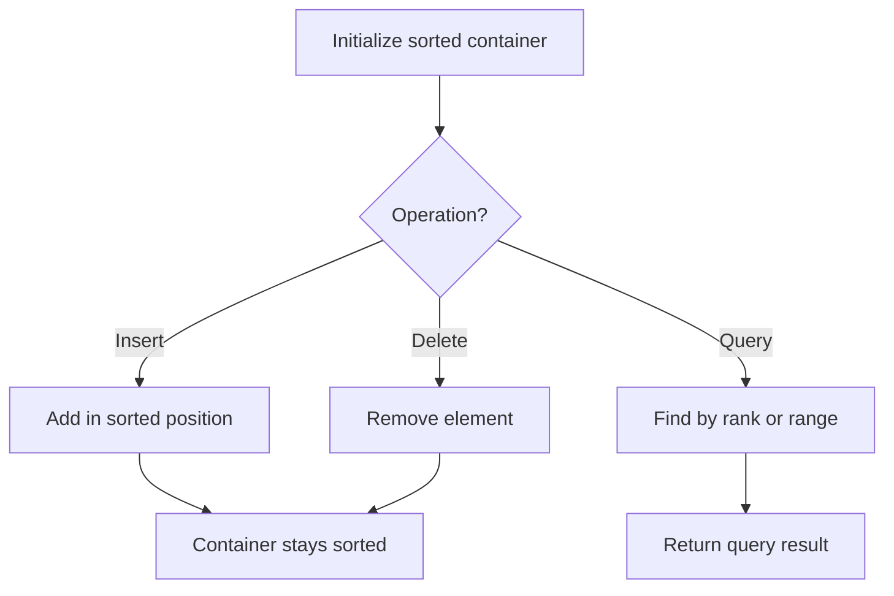

# Problem 855: Exam Room

**Difficulty:** Medium  
**Tags:** Design, Heap (Priority Queue), Ordered Set  
**Pattern:** Ordered Set / SortedList  
**Link:** [leetcode.com/problems/exam-room](https://leetcode.com/problems/exam-room/)

## Description

There is an exam room with `n` seats in a single row labeled from `0` to `n - 1`.

When a student enters the room, they must sit in the seat that maximizes the distance to the closest person. If there are multiple such seats, they sit in the seat with the lowest number. If no one is in the room, then the student sits at seat number `0`.

Design a class that simulates the mentioned exam room.

Implement the `ExamRoom` class:

	- `ExamRoom(int n)` Initializes the object of the exam room with the number of the seats `n`.
	- `int seat()` Returns the label of the seat at which the next student will set.
	- `void leave(int p)` Indicates that the student sitting at seat `p` will leave the room. It is guaranteed that there will be a student sitting at seat `p`.

 

Example 1:

```

**Input**
["ExamRoom", "seat", "seat", "seat", "seat", "leave", "seat"]
[[10], [], [], [], [], [4], []]
**Output**
[null, 0, 9, 4, 2, null, 5]

**Explanation**
ExamRoom examRoom = new ExamRoom(10);
examRoom.seat(); // return 0, no one is in the room, then the student sits at seat number 0.
examRoom.seat(); // return 9, the student sits at the last seat number 9.
examRoom.seat(); // return 4, the student sits at the last seat number 4.
examRoom.seat(); // return 2, the student sits at the last seat number 2.
examRoom.leave(4);
examRoom.seat(); // return 5, the student sits at the last seat number 5.

```

 

**Constraints:**

	- `1 <= n <= 10^9`
	- It is guaranteed that there is a student sitting at seat `p`.
	- At most `10^4` calls will be made to `seat` and `leave`.

## Approach: Ordered Set / SortedList

Maintain elements in sorted order for efficient insertion, deletion, and rank queries. Use balanced BST, skip list, or sorted container.

## Pseudocode

```
1. Initialize sorted container
2. For each operation:
   - Insert: add element in sorted position O(log n)
   - Delete: remove element O(log n)
   - Query: find kth element, count, or range O(log n)
3. Return results
```

## Algorithm Flow



## Complexity Analysis

- **Time:** O(n log n)
- **Space:** O(n)

## Solution (Python3)

```python
class ExamRoom:
    def __init__(self, n: int):
        # Initialize data structure
        self.n = n

    def seat(self) -> int:
        return 0

    def leave(self, p: int) -> None:
        return None

```

## Solution (C++)

```cpp
#include <algorithm>
#include <set>
#include <string>
#include <vector>
using namespace std;

class ExamRoom {
public:
    ExamRoom(int n) {
        // Initialize
    }

    int seat() {
        return 0;
    }

    void leave(int p) {
        return ;
    }

};
```
