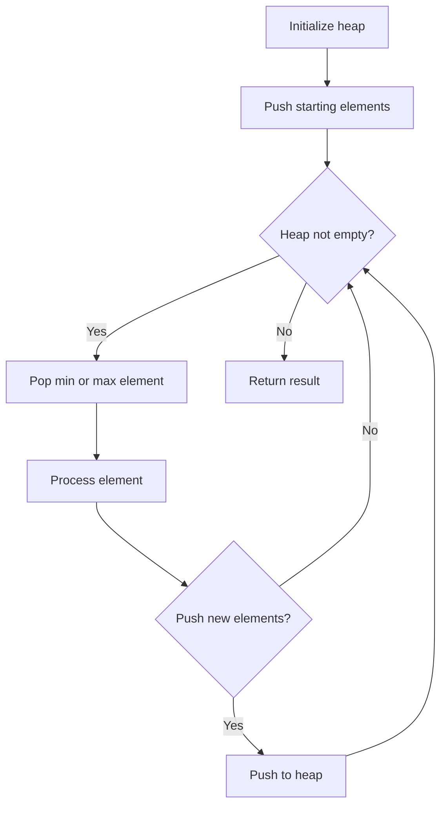
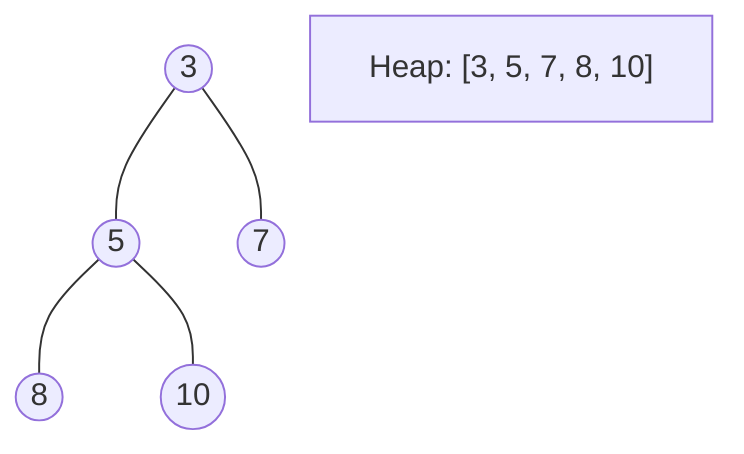
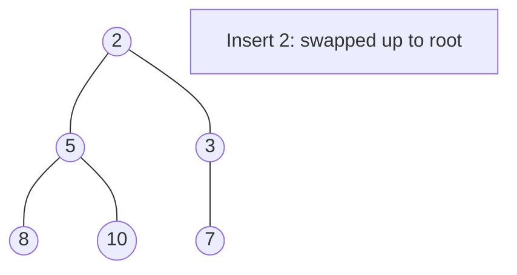
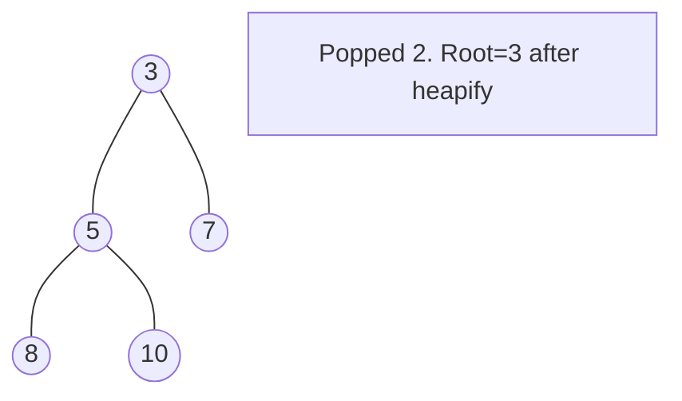

# Problem 857: Minimum Cost to Hire K Workers

**Difficulty:** Hard  
**Tags:** Array, Greedy, Sorting, Heap (Priority Queue)  
**Pattern:** Heap / Priority Queue  
**Link:** [leetcode.com/problems/minimum-cost-to-hire-k-workers](https://leetcode.com/problems/minimum-cost-to-hire-k-workers/)

## Description

There are `n` workers. You are given two integer arrays `quality` and `wage` where `quality[i]` is the quality of the `i^th` worker and `wage[i]` is the minimum wage expectation for the `i^th` worker.

We want to hire exactly `k` workers to form a **paid group**. To hire a group of `k` workers, we must pay them according to the following rules:

	- Every worker in the paid group must be paid at least their minimum wage expectation.
	- In the group, each worker's pay must be directly proportional to their quality. This means if a worker’s quality is double that of another worker in the group, then they must be paid twice as much as the other worker.

Given the integer `k`, return *the least amount of money needed to form a paid group satisfying the above conditions*. Answers within `10^-5` of the actual answer will be accepted.

 

Example 1:

```

**Input:** quality = [10,20,5], wage = [70,50,30], k = 2
**Output:** 105.00000
**Explanation:** We pay 70 to 0th worker and 35 to 2nd worker.

```

Example 2:

```

**Input:** quality = [3,1,10,10,1], wage = [4,8,2,2,7], k = 3
**Output:** 30.66667
**Explanation:** We pay 4 to 0th worker, 13.33333 to 2nd and 3rd workers separately.

```

 

**Constraints:**

	- `n == quality.length == wage.length`
	- `1 <= k <= n <= 10^4`
	- `1 <= quality[i], wage[i] <= 10^4`

## Approach: Heap / Priority Queue

Use a min-heap or max-heap to efficiently access the smallest/largest element. Push elements and pop the top to process in priority order.

## Pseudocode

```
1. Initialize heap (min or max)
2. Push initial elements onto heap
3. While heap not empty and condition:
   a. Pop top element (min or max)
   b. Process element
   c. Push new elements if needed
4. Return result
```

## Algorithm Flow



## Visual State Transitions

**Heap Operations (Min-Heap):**

**Frame 1: Initial heap**


**Frame 2: Insert 2 - bubble up**


**Frame 3: Pop minimum (2) - heapify down**



## Complexity Analysis

- **Time:** O(n log n)
- **Space:** O(n)

## Solution (Python3)

```python
class Solution:
    def mincostToHireWorkers(self, quality: List[int], wage: List[int], k: int) -> float:
        # Heap/Priority Queue - O(n log k) time
        import heapq
        if not quality:
            return 0.0
        # Min heap (negate for max heap)
        heap = []
        for val in quality:
            heapq.heappush(heap, val)
            if len(heap) > (wage if isinstance(wage, int) else len(quality)):
                heapq.heappop(heap)
        return heap[0] if heap else 0.0
```

## Solution (C++)

```cpp
#include <queue>
#include <string>
#include <vector>
using namespace std;

class Solution {
public:
    double mincostToHireWorkers(vector<int>& quality, vector<int>& wage, int k) {
        // Heap/Priority Queue - O(n log k) time
        priority_queue<int, vector<int>, greater<int>> pq;
        for (int val : quality) {
            pq.push(val);
            if ((int)pq.size() > wage)
                pq.pop();
        }
        return pq.empty() ? 0.0 : pq.top();
    }
};
```
