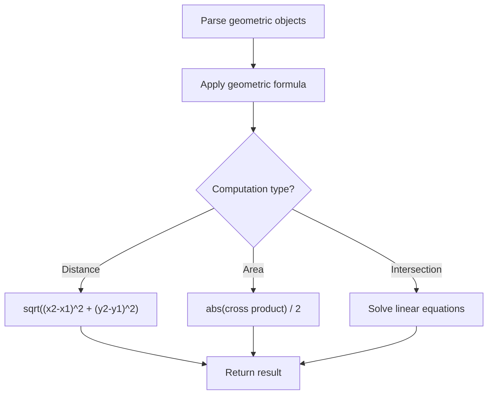

# Problem 858: Mirror Reflection

**Difficulty:** Medium  
**Tags:** Math, Geometry, Number Theory  
**Pattern:** Geometry  
**Link:** [leetcode.com/problems/mirror-reflection](https://leetcode.com/problems/mirror-reflection/)

## Description

There is a special square room with mirrors on each of the four walls. Except for the southwest corner, there are receptors on each of the remaining corners, numbered `0`, `1`, and `2`.

The square room has walls of length `p` and a laser ray from the southwest corner first meets the east wall at a distance `q` from the `0^th` receptor.

Given the two integers `p` and `q`, return *the number of the receptor that the ray meets first*.

The test cases are guaranteed so that the ray will meet a receptor eventually.

 

Example 1:

```

**Input:** p = 2, q = 1
**Output:** 2
**Explanation:** The ray meets receptor 2 the first time it gets reflected back to the left wall.

```

Example 2:

```

**Input:** p = 3, q = 1
**Output:** 1

```

 

**Constraints:**

	- `1 <= q <= p <= 1000`

## Approach: Geometry

Apply geometric formulas: distance, area, cross product, convex hull, line intersection. Handle floating-point precision carefully.

## Pseudocode

```
1. Parse geometric objects (points, lines, shapes)
2. Apply geometric operations:
   - Distance formula
   - Cross/dot product
   - Area computation
3. Handle precision and edge cases
4. Return result
```

## Algorithm Flow



## Complexity Analysis

- **Time:** O(n^2) or O(n log n)
- **Space:** O(n)

## Solution (Python3)

```python
class Solution:
    def mirrorReflection(self, p: int, q: int) -> int:
        # Geometry approach
        import math
        result = 0
        for i in range(len(p)):
            for j in range(i + 1, len(p)):
                dx = p[i][0] - p[j][0]
                dy = p[i][1] - p[j][1]
                dist = math.sqrt(dx*dx + dy*dy)
                result = max(result, dist)
        return result
```

## Solution (C++)

```cpp
#include <algorithm>
#include <cmath>
#include <string>
#include <vector>
using namespace std;

class Solution {
public:
    int mirrorReflection(int p, int q) {
        // Geometry approach
        double result = 0;
        for (int i = 0; i < (int)p.size(); i++) {
            for (int j = i + 1; j < (int)p.size(); j++) {
                double dx = p[i][0] - p[j][0];
                double dy = p[i][1] - p[j][1];
                result = max(result, sqrt(dx*dx + dy*dy));
            }
        }
        return result;
    }
};
```
