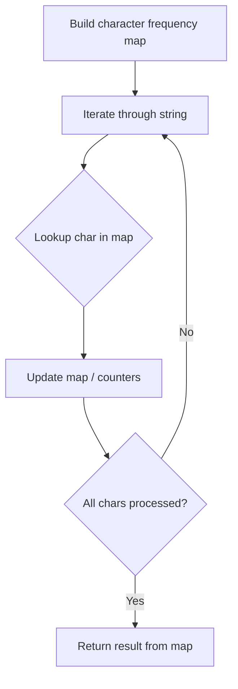

# Problem 859: Buddy Strings

**Difficulty:** Easy  
**Tags:** Hash Table, String  
**Pattern:** Hash Map String Processing  
**Link:** [leetcode.com/problems/buddy-strings](https://leetcode.com/problems/buddy-strings/)

## Description

Given two strings `s` and `goal`, return `true`* if you can swap two letters in *`s`* so the result is equal to *`goal`*, otherwise, return *`false`*.*

Swapping letters is defined as taking two indices `i` and `j` (0-indexed) such that `i != j` and swapping the characters at `s[i]` and `s[j]`.

	- For example, swapping at indices `0` and `2` in `"abcd"` results in `"cbad"`.

 

Example 1:

```

**Input:** s = "ab", goal = "ba"
**Output:** true
**Explanation:** You can swap s[0] = 'a' and s[1] = 'b' to get "ba", which is equal to goal.

```

Example 2:

```

**Input:** s = "ab", goal = "ab"
**Output:** false
**Explanation:** The only letters you can swap are s[0] = 'a' and s[1] = 'b', which results in "ba" != goal.

```

Example 3:

```

**Input:** s = "aa", goal = "aa"
**Output:** true
**Explanation:** You can swap s[0] = 'a' and s[1] = 'a' to get "aa", which is equal to goal.

```

 

**Constraints:**

	- `1 <= s.length, goal.length <= 2 * 10^4`
	- `s` and `goal` consist of lowercase letters.

## Approach: Hash Map String Processing

Use a hash map to count character frequencies or map characters/strings for O(1) lookups. Process the string in one or two passes.

## Pseudocode

```
1. Build frequency map / char-to-index map
2. Iterate through string:
   a. Look up character in map
   b. Update counts or mappings
3. Return result based on map state
```

## Algorithm Flow



## Complexity Analysis

- **Time:** O(n)
- **Space:** O(n)

## Solution (Python3)

```python
class Solution:
    def buddyStrings(self, s: str, goal: str) -> bool:
        # Hash map for string/character frequency - O(n) time
        freq = {}
        for ch in s:
            freq[ch] = freq.get(ch, 0) + 1
        # Process frequency map
        for ch, cnt in freq.items():
            if cnt == 1:
                return s.index(ch)
        return False
```

## Solution (C++)

```cpp
#include <string>
#include <unordered_map>
#include <vector>
using namespace std;

class Solution {
public:
    bool buddyStrings(string& s, string& goal) {
        // Hash map for string/character frequency - O(n) time
        unordered_map<char, int> freq;
        for (char ch : s) {
            freq[ch]++;
        }
        // Process frequency map
        for (int i = 0; i < s.size(); i++) {
            if (freq[s[i]] == 1) return i;
        }
        return false;
    }
};
```
