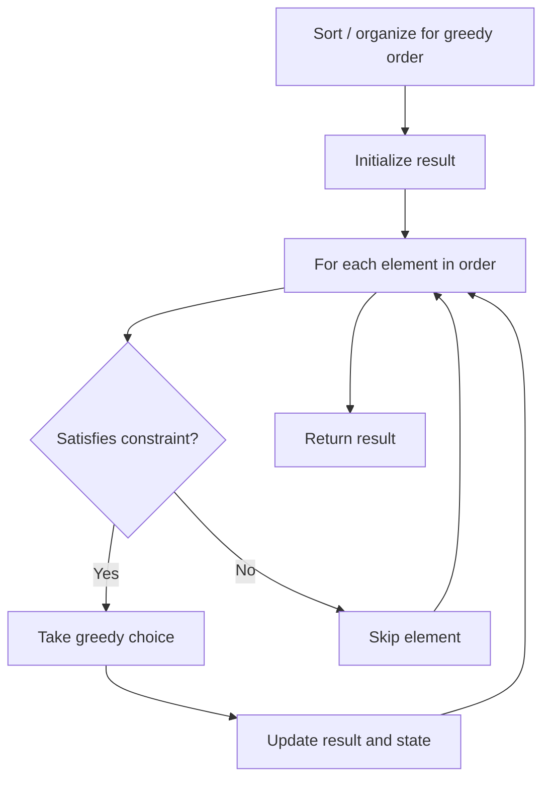

# Problem 860: Lemonade Change

**Difficulty:** Easy  
**Tags:** Array, Greedy  
**Pattern:** Greedy  
**Link:** [leetcode.com/problems/lemonade-change](https://leetcode.com/problems/lemonade-change/)

## Description

At a lemonade stand, each lemonade costs `$5`. Customers are standing in a queue to buy from you and order one at a time (in the order specified by bills). Each customer will only buy one lemonade and pay with either a `$5`, `$10`, or `$20` bill. You must provide the correct change to each customer so that the net transaction is that the customer pays `$5`.

Note that you do not have any change in hand at first.

Given an integer array `bills` where `bills[i]` is the bill the `i^th` customer pays, return `true` *if you can provide every customer with the correct change, or* `false` *otherwise*.

 

Example 1:

```

**Input:** bills = [5,5,5,10,20]
**Output:** true
**Explanation:** 
From the first 3 customers, we collect three $5 bills in order.
From the fourth customer, we collect a $10 bill and give back a $5.
From the fifth customer, we give a $10 bill and a $5 bill.
Since all customers got correct change, we output true.

```

Example 2:

```

**Input:** bills = [5,5,10,10,20]
**Output:** false
**Explanation:** 
From the first two customers in order, we collect two $5 bills.
For the next two customers in order, we collect a $10 bill and give back a $5 bill.
For the last customer, we can not give the change of $15 back because we only have two $10 bills.
Since not every customer received the correct change, the answer is false.

```

 

**Constraints:**

	- `1 <= bills.length <= 10^5`
	- `bills[i]` is either `5`, `10`, or `20`.

## Approach: Greedy

Make the locally optimal choice at each step, trusting it leads to a global optimum. Greedy works when the problem has the greedy-choice property and optimal substructure.

## Pseudocode

```
1. Sort or organize data for greedy ordering
2. Initialize result
3. For each element in greedy order:
   a. If element satisfies constraint:
      - Take the greedy choice
      - Update result and state
4. Return result
```

## Algorithm Flow



## Complexity Analysis

- **Time:** O(n log n)
- **Space:** O(1)

## Solution (Python3)

```python
class Solution:
    def lemonadeChange(self, bills: List[int]) -> bool:
        # Greedy approach - O(n) time
        result = 0
        curr_max = 0
        for i in range(len(bills)):
            if isinstance(bills[i], int):
                curr_max = max(curr_max, bills[i])
                result = max(result, curr_max)
            else:
                result += 1
        return result
```

## Solution (C++)

```cpp
#include <algorithm>
#include <string>
#include <vector>
using namespace std;

class Solution {
public:
    bool lemonadeChange(vector<int>& bills) {
        // Greedy approach - O(n) time
        int result = 0, curr_max = 0;
        for (int i = 0; i < (int)bills.size(); i++) {
            curr_max = max(curr_max, bills[i]);
            result = max(result, curr_max);
        }
        return result;
    }
};
```
