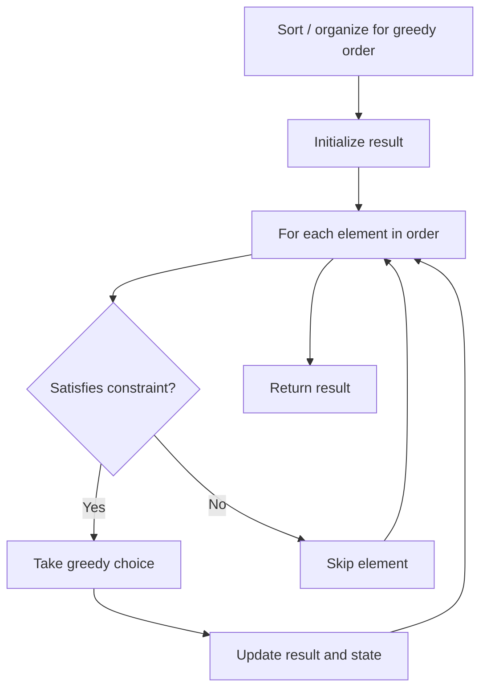

# Problem 861: Score After Flipping Matrix

**Difficulty:** Medium  
**Tags:** Array, Greedy, Bit Manipulation, Matrix  
**Pattern:** Greedy  
**Link:** [leetcode.com/problems/score-after-flipping-matrix](https://leetcode.com/problems/score-after-flipping-matrix/)

## Description

You are given an `m x n` binary matrix `grid`.

A **move** consists of choosing any row or column and toggling each value in that row or column (i.e., changing all `0`'s to `1`'s, and all `1`'s to `0`'s).

Every row of the matrix is interpreted as a binary number, and the **score** of the matrix is the sum of these numbers.

Return *the highest possible **score** after making any number of **moves** (including zero moves)*.

 

Example 1:

```

**Input:** grid = [[0,0,1,1],[1,0,1,0],[1,1,0,0]]
**Output:** 39
**Explanation:** 0b1111 + 0b1001 + 0b1111 = 15 + 9 + 15 = 39

```

Example 2:

```

**Input:** grid = [[0]]
**Output:** 1

```

 

**Constraints:**

	- `m == grid.length`
	- `n == grid[i].length`
	- `1 <= m, n <= 20`
	- `grid[i][j]` is either `0` or `1`.

## Approach: Greedy

Make the locally optimal choice at each step, trusting it leads to a global optimum. Greedy works when the problem has the greedy-choice property and optimal substructure.

## Pseudocode

```
1. Sort or organize data for greedy ordering
2. Initialize result
3. For each element in greedy order:
   a. If element satisfies constraint:
      - Take the greedy choice
      - Update result and state
4. Return result
```

## Algorithm Flow



## Complexity Analysis

- **Time:** O(n log n)
- **Space:** O(1)

## Solution (Python3)

```python
class Solution:
    def matrixScore(self, grid: List[List[int]]) -> int:
        # Greedy approach - O(n) time
        result = 0
        curr_max = 0
        for i in range(len(grid)):
            if isinstance(grid[i], int):
                curr_max = max(curr_max, grid[i])
                result = max(result, curr_max)
            else:
                result += 1
        return result
```

## Solution (C++)

```cpp
#include <algorithm>
#include <string>
#include <vector>
using namespace std;

class Solution {
public:
    int matrixScore(vector<vector<int>>& grid) {
        // Greedy approach - O(n) time
        int result = 0, curr_max = 0;
        for (int i = 0; i < (int)grid.size(); i++) {
            curr_max = max(curr_max, grid[i]);
            result = max(result, curr_max);
        }
        return result;
    }
};
```
