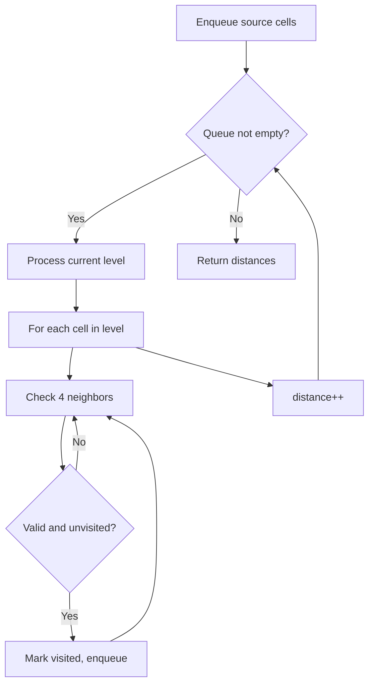
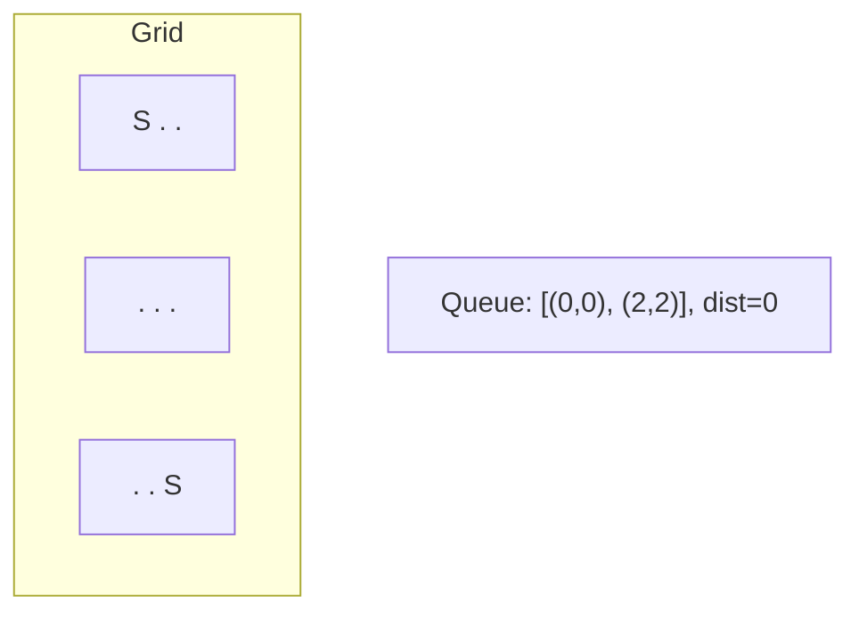
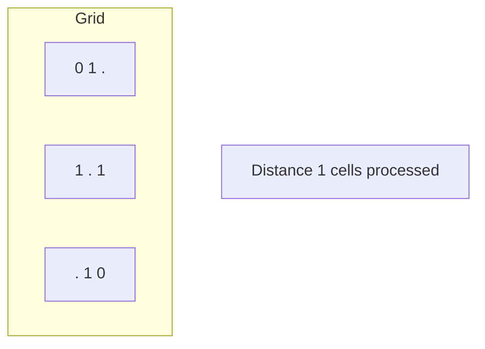
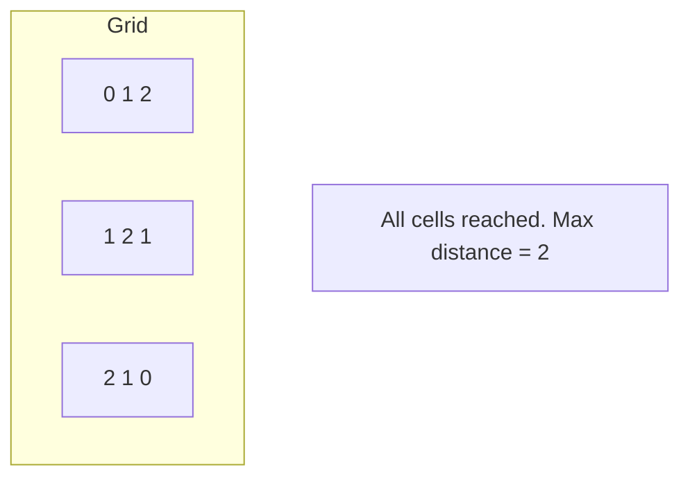

# Problem 864: Shortest Path to Get All Keys

**Difficulty:** Hard  
**Tags:** Array, Bit Manipulation, Breadth-First Search, Matrix  
**Pattern:** BFS on Matrix / Grid  
**Link:** [leetcode.com/problems/shortest-path-to-get-all-keys](https://leetcode.com/problems/shortest-path-to-get-all-keys/)

## Description

You are given an `m x n` grid `grid` where:

	- `'.'` is an empty cell.
	- `'#'` is a wall.
	- `'@'` is the starting point.
	- Lowercase letters represent keys.
	- Uppercase letters represent locks.

You start at the starting point and one move consists of walking one space in one of the four cardinal directions. You cannot walk outside the grid, or walk into a wall.

If you walk over a key, you can pick it up and you cannot walk over a lock unless you have its corresponding key.

For some `1 <= k <= 6`, there is exactly one lowercase and one uppercase letter of the first `k` letters of the English alphabet in the grid. This means that there is exactly one key for each lock, and one lock for each key; and also that the letters used to represent the keys and locks were chosen in the same order as the English alphabet.

Return *the lowest number of moves to acquire all keys*. If it is impossible, return `-1`.

 

Example 1:

```

**Input:** grid = ["@.a..","###.#","b.A.B"]
**Output:** 8
**Explanation:** Note that the goal is to obtain all the keys not to open all the locks.

```

Example 2:

```

**Input:** grid = ["@..aA","..B#.","....b"]
**Output:** 6

```

Example 3:

```

**Input:** grid = ["@Aa"]
**Output:** -1

```

 

**Constraints:**

	- `m == grid.length`
	- `n == grid[i].length`
	- `1 <= m, n <= 30`
	- `grid[i][j]` is either an English letter, `'.'`, `'#'`, or `'@'`. 
	- There is exactly one `'@'` in the grid.
	- The number of keys in the grid is in the range `[1, 6]`.
	- Each key in the grid is **unique**.
	- Each key in the grid has a matching lock.

## Approach: BFS on Matrix / Grid

Breadth-first search on the grid. Enqueue all starting cells, then expand level by level. BFS on grids finds shortest distance from source(s).

## Pseudocode

```
1. Enqueue all source cells, mark visited
2. distance = 0
3. While queue not empty:
   a. Process all cells at current distance
   b. For each cell, enqueue unvisited neighbors
   c. distance++
4. Return result
```

## Algorithm Flow



## Visual State Transitions

**Multi-source BFS on Grid:**

**Frame 1: Enqueue all sources**


**Frame 2: Expand distance 1**


**Frame 3: Expand distance 2**



## Complexity Analysis

- **Time:** O(m * n)
- **Space:** O(m * n)

## Solution (Python3)

```python
class Solution:
    def shortestPathAllKeys(self, grid: List[str]) -> int:
        # BFS on grid - O(m*n) time
        from collections import deque
        if not grid:
            return 0
        rows, cols = len(grid), len(grid[0])
        queue = deque()
        visited = set()
        # Initialize BFS sources
        for r in range(rows):
            for c in range(cols):
                if grid[r][c] == 1 or grid[r][c] == '1':
                    queue.append((r, c, 0))
                    visited.add((r, c))
        steps = 0
        while queue:
            r, c, d = queue.popleft()
            steps = max(steps, d)
            for dr, dc in [(1,0),(-1,0),(0,1),(0,-1)]:
                nr, nc = r+dr, c+dc
                if 0 <= nr < rows and 0 <= nc < cols and (nr,nc) not in visited:
                    visited.add((nr, nc))
                    queue.append((nr, nc, d+1))
        return steps
```

## Solution (C++)

```cpp
#include <algorithm>
#include <queue>
#include <string>
#include <tuple>
#include <vector>
using namespace std;

class Solution {
public:
    int shortestPathAllKeys(vector<string>& grid) {
        // BFS on grid - O(m*n) time
        if (grid.empty()) return 0;
        int rows = grid.size(), cols = grid[0].size();
        queue<tuple<int,int,int>> q;
        vector<vector<bool>> visited(rows, vector<bool>(cols, false));
        int dirs[4][2] = {{1,0},{-1,0},{0,1},{0,-1}};
        for (int r = 0; r < rows; r++)
            for (int c = 0; c < cols; c++)
                if (grid[r][c] == 1) {
                    q.push({r, c, 0});
                    visited[r][c] = true;
                }
        int steps = 0;
        while (!q.empty()) {
            auto [r, c, d] = q.front(); q.pop();
            steps = max(steps, d);
            for (auto& dir : dirs) {
                int nr = r+dir[0], nc = c+dir[1];
                if (nr>=0 && nr<rows && nc>=0 && nc<cols && !visited[nr][nc]) {
                    visited[nr][nc] = true;
                    q.push({nr, nc, d+1});
                }
            }
        }
        return steps;
    }
};
```
