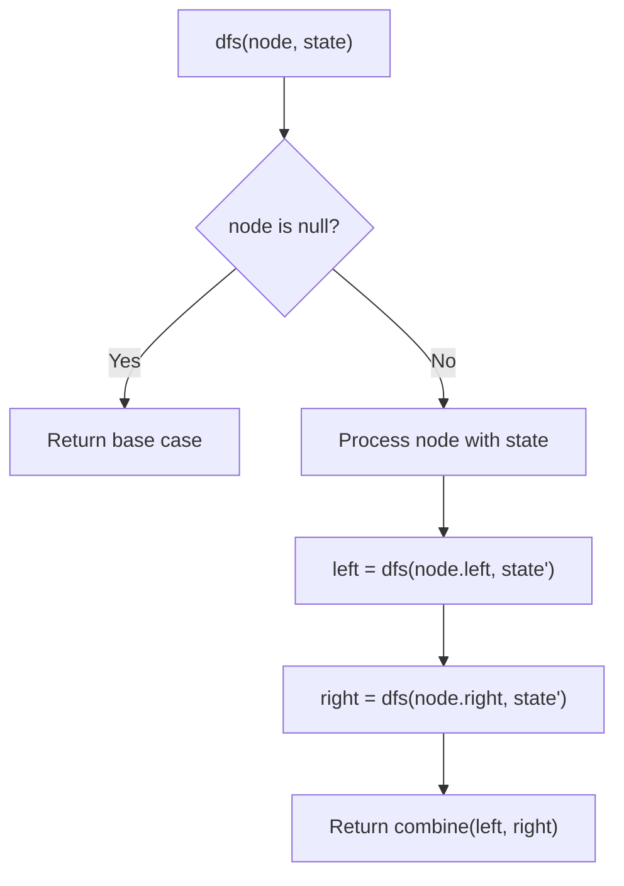
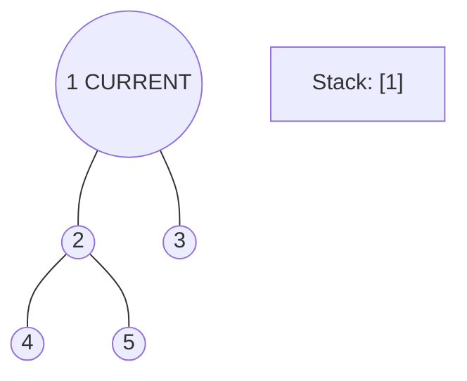
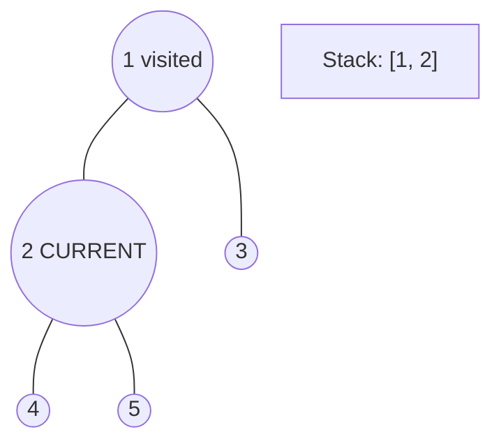
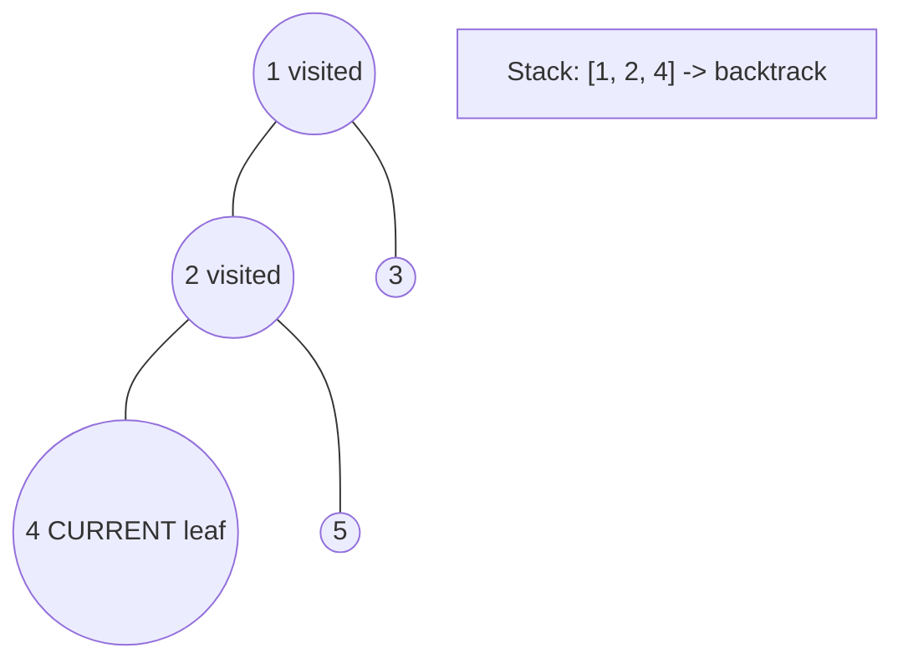
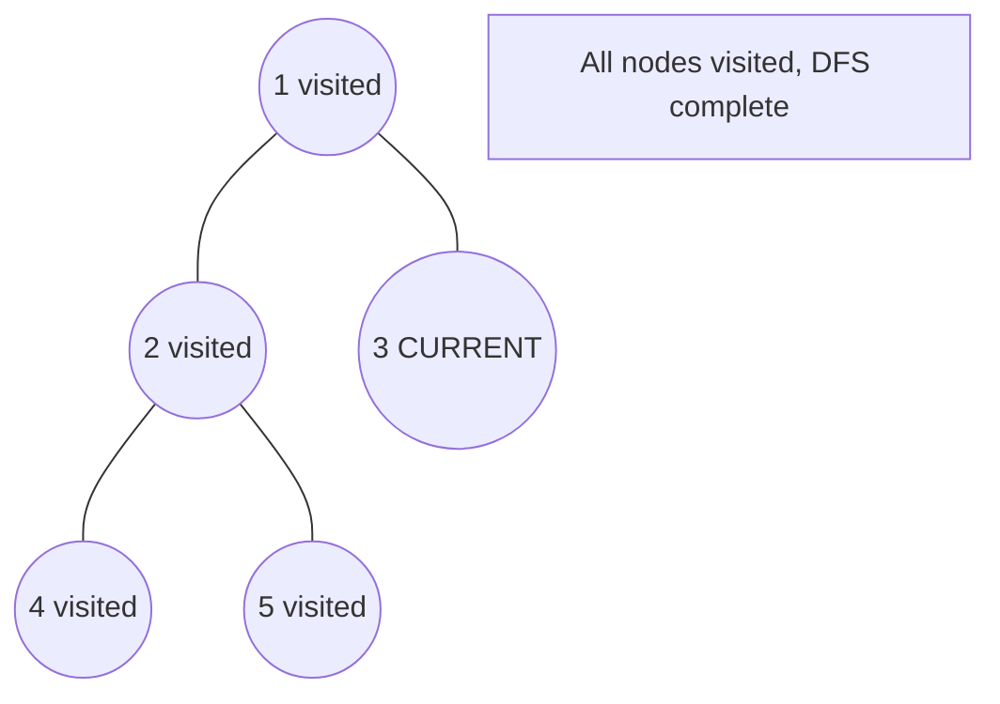

# Problem 865: Smallest Subtree with all the Deepest Nodes

**Difficulty:** Medium  
**Tags:** Hash Table, Tree, Depth-First Search, Breadth-First Search, Binary Tree  
**Pattern:** DFS Tree Traversal  
**Link:** [leetcode.com/problems/smallest-subtree-with-all-the-deepest-nodes](https://leetcode.com/problems/smallest-subtree-with-all-the-deepest-nodes/)

## Description

Given the `root` of a binary tree, the depth of each node is **the shortest distance to the root**.

Return *the smallest subtree* such that it contains **all the deepest nodes** in the original tree.

A node is called **the deepest** if it has the largest depth possible among any node in the entire tree.

The **subtree** of a node is a tree consisting of that node, plus the set of all descendants of that node.

 

Example 1:

```

**Input:** root = [3,5,1,6,2,0,8,null,null,7,4]
**Output:** [2,7,4]
**Explanation:** We return the node with value 2, colored in yellow in the diagram.
The nodes coloured in blue are the deepest nodes of the tree.
Notice that nodes 5, 3 and 2 contain the deepest nodes in the tree but node 2 is the smallest subtree among them, so we return it.

```

Example 2:

```

**Input:** root = [1]
**Output:** [1]
**Explanation:** The root is the deepest node in the tree.

```

Example 3:

```

**Input:** root = [0,1,3,null,2]
**Output:** [2]
**Explanation:** The deepest node in the tree is 2, the valid subtrees are the subtrees of nodes 2, 1 and 0 but the subtree of node 2 is the smallest.

```

 

**Constraints:**

	- The number of nodes in the tree will be in the range `[1, 500]`.
	- `0 <= Node.val <= 500`
	- The values of the nodes in the tree are **unique**.

 

**Note:** This question is the same as 1123: https://leetcode.com/problems/lowest-common-ancestor-of-deepest-leaves/

## Approach: DFS Tree Traversal

Perform depth-first search on the tree. Recurse on left and right subtrees, combining results bottom-up. Track state (path, depth, sum) during traversal.

## Pseudocode

```
1. Define dfs(node, state):
   a. Base case: if null, return default
   b. Process node with current state
   c. left_result = dfs(node.left, updated_state)
   d. right_result = dfs(node.right, updated_state)
   e. Return combine(left_result, right_result)
2. Return dfs(root, initial_state)
```

## Algorithm Flow



## Visual State Transitions

**DFS Tree Traversal Step-by-Step:**

**Frame 1: Start at root**


**Frame 2: Go left - visit node 2**


**Frame 3: Go left - visit node 4 (leaf)**


**Frame 4: Backtrack, visit node 5, then node 3**



## Complexity Analysis

- **Time:** O(n)
- **Space:** O(h)

## Solution (Python3)

```python
class Solution:
    def subtreeWithAllDeepest(self, root: Optional[TreeNode]) -> Optional[TreeNode]:
        # DFS on binary tree - O(n) time, O(h) space
        def dfs(node):
            if not node:
                return 0
            left = dfs(node.left)
            right = dfs(node.right)
            return 1 + max(left, right)
        
        result = dfs(root)
        return result
```

## Solution (C++)

```cpp
#include <algorithm>
#include <functional>
#include <string>
#include <vector>
using namespace std;

class Solution {
public:
    TreeNode* subtreeWithAllDeepest(TreeNode* root) {
        // DFS on binary tree - O(n) time, O(h) space
        function<int(TreeNode*)> dfs = [&](TreeNode* node) -> int {
            if (!node) return 0;
            int left = dfs(node->left);
            int right = dfs(node->right);
            return 1 + max(left, right);
        };
        return dfs(root);
    }
};
```
