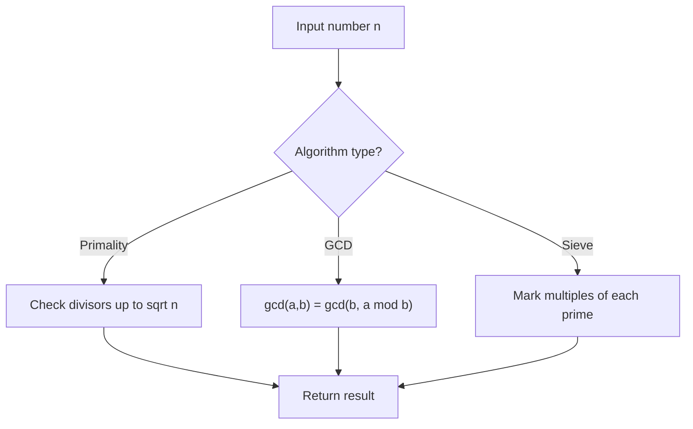

# Problem 866: Prime Palindrome

**Difficulty:** Medium  
**Tags:** Math, Number Theory  
**Pattern:** Number Theory  
**Link:** [leetcode.com/problems/prime-palindrome](https://leetcode.com/problems/prime-palindrome/)

## Description

Given an integer n, return *the smallest **prime palindrome** greater than or equal to *`n`.

An integer is **prime** if it has exactly two divisors: `1` and itself. Note that `1` is not a prime number.

	- For example, `2`, `3`, `5`, `7`, `11`, and `13` are all primes.

An integer is a **palindrome** if it reads the same from left to right as it does from right to left.

	- For example, `101` and `12321` are palindromes.

The test cases are generated so that the answer always exists and is in the range `[2, 2 * 10^8]`.

 

Example 1:

```
**Input:** n = 6
**Output:** 7

```
Example 2:

```
**Input:** n = 8
**Output:** 11

```
Example 3:

```
**Input:** n = 13
**Output:** 101

```

 

**Constraints:**

	- `1 <= n <= 10^8`

## Approach: Number Theory

Apply number theory: prime checking, factorization, GCD, modular exponentiation, sieve of Eratosthenes, or Euler's totient.

## Pseudocode

```
1. Apply number-theoretic algorithm:
   - Sieve for primes up to n
   - GCD via Euclidean algorithm
   - Modular exponentiation
2. Process results
3. Return answer
```

## Algorithm Flow



## Complexity Analysis

- **Time:** O(sqrt(n)) or O(n log log n)
- **Space:** O(n)

## Solution (Python3)

```python
class Solution:
    def primePalindrome(self, n: int) -> int:
        # Number theory approach
        def gcd(a, b):
            while b:
                a, b = b, a % b
            return a
        
        result = n[0] if isinstance(n, list) else n
        if isinstance(n, list):
            for val in n[1:]:
                result = gcd(result, val)
        return result
```

## Solution (C++)

```cpp
#include <string>
#include <vector>
using namespace std;

class Solution {
public:
    int primePalindrome(int n) {
        // Number theory approach
        auto gcd_func = [](int a, int b) -> int {
            while (b) { int t = b; b = a % b; a = t; }
            return a;
        };
        int result = n[0];
        for (int i = 1; i < (int)n.size(); i++) {
            result = gcd_func(result, n[i]);
        }
        return result;
    }
};
```
