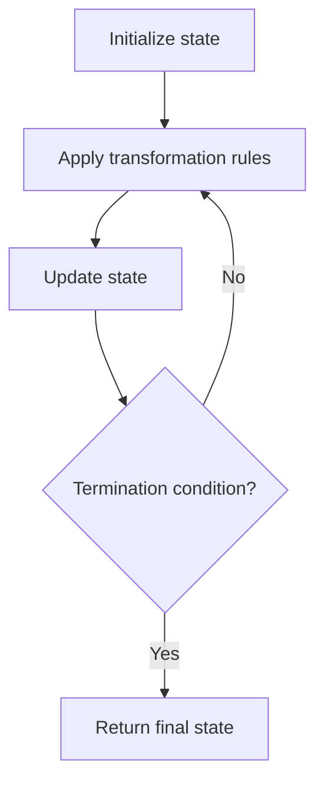

# Problem 867: Transpose Matrix

**Difficulty:** Easy  
**Tags:** Array, Matrix, Simulation  
**Pattern:** Simulation  
**Link:** [leetcode.com/problems/transpose-matrix](https://leetcode.com/problems/transpose-matrix/)

## Description

Given a 2D integer array `matrix`, return *the **transpose** of* `matrix`.

The **transpose** of a matrix is the matrix flipped over its main diagonal, switching the matrix's row and column indices.

 

Example 1:

```

**Input:** matrix = [[1,2,3],[4,5,6],[7,8,9]]
**Output:** [[1,4,7],[2,5,8],[3,6,9]]

```

Example 2:

```

**Input:** matrix = [[1,2,3],[4,5,6]]
**Output:** [[1,4],[2,5],[3,6]]

```

 

**Constraints:**

	- `m == matrix.length`
	- `n == matrix[i].length`
	- `1 <= m, n <= 1000`
	- `1 <= m * n <= 10^5`
	- `-10^9 <= matrix[i][j] <= 10^9`

## Approach: Simulation

Simulate the process described in the problem step by step. Follow the rules exactly, tracking state at each step.

## Pseudocode

```
1. Initialize state (grid, pointers, counters)
2. For each step / iteration:
   a. Apply the transformation rules
   b. Update state
   c. Check termination condition
3. Return final state or result
```

## Algorithm Flow



## Complexity Analysis

- **Time:** O(n) or O(n * k)
- **Space:** O(n)

## Solution (Python3)

```python
class Solution:
    def transpose(self, matrix: List[List[int]]) -> List[List[int]]:
        # Simulation approach - follow the rules step by step
        result = []
        for i in range(len(matrix) if isinstance(matrix, list) else matrix):
            # Simulate each step
            pass
        return result
```

## Solution (C++)

```cpp
#include <string>
#include <vector>
using namespace std;

class Solution {
public:
    vector<vector<int>> transpose(vector<vector<int>>& matrix) {
        // Simulation approach
        int n = matrix.size();
        for (int i = 0; i < n; i++) {
            // Simulate each step
        }
        return {};
    }
};
```
