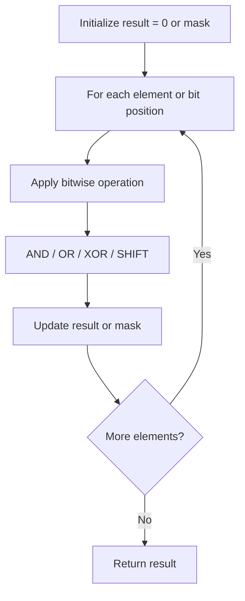

# Problem 868: Binary Gap

**Difficulty:** Easy  
**Tags:** Bit Manipulation  
**Pattern:** Bit Manipulation  
**Link:** [leetcode.com/problems/binary-gap](https://leetcode.com/problems/binary-gap/)

## Description

Given a positive integer `n`, find and return *the **longest distance** between any two **adjacent** *`1`*'s in the binary representation of *`n`*. If there are no two adjacent *`1`*'s, return *`0`*.*

Two `1`'s are **adjacent** if there are only `0`'s separating them (possibly no `0`'s). The **distance** between two `1`'s is the absolute difference between their bit positions. For example, the two `1`'s in `"1001"` have a distance of 3.

 

Example 1:

```

**Input:** n = 22
**Output:** 2
**Explanation:** 22 in binary is "10110".
The first adjacent pair of 1's is "10110" with a distance of 2.
The second adjacent pair of 1's is "10110" with a distance of 1.
The answer is the largest of these two distances, which is 2.
Note that "10110" is not a valid pair since there is a 1 separating the two 1's underlined.

```

Example 2:

```

**Input:** n = 8
**Output:** 0
**Explanation:** 8 in binary is "1000".
There are not any adjacent pairs of 1's in the binary representation of 8, so we return 0.

```

Example 3:

```

**Input:** n = 5
**Output:** 2
**Explanation:** 5 in binary is "101".

```

 

**Constraints:**

	- `1 <= n <= 10^9`

## Approach: Bit Manipulation

Operate on individual bits using bitwise operators (AND, OR, XOR, shift). Common tricks: x & (x-1) removes lowest set bit, x ^ x = 0, XOR all elements to find unique.

## Pseudocode

```
1. Apply bitwise operations:
   - XOR all elements to cancel paired bits
   - Use bitmask to track state
   - Shift and mask to extract/set individual bits
2. Return result
```

## Algorithm Flow



## Complexity Analysis

- **Time:** O(n) or O(log n)
- **Space:** O(1)

## Solution (Python3)

```python
class Solution:
    def binaryGap(self, n: int) -> int:
        # Bit manipulation - O(n) time, O(1) space
        result = 0
        for val in n:
            result ^= val
        return result
```

## Solution (C++)

```cpp
#include <string>
#include <vector>
using namespace std;

class Solution {
public:
    int binaryGap(int n) {
        // Bit manipulation - O(n) time, O(1) space
        int result = 0;
        for (int val : n) {
            result ^= val;
        }
        return result;
    }
};
```
