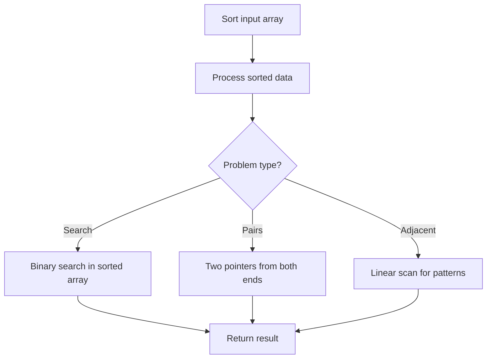

# Problem 869: Reordered Power of 2

**Difficulty:** Medium  
**Tags:** Hash Table, Math, Sorting, Counting, Enumeration  
**Pattern:** Sorting  
**Link:** [leetcode.com/problems/reordered-power-of-2](https://leetcode.com/problems/reordered-power-of-2/)

## Description

You are given an integer `n`. We reorder the digits in any order (including the original order) such that the leading digit is not zero.

Return `true` *if and only if we can do this so that the resulting number is a power of two*.

 

Example 1:

```

**Input:** n = 1
**Output:** true

```

Example 2:

```

**Input:** n = 10
**Output:** false

```

 

**Constraints:**

	- `1 <= n <= 10^9`

## Approach: Sorting

Sort the data to enable efficient processing. After sorting, use techniques like binary search, two pointers, or linear scan to solve the problem.

## Pseudocode

```
1. Sort the input array
2. Process sorted data:
   - Use binary search for lookups
   - Use two pointers for pair finding
   - Scan for adjacent patterns
3. Return result
```

## Algorithm Flow



## Complexity Analysis

- **Time:** O(n log n)
- **Space:** O(n)

## Solution (Python3)

```python
class Solution:
    def reorderedPowerOf2(self, n: int) -> bool:
        # Sort-based approach - O(n log n) time
        n.sort(key=lambda x: x[0] if isinstance(x, (list, tuple)) else x)
        result = [n[0]]
        for i in range(1, len(n)):
            curr = n[i]
            if isinstance(curr, (list, tuple)) and isinstance(result[-1], (list, tuple)):
                if curr[0] <= result[-1][1]:
                    result[-1] = [result[-1][0], max(result[-1][1], curr[1])]
                else:
                    result.append(curr)
            else:
                result.append(curr)
        return result
```

## Solution (C++)

```cpp
#include <algorithm>
#include <string>
#include <vector>
using namespace std;

class Solution {
public:
    bool reorderedPowerOf2(int n) {
        // Sort-based approach - O(n log n) time
        sort(n.begin(), n.end());
        vector<vector<int>> result;
        result.push_back(n[0]);
        for (int i = 1; i < (int)n.size(); i++) {
            if (n[i][0] <= result.back()[1]) {
                result.back()[1] = max(result.back()[1], n[i][1]);
            } else {
                result.push_back(n[i]);
            }
        }
        return result;
    }
};
```
