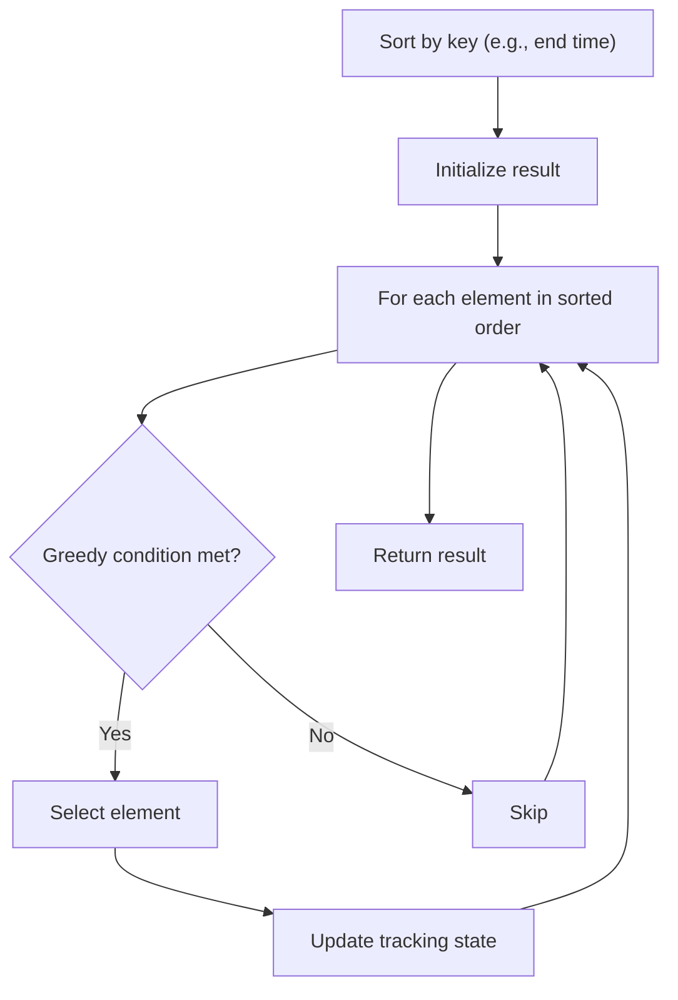

# Problem 870: Advantage Shuffle

**Difficulty:** Medium  
**Tags:** Array, Two Pointers, Greedy, Sorting  
**Pattern:** Greedy with Sorting  
**Link:** [leetcode.com/problems/advantage-shuffle](https://leetcode.com/problems/advantage-shuffle/)

## Description

You are given two integer arrays `nums1` and `nums2` both of the same length. The **advantage** of `nums1` with respect to `nums2` is the number of indices `i` for which `nums1[i] > nums2[i]`.

Return *any permutation of *`nums1`* that maximizes its **advantage** with respect to *`nums2`.

 

Example 1:

```
**Input:** nums1 = [2,7,11,15], nums2 = [1,10,4,11]
**Output:** [2,11,7,15]

```
Example 2:

```
**Input:** nums1 = [12,24,8,32], nums2 = [13,25,32,11]
**Output:** [24,32,8,12]

```

 

**Constraints:**

	- `1 <= nums1.length <= 10^5`
	- `nums2.length == nums1.length`
	- `0 <= nums1[i], nums2[i] <= 10^9`

## Approach: Greedy with Sorting

Sort the input by a key criterion, then greedily process elements in sorted order. The sorting ensures the greedy choice is always optimal.

## Pseudocode

```
1. Sort elements by key (start time, weight, etc.)
2. Initialize result, tracking variables
3. For each element in sorted order:
   a. Apply greedy selection rule
   b. Update result
4. Return result
```

## Algorithm Flow



## Complexity Analysis

- **Time:** O(n log n)
- **Space:** O(n)

## Solution (Python3)

```python
class Solution:
    def advantageCount(self, nums1: List[int], nums2: List[int]) -> List[int]:
        # Sort + greedy - O(n log n) time
        nums1.sort()
        result = 0
        curr_end = 0
        for item in nums1:
            if isinstance(item, (list, tuple)):
                if item[0] >= curr_end:
                    result += 1
                    curr_end = item[1]
            else:
                result += 1
        return result
```

## Solution (C++)

```cpp
#include <algorithm>
#include <string>
#include <vector>
using namespace std;

class Solution {
public:
    vector<int> advantageCount(vector<int>& nums1, vector<int>& nums2) {
        // Sort + greedy - O(n log n) time
        sort(nums1.begin(), nums1.end());
        int result = 0, curr_end = 0;
        for (auto& item : nums1) {
            result++;
        }
        return result;
    }
};
```
