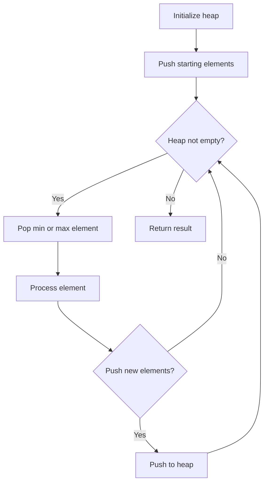
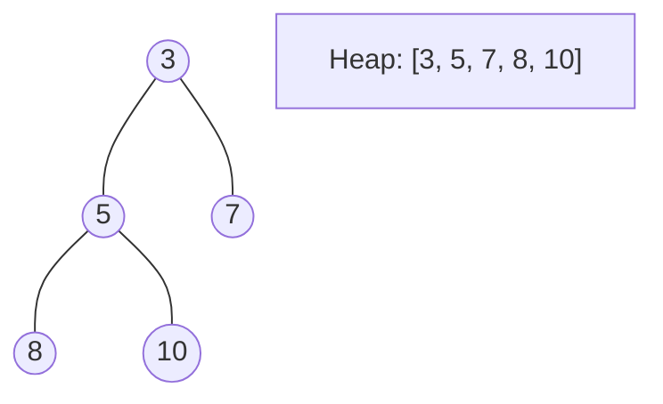
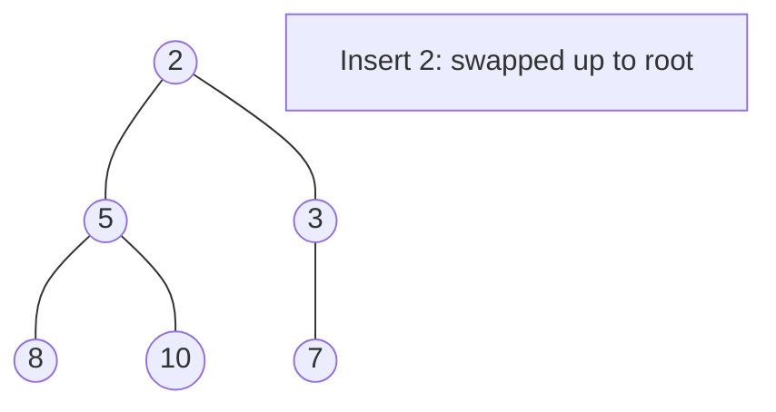
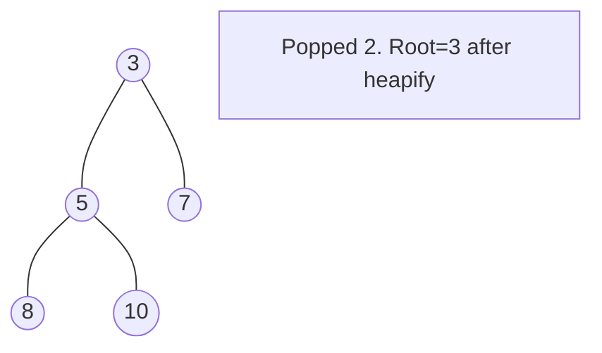

# Problem 871: Minimum Number of Refueling Stops

**Difficulty:** Hard  
**Tags:** Array, Dynamic Programming, Greedy, Heap (Priority Queue)  
**Pattern:** Heap / Priority Queue  
**Link:** [leetcode.com/problems/minimum-number-of-refueling-stops](https://leetcode.com/problems/minimum-number-of-refueling-stops/)

## Description

A car travels from a starting position to a destination which is `target` miles east of the starting position.

There are gas stations along the way. The gas stations are represented as an array `stations` where `stations[i] = [positioni, fueli]` indicates that the `i^th` gas station is `positioni` miles east of the starting position and has `fueli` liters of gas.

The car starts with an infinite tank of gas, which initially has `startFuel` liters of fuel in it. It uses one liter of gas per one mile that it drives. When the car reaches a gas station, it may stop and refuel, transferring all the gas from the station into the car.

Return *the minimum number of refueling stops the car must make in order to reach its destination*. If it cannot reach the destination, return `-1`.

Note that if the car reaches a gas station with `0` fuel left, the car can still refuel there. If the car reaches the destination with `0` fuel left, it is still considered to have arrived.

 

Example 1:

```

**Input:** target = 1, startFuel = 1, stations = []
**Output:** 0
**Explanation:** We can reach the target without refueling.

```

Example 2:

```

**Input:** target = 100, startFuel = 1, stations = [[10,100]]
**Output:** -1
**Explanation:** We can not reach the target (or even the first gas station).

```

Example 3:

```

**Input:** target = 100, startFuel = 10, stations = [[10,60],[20,30],[30,30],[60,40]]
**Output:** 2
**Explanation:** We start with 10 liters of fuel.
We drive to position 10, expending 10 liters of fuel.  We refuel from 0 liters to 60 liters of gas.
Then, we drive from position 10 to position 60 (expending 50 liters of fuel),
and refuel from 10 liters to 50 liters of gas.  We then drive to and reach the target.
We made 2 refueling stops along the way, so we return 2.

```

 

**Constraints:**

	- `1 <= target, startFuel <= 10^9`
	- `0 <= stations.length <= 500`
	- `1 <= positioni < positioni+1 < target`
	- `1 <= fueli < 10^9`

## Approach: Heap / Priority Queue

Use a min-heap or max-heap to efficiently access the smallest/largest element. Push elements and pop the top to process in priority order.

## Pseudocode

```
1. Initialize heap (min or max)
2. Push initial elements onto heap
3. While heap not empty and condition:
   a. Pop top element (min or max)
   b. Process element
   c. Push new elements if needed
4. Return result
```

## Algorithm Flow



## Visual State Transitions

**Heap Operations (Min-Heap):**

**Frame 1: Initial heap**


**Frame 2: Insert 2 - bubble up**


**Frame 3: Pop minimum (2) - heapify down**



## Complexity Analysis

- **Time:** O(n log n)
- **Space:** O(n)

## Solution (Python3)

```python
class Solution:
    def minRefuelStops(self, target: int, startFuel: int, stations: List[List[int]]) -> int:
        # Heap/Priority Queue - O(n log k) time
        import heapq
        if not target:
            return 0
        # Min heap (negate for max heap)
        heap = []
        for val in target:
            heapq.heappush(heap, val)
            if len(heap) > (startFuel if isinstance(startFuel, int) else len(target)):
                heapq.heappop(heap)
        return heap[0] if heap else 0
```

## Solution (C++)

```cpp
#include <queue>
#include <string>
#include <vector>
using namespace std;

class Solution {
public:
    int minRefuelStops(int target, int startFuel, vector<vector<int>>& stations) {
        // Heap/Priority Queue - O(n log k) time
        priority_queue<int, vector<int>, greater<int>> pq;
        for (int val : target) {
            pq.push(val);
            if ((int)pq.size() > startFuel)
                pq.pop();
        }
        return pq.empty() ? 0 : pq.top();
    }
};
```
