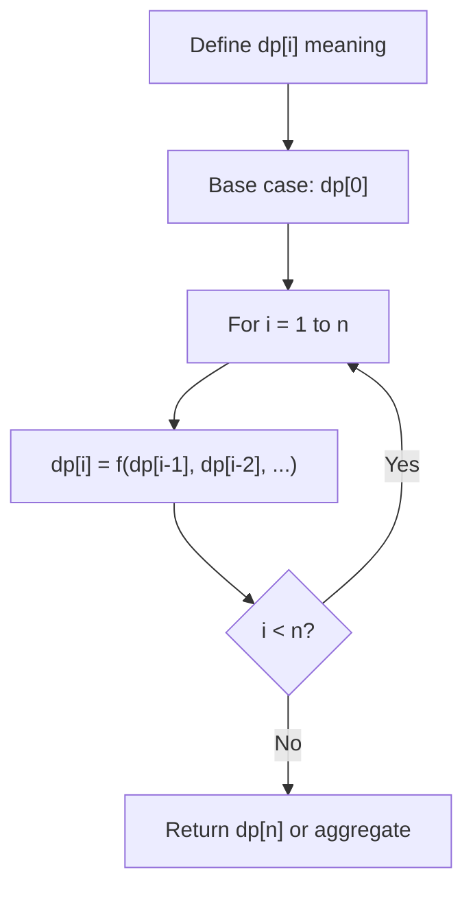
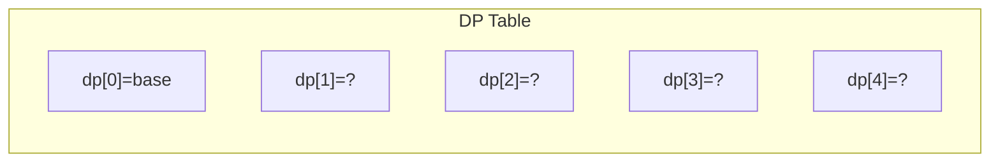
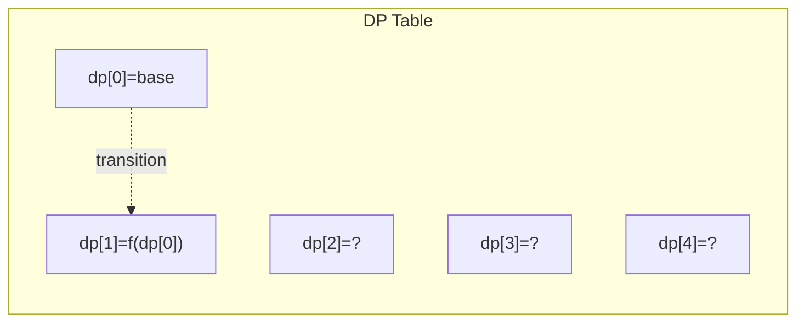
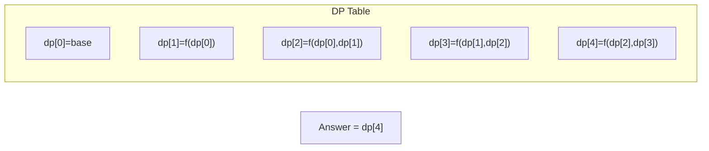

# Problem 873: Length of Longest Fibonacci Subsequence

**Difficulty:** Medium  
**Tags:** Array, Hash Table, Dynamic Programming  
**Pattern:** Dynamic Programming (1D)  
**Link:** [leetcode.com/problems/length-of-longest-fibonacci-subsequence](https://leetcode.com/problems/length-of-longest-fibonacci-subsequence/)

## Description

A sequence `x1, x2, ..., xn` is *Fibonacci-like* if:

	- `n >= 3`
	- `xi + xi+1 == xi+2` for all `i + 2 <= n`

Given a **strictly increasing** array `arr` of positive integers forming a sequence, return *the **length** of the longest Fibonacci-like subsequence of* `arr`. If one does not exist, return `0`.

A **subsequence** is derived from another sequence `arr` by deleting any number of elements (including none) from `arr`, without changing the order of the remaining elements. For example, `[3, 5, 8]` is a subsequence of `[3, 4, 5, 6, 7, 8]`.

 

Example 1:

```

**Input:** arr = [1,2,3,4,5,6,7,8]
**Output:** 5
**Explanation:** The longest subsequence that is fibonacci-like: [1,2,3,5,8].
```

Example 2:

```

**Input:** arr = [1,3,7,11,12,14,18]
**Output:** 3
**Explanation**:** **The longest subsequence that is fibonacci-like: [1,11,12], [3,11,14] or [7,11,18].
```

 

**Constraints:**

	- `3 <= arr.length <= 1000`
	- `1 <= arr[i] < arr[i + 1] <= 10^9`

## Approach: Dynamic Programming (1D)

Break the problem into overlapping subproblems. Define dp[i] as the optimal value for the subproblem ending at or considering index i. Build the solution bottom-up, using previously computed dp values.

## Pseudocode

```
1. Define dp[i] = optimal value for subproblem i
2. Base case: dp[0] = initial value
3. For i from 1 to n:
   a. dp[i] = recurrence(dp[i-1], dp[i-2], ...)
4. Return dp[n] or max/min of dp
```

## Algorithm Flow



## Visual State Transitions

**1D Dynamic Programming Table Build:**

**Frame 1: Initialize base cases**


**Frame 2: Fill dp[1] from dp[0]**


**Frame 3: Fill remaining cells**



## Complexity Analysis

- **Time:** O(n)
- **Space:** O(n)

## Solution (Python3)

```python
class Solution:
    def lenLongestFibSubseq(self, arr: List[int]) -> int:
        # Dynamic programming (1D) - O(n) time, O(n) space
        if not arr:
            return 0
        n = len(arr) if isinstance(arr, list) else arr
        dp = [0] * (n + 1)
        dp[0] = 1  # base case
        for i in range(1, n + 1):
            dp[i] = dp[i-1]  # transition (customize per problem)
            if i >= 2:
                dp[i] += dp[i-2]
        return dp[n]
```

## Solution (C++)

```cpp
#include <string>
#include <vector>
using namespace std;

class Solution {
public:
    int lenLongestFibSubseq(vector<int>& arr) {
        // Dynamic programming (1D) - O(n) time, O(n) space
        int n = arr;
        if (n <= 0) return 0;
        vector<int> dp(n + 1, 0);
        dp[0] = 1;
        for (int i = 1; i <= n; i++) {
            dp[i] = dp[i-1];
            if (i >= 2) dp[i] += dp[i-2];
        }
        return dp[n];
    }
};
```
