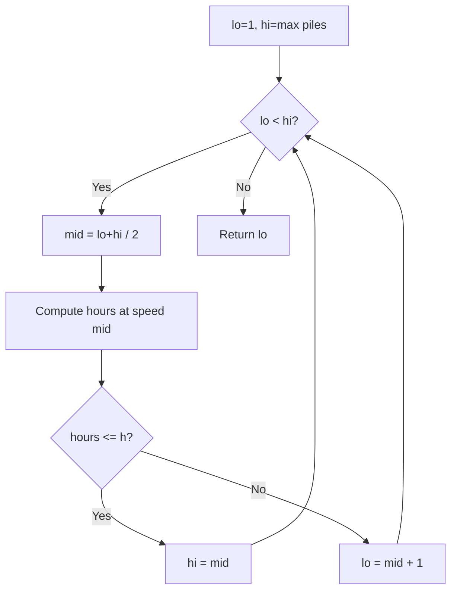
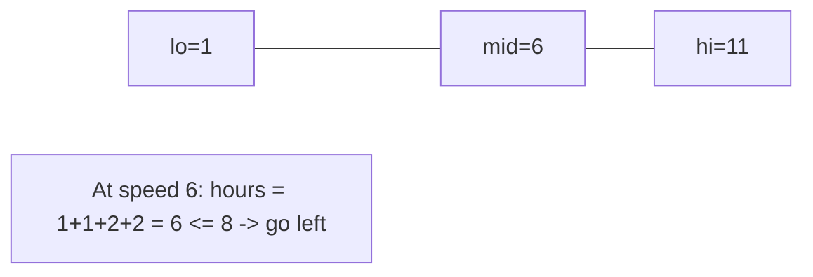
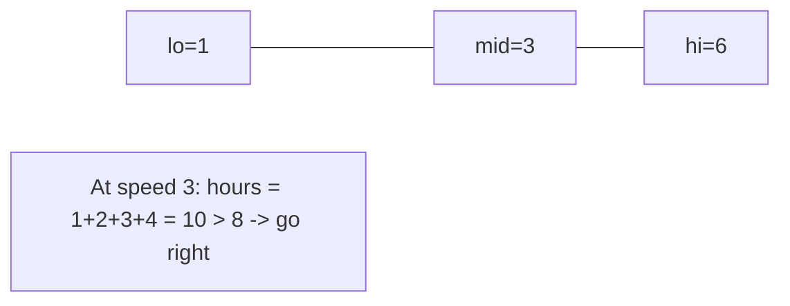
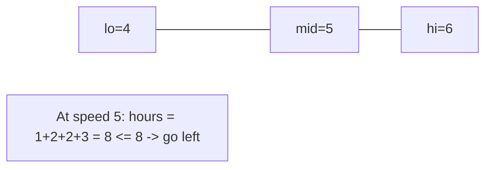
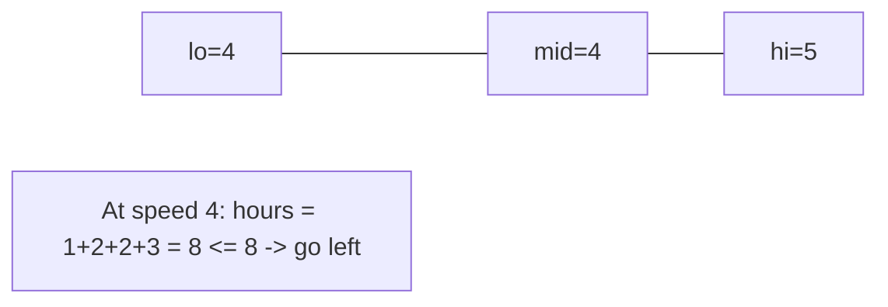
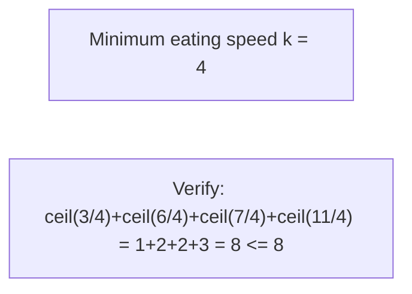

# Problem 875: Koko Eating Bananas

**Difficulty:** Medium  
**Tags:** Array, Binary Search  
**Pattern:** Binary Search on Answer  
**Link:** [leetcode.com/problems/koko-eating-bananas](https://leetcode.com/problems/koko-eating-bananas/)

## Description

Koko loves to eat bananas. There are `n` piles of bananas, the `i^th` pile has `piles[i]` bananas. The guards have gone and will come back in `h` hours.

Koko can decide her bananas-per-hour eating speed of `k`. Each hour, she chooses some pile of bananas and eats `k` bananas from that pile. If the pile has less than `k` bananas, she eats all of them instead and will not eat any more bananas during this hour.

Koko likes to eat slowly but still wants to finish eating all the bananas before the guards return.

Return *the minimum integer* `k` *such that she can eat all the bananas within* `h` *hours*.

 

Example 1:

```

**Input:** piles = [3,6,7,11], h = 8
**Output:** 4

```

Example 2:

```

**Input:** piles = [30,11,23,4,20], h = 5
**Output:** 30

```

Example 3:

```

**Input:** piles = [30,11,23,4,20], h = 6
**Output:** 23

```

 

**Constraints:**

	- `1 <= piles.length <= 10^4`
	- `piles.length <= h <= 10^9`
	- `1 <= piles[i] <= 10^9`

## Approach: Binary Search on Answer

Binary search on eating speed k. For each k, compute total hours and compare with h.

## Pseudocode

```
1. lo = lower_bound, hi = upper_bound
2. While lo <= hi (or lo < hi):
   a. mid = (lo + hi) // 2
   b. If condition(mid) is satisfied: record answer, search left half
   c. Else: search right half
3. Return answer
```

## Algorithm Flow



## Visual State Transitions

**Binary Search on Answer:**

**Input:** piles = [3, 6, 7, 11], h = 8

**Frame 1: Initial search space**


**Frame 2: Narrow to [1, 6]**


**Frame 3: Narrow to [4, 6]**


**Frame 4: Narrow to [4, 5]**


**Frame 5: lo=4, hi=4 -> Answer = 4**



## Complexity Analysis

- **Time:** O(n log m)
- **Space:** O(1)

## Solution (Python3)

```python
import math

class Solution:
    def minEatingSpeed(self, piles: list[int], h: int) -> int:
        lo, hi = 1, max(piles)
        while lo < hi:
            mid = (lo + hi) // 2
            hours = sum(math.ceil(p / mid) for p in piles)
            if hours <= h:
                hi = mid
            else:
                lo = mid + 1
        return lo
```

## Solution (C++)

```cpp
#include <string>
#include <vector>
using namespace std;

class Solution {
public:
    int minEatingSpeed(vector<int>& piles, int h) {
        // Binary search - O(log n) time, O(1) space
        int lo = 0, hi = piles.size() - 1;
        while (lo <= hi) {
            int mid = lo + (hi - lo) / 2;
            if (piles[mid] == h) {
                return mid;
            } else if (piles[mid] < h) {
                lo = mid + 1;
            } else {
                hi = mid - 1;
            }
        }
        return 0;
    }
};
```
