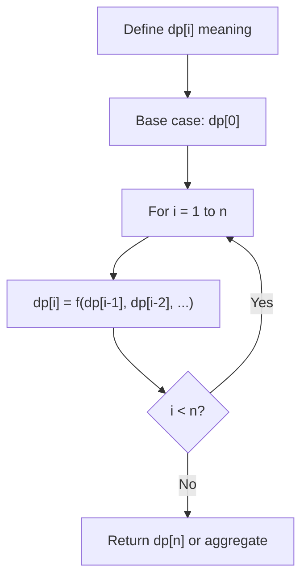
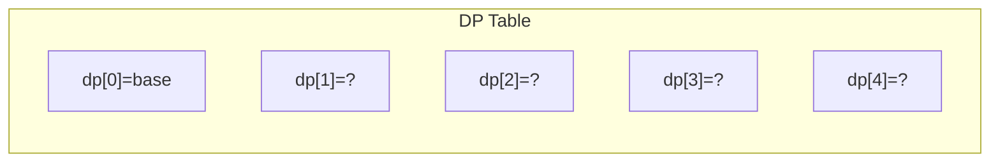
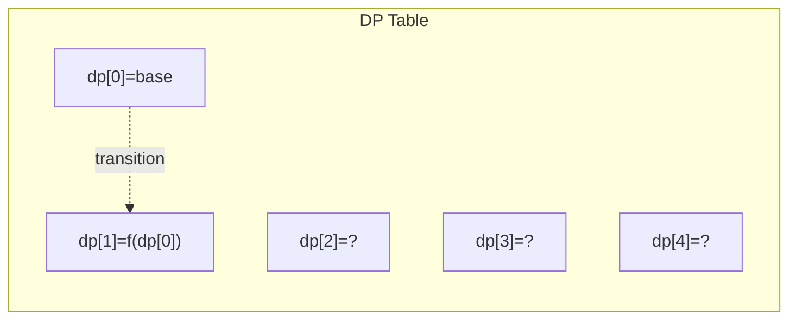
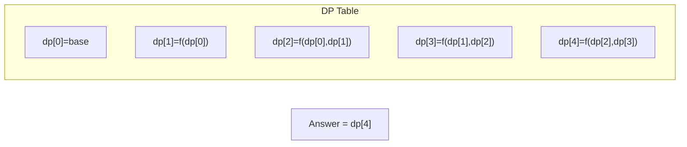

# Problem 877: Stone Game

**Difficulty:** Medium  
**Tags:** Array, Math, Dynamic Programming, Game Theory  
**Pattern:** Dynamic Programming (1D)  
**Link:** [leetcode.com/problems/stone-game](https://leetcode.com/problems/stone-game/)

## Description

Alice and Bob play a game with piles of stones. There are an **even** number of piles arranged in a row, and each pile has a **positive** integer number of stones `piles[i]`.

The objective of the game is to end with the most stones. The **total** number of stones across all the piles is **odd**, so there are no ties.

Alice and Bob take turns, with **Alice starting first**. Each turn, a player takes the entire pile of stones either from the **beginning** or from the **end** of the row. This continues until there are no more piles left, at which point the person with the **most stones wins**.

Assuming Alice and Bob play optimally, return `true`* if Alice wins the game, or *`false`* if Bob wins*.

 

Example 1:

```

**Input:** piles = [5,3,4,5]
**Output:** true
**Explanation:** 
Alice starts first, and can only take the first 5 or the last 5.
Say she takes the first 5, so that the row becomes [3, 4, 5].
If Bob takes 3, then the board is [4, 5], and Alice takes 5 to win with 10 points.
If Bob takes the last 5, then the board is [3, 4], and Alice takes 4 to win with 9 points.
This demonstrated that taking the first 5 was a winning move for Alice, so we return true.

```

Example 2:

```

**Input:** piles = [3,7,2,3]
**Output:** true

```

 

**Constraints:**

	- `2 <= piles.length <= 500`
	- `piles.length` is **even**.
	- `1 <= piles[i] <= 500`
	- `sum(piles[i])` is **odd**.

## Approach: Dynamic Programming (1D)

Break the problem into overlapping subproblems. Define dp[i] as the optimal value for the subproblem ending at or considering index i. Build the solution bottom-up, using previously computed dp values.

## Pseudocode

```
1. Define dp[i] = optimal value for subproblem i
2. Base case: dp[0] = initial value
3. For i from 1 to n:
   a. dp[i] = recurrence(dp[i-1], dp[i-2], ...)
4. Return dp[n] or max/min of dp
```

## Algorithm Flow



## Visual State Transitions

**1D Dynamic Programming Table Build:**

**Frame 1: Initialize base cases**


**Frame 2: Fill dp[1] from dp[0]**


**Frame 3: Fill remaining cells**



## Complexity Analysis

- **Time:** O(n)
- **Space:** O(n)

## Solution (Python3)

```python
class Solution:
    def stoneGame(self, piles: List[int]) -> bool:
        # Dynamic programming (1D) - O(n) time, O(n) space
        if not piles:
            return 0
        n = len(piles) if isinstance(piles, list) else piles
        dp = [0] * (n + 1)
        dp[0] = 1  # base case
        for i in range(1, n + 1):
            dp[i] = dp[i-1]  # transition (customize per problem)
            if i >= 2:
                dp[i] += dp[i-2]
        return dp[n]
```

## Solution (C++)

```cpp
#include <string>
#include <vector>
using namespace std;

class Solution {
public:
    bool stoneGame(vector<int>& piles) {
        // Dynamic programming (1D) - O(n) time, O(n) space
        int n = piles;
        if (n <= 0) return 0;
        vector<int> dp(n + 1, 0);
        dp[0] = 1;
        for (int i = 1; i <= n; i++) {
            dp[i] = dp[i-1];
            if (i >= 2) dp[i] += dp[i-2];
        }
        return dp[n];
    }
};
```
